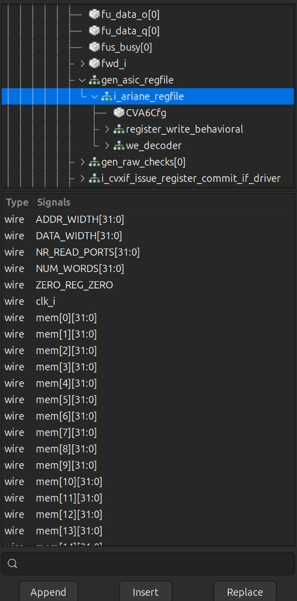

# CVA6 Simulation Flow

This document is the third part of a three-part series on the CVA6 core, covering the complete simulation flow from the first successful run through quantitative performance analysis. Part one shows why behavioral simulation fails on constrained hardware and how that limitation can be worked around using post-synthesis simulation in Vivado/XSIM — together with a custom AXI testbench and bare-metal firmware. Part two introduces the developer flow: the `cva6.py` script alongside Verilator and Spike, which enables running arbitrary C and assembly programs and reveals the actual program-termination mechanism — a write to `tohost` via HTIF, not UART. Part three goes one level deeper and demonstrates building the simulator independently from scratch: from generating the file list with Bender and writing a custom AXI wrapper, to implementing a self-checking C++ testbench that compares RTL output against the Spike log instruction by instruction. Part four is the practical payoff of that infrastructure: a quantitative comparison of four processor configurations (32/64-bit × single/dual-issue) across three real benchmarks, each placing a different kind of pressure on the pipeline.

---

## 1. Post-Synthesis Simulation (Vivado / XSIM)

**Goal:** Run a functional simulation of the synthesized CVA6 netlist in XSIM, load a small RISC-V program into the core over its AXI instruction interface, and verify at the waveform level that the core actually fetches and executes it.

**Why this step exists.** Behavioral simulation of CVA6 does not work on a 16 GB machine. XSIM fails during elaboration with `[XSIM 43-3322] Static elaboration of top level Verilog design unit(s) in library work failed.` for every configuration, including the lightest one, because the core instantiates internal arrays whose static footprint exceeds available RAM. The workaround — and the subject of this document — is to **synthesize first**, then simulate the resulting netlist using **Post-Synthesis Functional Simulation**. This trades elaboration memory for compile time and gives a design that XSIM can actually load.

**Prerequisites.** The machine preparation and the synthesis run are already covered, and are *not* repeated here:

- **[`1-environment-setup.md`](1-environment-setup.md)** — Linux/WSL2, ext4, storage and RAM planning, swap configuration, Bender installation, and network access.
- **[`2-vivado-synthesis.md`](2-vivado-synthesis.md)** — project creation, `bender script vivado -t <cpu_version> > cva6_files.tcl`, and the full synthesis flow through the utilization report.

**What this section covers.** Three parts, in order:

- **1.1 AXI Testbench and Firmware Setup** — CVA6 has no internal program memory, so a SystemVerilog testbench is written to act as a virtual AXI RAM slave, and a minimal RISC-V program (`main.S` + `link.ld`) is compiled and converted to a memory image the testbench can preload.
- **1.2 Elaboration and Simulation in XSIM** — launching Post-Synthesis Functional Simulation, handling the flattened netlist ports (packed structs become auto-named nets), and running to the point where the core begins fetching.
- **1.3 Waveform Inspection** — reading the AXI read/write channels, confirming the FSM leaves `AR_IDLE`, and verifying the self-checking result: `noc_w_data[63:0] = 0x0000001e_0000001e` when `noc_w_valid` asserts.

**Expected cost and outcome.** Peak memory during simulation is roughly **10.8 GB**, and the initial `launch_simulation` takes about **8 minutes**. Bus activity begins at approximately **2,685,000 ns**, well after reset release. A successful run ends with an observed AXI write

---

### 1.1 AXI Testbench and Firmware Setup

Post-synthesis simulation of CVA6 introduces three interrelated challenges that do not exist in a pure RTL flow. First, Vivado's synthesis flattens every packed struct and interface into individual scalar nets, breaking the signal hierarchy that the RTL testbench depended on. Second, CVA6 has no internal instruction ROM — it is a bus-master that fetches code over AXI, so the simulation environment must supply a working AXI slave loaded with real firmware. Third, that firmware must be compiled, linked, and address-translated into a format that a SystemVerilog `$readmemh` call can consume directly.

The four subsections below address each of these problems in the order you encounter them when setting up the flow from scratch.

---

#### 1.1.1 The Flattened-Netlist Problem

**Why CVA6 uses struct types**

The CVA6 top module exposes a mix of plain-logic ports and struct-typed ports:

```systemverilog
input  logic                       clk_i,
input  logic                       rst_ni,
input  logic [CVA6Cfg.VLEN-1:0]   boot_addr_i,
// ...
output rvfi_probes_t               rvfi_probes_o,
output cvxif_req_t                 cvxif_req_o,
input  cvxif_resp_t                cvxif_resp_i,
output noc_req_t                   noc_req_o,
input  noc_resp_t                  noc_resp_i
```

Types like `noc_req_t` are `parameter type` packed structs — for example:

```systemverilog
parameter type noc_req_t = struct packed {
    axi_aw_chan_t  aw;
    logic          aw_valid;
    axi_w_chan_t   w;
    logic          w_valid;
    logic          b_ready;
    axi_ar_chan_t  ar;
    logic          ar_valid;
    logic          r_ready;
};
```

The project uses this style because it groups related signals under one named port, makes the RTL readable, and makes waveform debugging easier — you see `noc_req_o.ar_valid` instead of thirty anonymous wires.

**What synthesis does to them**

Vivado does not preserve struct types in the output netlist. Every field of every packed struct gets flattened into its own standalone wire, named by the tool. The struct hierarchy you see in RTL simply does not exist in the synthesized netlist.

**Extracting the ground truth**

Before writing any testbench code, dump the post-synthesis netlist:

```tcl
# In the Vivado Tcl console, after synthesis:
pwd                          ; # shows where the file will be written
write_verilog -force cva6_netlist.v
```

The resulting file will be large — on the order of five million lines for a full CVA6 configuration. That is normal. Open it, search for the top-level module declaration, and look at the port list.

**Understanding the names you find**

The first thing that will look strange is lines like this:

```systemverilog
output [31:0] \rvfi_probes_o[csr][jvt_q] ;
```

The `\` is Verilog's **escaped identifier** syntax. It means: everything between the backslash and the next whitespace character is the signal name, even if it contains characters — brackets, dots — that are normally illegal in an identifier. That trailing space before the `;` is part of the syntax, not a typo.

This is how Vivado encodes the flattened field names. The `noc_req_o` struct becomes a set of ports like:

```systemverilog
\noc_req_o[ar_valid]
\noc_req_o[aw_valid]
\noc_req_o[w_data][63]
\noc_req_o[w_data][62]
...
```

These escaped identifiers are the exact strings your testbench must use when wiring up the DUT. You cannot use the original struct port names — they no longer exist as ports.

**Impact on testbench instantiation**

A behavioral testbench connects struct ports cleanly:

```systemverilog
cva6_top dut (
    .clk_i      (clk),
    .noc_req_o  (axi_req),   // single struct connection — RTL sim only
    .noc_resp_i (axi_resp)
);
```

In post-synthesis simulation, that elaborates with an error because `noc_req_o` is not a port. Instead, every field must be connected individually:

```systemverilog
cva6_top dut (
    .clk_i                          (clk),
    .\noc_req_o[ar_valid]           (ar_valid_wire),
    .\noc_req_o[ar_bits_addr][31:0] (ar_addr_wire),
    // ... one line per flattened field
);
```

The practical workflow is: extract the port list from `cva6_netlist.v`, generate the connection list (a small script helps here), and drop it into the testbench. Section 1.1.4 shows how the AXI RAM testbench maps these flat ports onto its internal FSM.

---

#### 1.1.2 Firmware: `main-syn.S` and `link-syn.ld`

CVA6 has no internal ROM. When reset releases, the core immediately issues an AXI read at `PC_RESET` — it expects real, valid instructions to be waiting there. This means the simulation cannot start without a working firmware image preloaded into the testbench RAM.

The firmware has two jobs: give the core something meaningful to execute, and communicate the result back to the testbench without any dedicated signaling hardware. Both constraints are solved by the same one-line technique.

**The assembly program**

```asm
    .section .text
    .global _start

_start:
    li  x1, 10             # x1 = 0x0A
    li  x2, 20             # x2 = 0x14
    add x3, x1, x2         # x3 = 0x1E  ← expected result

    li  x4, 0x80001000     # target address
    sw  x3, 0(x4)          # write result into RAM

loop:
    j loop                 # park the core
```

The arithmetic is intentionally trivial — the interesting part is the `sw`. Because the testbench acts as the AXI RAM slave, it sees every write transaction on the bus. Writing a known value (`0x1E`) to a known address (`0x80001000`) is the handshake: when the testbench's FSM observes that write, it knows the core has finished executing and the result is correct. No interrupt lines, no extra ports, no out-of-band signaling — just a store that the AXI slave was always going to handle anyway.

The trailing `j loop` prevents the core from fetching past the end of the `.text` section into unmapped memory, which would generate bus errors and pollute the waveform.

**The linker script**

```ld
OUTPUT_ARCH("riscv")
ENTRY(_start)

SECTIONS
{
    . = 0x80000000;    /* CVA6 boot address */

    .text : { *(.text) }
    .data : { *(.data) }
    .bss  : { *(.bss)  }
}
```

The only non-obvious line is `. = 0x80000000`. This sets the load address of `.text` to match `PC_RESET` in the CVA6 configuration. If this address does not match, the core's first fetch hits the right physical location in the testbench RAM but the ELF symbol table disagrees with the actual instruction layout — the core executes garbage. Getting this address right is the entire purpose of the linker script.

**you can view the files in these directories:**

    CVA6-lab/                     # Main repository root
    └── benchmarks/               # Software only (formerly firmware)
        ├── src/                  # Source files (main-syn.S)
        └── linker/               # Linker scripts (link.ld, link-syn.ld)

---

#### 1.1.3 Building the Hex Image

Two source files exist at this point — `benchmarks/src/main-syn.S` and `benchmarks/linker/link-syn.ld`. The simulation testbench cannot consume either of them directly. It needs a Verilog hex file, loaded via `$readmemh`, with addresses that match its internal RAM layout. Getting there requires two commands.

---

**Method 1: Manual build**

**Compile and link**

```bash
riscv-none-elf-gcc \
    -march=rv32imac \
    -mabi=ilp32 \
    -nostdlib \
    -T benchmarks/linker/link-syn.ld \
    benchmarks/src/main-syn.S \
    -o firmware.elf
```

- `-march=rv32imac` and `-mabi=ilp32` match the CVA6 configuration being simulated.
- `-nostdlib` suppresses any C runtime startup; the linker script is the complete memory map.

**Extract the hex image**

```bash
riscv-none-elf-objcopy \
    -O verilog \
    --verilog-data-width=4 \
    --change-addresses -0x80000000 \
    firmware.elf \
    firmware_syn.hex
```

The flag that requires explanation is `--change-addresses -0x80000000`. The linker placed `.text` at `0x80000000` to satisfy `PC_RESET`. The testbench's `ram` array, however, is indexed from `0` — `ram[0]` holds the first instruction word, not `ram[0x20000000]`. Without the address shift, `$readmemh` either writes into an impossibly large index or produces an elaboration error. Subtracting `0x80000000` from every address before writing the hex file relocates the first instruction to offset `0x0`, which is exactly where `ram[0]` sits.

`--verilog-data-width=4` sets each hex record to four bytes, matching the 32-bit word layout of the testbench RAM.

After both commands:

firmware.elf   ← ELF binary; usable for Spike verification (see benchmarks/spike-checking/)

firmware_syn.hex   ← Verilog hex file, addresses shifted to start at 0x0


The testbench loads it with:

```systemverilog
$readmemh("path/to/firmware_syn.hex", ram);
```

Because addresses now start at `0`, `ram[0]` through `ram[N]` initialize exactly as expected, and the core's first fetch at `0x80000000` maps straight to `ram[0]`.

---

**Method 2: Automated Build via Makefile**

Both steps above are wrapped in the project's Makefiles. You can run the simulation from the repository root:

```bash
# From CVA6-lab/
make <sim-target>
```

Or equivalently, directly from the simulation workspace:

```bash
# From CVA6-lab/sim/
make <sim-target>
```

Where `<sim-target>` can be:
* `post-syn-sim-32`: Runs post-synthesis simulation for CV32A6.
* `post-syn-sim-64`: Runs post-synthesis simulation for CV64A6.

Exact target names are defined in `CVA6-lab/Makefile` and `CVA6-lab/sim/Makefile`. Running `make help` from either directory will list available targets if a help rule is present.

The practical value of this path is **substitutability**. The only file you ever need to touch to simulate a different program is `benchmarks/src/main-syn.S`. Replace its contents with any valid RV32IMAC assembly — a multiply sequence, a CSR read, a branch-heavy loop — keep `link-syn.ld` and the output filename unchanged, and the rest of the flow runs without modification. The Makefile recompiles, re-extracts, and the testbench picks up the new hex on the next simulation launch. The handshake mechanism from section 1.1.2 still applies: whatever the program computes, a `sw` to a known address at the end is the signal the testbench FSM waits for.

---

#### 1.1.4 The AXI RAM Testbench

The testbench (`cva6_tb.sv`) has one job: act as a fully-functional AXI subordinate so that the synthesized CVA6 netlist can boot, fetch instructions, and write a result back, all without any real hardware. Everything else in the file — clock generation, reset sequencing, memory initialization — exists in service of that one goal.

---

**Module-level parameters**

```systemverilog
`timescale 1ns / 1ps
```

The testbench runs at 1 ns resolution. The clock period is 10 ns, giving a 100 MHz simulation frequency. All timing discussions below use nanoseconds.

---

**Clock and reset**

```systemverilog
initial clk = 0;
always #5 clk = ~clk;          // 100 MHz

initial begin
    rst_n = 0;
    #100;
    rst_n = 1;
end
```

`rst_n` is active-low. The core is held in reset for 100 ns — ten clock cycles — then released. CVA6 begins its AXI fetch sequence shortly after `rst_n` goes high. Bus activity in practice starts around **2,685,000 ns**, which reflects the number of cycles the core needs to flush its pipeline from reset and issue its first read transaction.

---

**Memory model**

```systemverilog
logic [31:0] ram [0:16383];    // 64 KB, word-addressed
```

The RAM is 16,384 words of 32 bits each, giving 64 KB total. It is word-addressed: index `0` holds bytes `[3:0]` of the firmware image, index `1` holds bytes `[7:4]`, and so on.

Initialization happens in two steps:

```systemverilog
initial begin
    for (int i = 0; i < 16384; i++) ram[i] = 32'h0;
    $readmemh("../../sim/firmware_syn.hex", ram);
end
```

The explicit zero-fill before `$readmemh` matters. Any word not written by the hex file remains zero, which is a valid (though useless) instruction — `addi x0, x0, 0`. This prevents undefined-value propagation into the instruction decoder.

The path `../../sim/firmware_syn.hex` is relative to wherever Vivado launches simulation. Section 1.1.3 explains how the address-shifted hex file is produced so that `ram[0]` correctly holds the first instruction at `0x80000000`.

The addressing logic used everywhere in the FSMs below is `ram[addr[15:2]]`. Bits `[1:0]` are the byte offset within a word (dropped because the RAM is word-aligned) and bits `[15:2]` are the 14-bit word index into the 16 K-word array.

---

**AXI read channel — the fetch path**

CVA6 issues AXI read transactions to fetch instructions. The testbench handles them with a two-state FSM:

AR_IDLE  ──(ar_valid && ar_ready)──►  R_DATA
R_DATA   ──(r_valid && r_ready && r_last)──►  AR_IDLE


**`AR_IDLE`**

The testbench holds `ar_ready = 1` continuously in this state, meaning it accepts address requests immediately with no latency. When `ar_valid` asserts and the handshake completes, it captures:

- `r_addr ← ar_addr` — the starting address
- `r_len  ← ar_len`  — the burst length (`ARLEN`; 0 means one beat)
- `r_id   ← ar_id`   — the transaction ID, echoed back on the R channel
- `r_cnt  ← 0`       — beat counter reset

It then moves to `R_DATA`, drives `r_valid = 1`, and sets `r_last = (r_len == 0)` — if the burst is a single beat, the first beat is also the last.

**`R_DATA`**

Each cycle where `r_valid && r_ready` both assert, a beat is consumed. The testbench checks `r_last`:

- If `r_last` is set: the burst is complete. FSM returns to `AR_IDLE`, `ar_ready` returns to 1.
- Otherwise: `r_addr += 8` (AXI data width is 64 bits, so the address advances by 8 bytes per beat), `r_cnt` increments, and `r_last` is re-evaluated as `(r_cnt + 1 == r_len)`.

**Read data assembly**

The data path is a combinational assign:

```systemverilog
assign noc_r_data = (r_state == R_DATA)
    ? {ram[r_addr[15:2] + 1], ram[r_addr[15:2]]}
    : 64'b0;
```

Because the AXI data bus is 64 bits wide and the RAM words are 32 bits, each beat concatenates two adjacent words. `ram[r_addr[15:2]]` provides the low 32 bits; `ram[r_addr[15:2] + 1]` provides the high 32 bits. This gives a little-endian 64-bit word aligned to the AXI bus width.

When not in `R_DATA`, the output drives zero rather than X, which keeps the waveform readable.

---

**AXI write channel — the result path**

CVA6 issues AXI write transactions when the firmware executes `sw`. The testbench handles them with a three-state FSM:

AW_IDLE  ──(aw_valid && aw_ready)──►  W_DATA
W_DATA   ──(w_valid && w_ready && w_last)──►  B_RESP
B_RESP   ──(b_valid && b_ready)──►  AW_IDLE


**`AW_IDLE`**

`aw_ready = 1`. On address handshake, captures `w_addr ← aw_addr` and `w_id ← aw_id`, then moves to `W_DATA` with `w_ready = 1`.

**`W_DATA`**

This state performs the actual write, with byte-granularity support via `WSTRB`:

```systemverilog
if (w_strb[0]) ram[w_addr[15:2]][7:0]   <= w_data[7:0];
if (w_strb[1]) ram[w_addr[15:2]][15:8]  <= w_data[15:8];
if (w_strb[2]) ram[w_addr[15:2]][23:16] <= w_data[23:16];
if (w_strb[3]) ram[w_addr[15:2]][31:24] <= w_data[31:24];
// strobes [4..7] write ram[w_addr[15:2] + 1] similarly
```

The byte-enable logic is there to correctly handle `sb` and `sh` instructions, not just `sw`. For the full 32-bit store the firmware executes (`sw x3, 0(x4)`), `w_strb` will be `8'hFF` (all eight bytes enabled) and both adjacent RAM words are updated.

When `w_last` asserts on the same handshake, the FSM moves to `B_RESP`, clears `w_ready`, and raises `b_valid`. For burst writes, `w_addr += 8` and the beat counter advances before the last beat arrives.

**`B_RESP`**

The write response channel. `b_valid = 1` with `b_id = w_id` (the same transaction ID that arrived on the AW channel). When the manager asserts `b_ready` and the handshake completes, the FSM returns to `AW_IDLE`.

`b_resp = 2'b00` is hardwired to OKAY — the testbench never generates SLVERR or DECERR.

---

**The handshake in practice**

The firmware's `sw x3, 0(x4)` targets `0x80001000`. After the address shift, that maps to RAM word index `0x400` (word 1024 out of 16384). After the write FSM processes the transaction, `ram[0x400]` will hold `0x0000_001E`. The AXI write channel is the only observable output from the firmware — inspecting `ram[0x400]` in the waveform, or watching `noc_w_data[31:0]` when `noc_w_valid` asserts, is how you confirm the core executed correctly.

---

**CVA6 instantiation**

The DUT is instantiated at the bottom of the file:

```systemverilog
cva6 u_cva6 (
    .clk_i         (clk),
    .rst_ni        (rst_n),
    .boot_addr_i   (32'h8000_0000),
    .hart_id_i     (64'h0),
    .irq_i         (2'b0),
    .ipi_i         (1'b0),
    .time_irq_i    (1'b0),
    .debug_req_i   (1'b0),
    // AXI channels via escaped identifiers:
    .\noc_req_o[ar_valid]     (ar_valid),
    .\noc_req_o[ar_bits_addr] (ar_addr),
    // ...
    .\noc_resp_i[r][data]     (noc_r_data),
    .\noc_resp_i[r][valid]    (r_valid),
    // ...
);
```

`boot_addr_i = 0x80000000` is what sends the core's first fetch to `ram[0]`. All interrupt lines are tied off. The CVXIF coprocessor interface is fully disabled — `compressed_ready`, `issue_ready`, `accept`, and `result_valid` are all driven zero, telling the core that no coprocessor exists and it should handle every instruction itself.

The escaped-identifier connections (`.\noc_req_o[ar_valid]`, `.\noc_resp_i[r][data]`) are exactly the flattened port names extracted from the synthesized netlist, as described in section 1.1.1. Each one maps a scalar net from the flat netlist onto a named wire in the testbench.

---

**Termination**

There is no `$finish`, no timeout counter, and no self-checking assertion in the testbench. The simulation runs until you stop it. This is intentional: the firmware parks in `j loop` after writing the result, and the testbench has nothing to react to. The expected workflow is to run the simulation, observe the AXI write transaction in the waveform viewer, confirm `noc_w_data[31:0] = 0x0000_001E` when `noc_w_valid` asserts, then stop manually. Section 1.3 covers reading those waveforms in detail.

---

### 1.2 Elaboration and Simulation in XSIM

#### Vivado GUI Flow

In the **Flow Navigator** (left panel), click **Run Simulation → Run Post-Synthesis Functional Simulation**. Vivado elaborates the synthesized netlist and opens the simulator window. Add signals from the **Scope/Objects** panel to the waveform viewer, then click **Run All** (or press `F3`).

The testbench has no `$finish` — the simulation runs indefinitely. Stop it manually once you have seen what you need in the waveform.

#### Makefile (Batch Mode)

Running `make post-syn-sim-32` or `make post-syn-sim-64` launches Vivado in batch mode with no GUI. The waveform database is written to:

<project_root>/<project_name>.sim/sim_1/synth/func/xsim/


To inspect it, open Vivado separately and use **File → Open Waveform Database**, then load the `.wdb` file from that path.

---

### 1.3 Waveform Inspection

The simulation is only as useful as your ability to read its output. This section walks through the waveform in the order events actually occur: a long quiet boot phase, a burst of AXI read activity as the core fetches the firmware, and finally a single AXI write transaction that carries the computed result. That write is the pass/fail signal for the entire flow.

---

#### Optional sanity check: the schematic view

Before diving into waveforms, the synthesized design itself can be inspected. With the synthesized design open, the **Schematic** view shows the flattened netlist structure — a useful confirmation that synthesis actually produced a populated design rather than an optimized-away shell:


*Figure 1: Schematic view of the synthesized CVA6 netlist. The cell/net counts in the toolbar (98 cells, 5,320 nets on the first page of 12) confirm a real, populated design.*

This step is not required for simulation; skip it if you only care about functional verification.

---

#### Signals worth adding

The flattened netlist exposes thousands of nets, but only a handful matter for this test. From the **Objects** panel, add the testbench-level signals — they are already named cleanly because they live in `cva6_tb.sv`, not in the flattened DUT:

| Group | Signals | What they tell you |
|---|---|---|
| Control | `clk`, `rst_n` | Reset release at 100 ns |
| AXI read address | `noc_ar_valid`, `noc_ar_addr`, `noc_ar_len`, `noc_ar_ready` | Fetch requests from the core |
| AXI read data | `noc_r_valid`, `noc_r_data`, `noc_r_last`, `noc_r_ready` | Instructions returned by the RAM |
| Read FSM | `r_state`, `r_addr`, `r_cnt` | Testbench-side view of each burst |
| AXI write | `noc_aw_valid`, `noc_aw_addr`, `noc_w_valid`, `noc_w_data`, `noc_w_last` | The result write — the signal that matters |

Adding the testbench FSM state (`r_state`) is the single most useful debugging aid: it renders as a named enum (`AR_IDLE`, `R_DATA`) in the viewer, so you can see burst boundaries without decoding handshakes by eye.

---

#### Phase 1: The quiet boot window

Do not expect activity immediately after reset. `rst_n` releases at 100 ns, but the first AXI read transaction does not appear until approximately **2,685,100 ns**:


*Figure 2: Full simulation window. The bus stays idle for the first ~2.68 ms of simulated time; the burst of transitions on the `noc_ar_*` / `noc_r_*` channels and `r_state` leaving `AR_IDLE` marks the start of instruction fetch.*

This is the point where an impatient user concludes the simulation is broken and kills it. It is not broken. Run for at least **3,000,000 ns** (`run 3000000 ns` in the Tcl console, or several presses of `F3` with the default 6,500 ns step increased) before drawing any conclusions. If the bus is still flat after 3 ms of simulated time, *then* something is wrong — the usual suspects are a missing or mis-pathed `firmware_syn.hex` (all-zero RAM) or a `boot_addr_i` mismatch.

---

#### Phase 2: Instruction fetch

Once fetch begins, the read channel shows a repeating pattern that maps directly onto the testbench FSM from section 1.1.4:

1. `noc_ar_valid` pulses with an address in the `0x8000_00xx` range — the core requesting instructions.
2. `r_state` transitions `AR_IDLE → R_DATA`.
3. `noc_r_data` presents concatenated 64-bit words (two adjacent RAM entries per beat) while `noc_r_valid` is high.
4. `noc_r_last` closes the burst; `r_state` returns to `AR_IDLE`.

The addresses on `noc_ar_addr` should walk through the firmware image. Given how short the program is, only a few fetch bursts occur before the core reaches the `j loop` parking instruction — after which fetch activity becomes a tight repeating pattern (or stops entirely if the loop is served from the instruction cache).

---

#### Phase 3: The result write — pass/fail

The verification criterion is a single AXI write transaction. Scroll (or search for a transition on `noc_w_valid`) past the fetch activity:


*Figure 3: The result write. When `noc_w_valid` asserts, `noc_w_data[63:0]` carries `0x0000001e_0000001e` — the value 30 (0x1E) produced by `add x3, x1, x2` and stored by `sw x3, 0(x4)` to address `0x80001000`.*

Three things to check on this transaction:

- **`noc_aw_addr` = `0x0000_0000_8000_1000`** — the store target from the firmware. Any other address means the core executed something unexpected.
- **`noc_w_data` = `0x0000001e_0000001e`** — the expected value `0x1E` appears in both halves because the testbench RAM assembles 64-bit beats from two adjacent 32-bit words; the low 32 bits are the ones the `sw` actually wrote and the strobes select.
- **`noc_w_last` high on the same beat** — a single-beat burst, matching a lone `sw`.

Seeing this transaction is the definition of success for the entire flow: the synthesized netlist booted, fetched real instructions over AXI, executed them, and wrote the correct arithmetic result back over the bus. Once observed, stop the simulation manually — the firmware is parked in `j loop` and nothing further will happen.

---

## 2. Developer Simulation Flow (cva6.py + Verilator + Spike)

**Goal.** Build a complete mental model of the CVA6 simulation toolchain — from running the default test suite to writing custom programs, tracing RTL signals, and understanding the HTIF communication layer behind all bare-metal I/O.

**Why this section exists.** Section 1 validated a synthesized netlist against a pre-built testbench. This section inverts that: it hands you control over what the core executes, how you instrument it, and how you interpret what you see. The `cva6.py` script wraps compilation, Verilator elaboration, and Spike co-simulation into a single command — but that convenience hides several non-obvious layers. Understanding those layers is the difference between running a test and actually debugging hardware.

**Prerequisites.** The environment from [`1-environment-setup.md`](1-environment-setup.md) must be complete: RISC-V toolchain, Verilator, Spike, and the CVA6 repository all confirmed working. The Vivado flow from Section 1 is not required; this section is fully independent.

**What this section covers.**

- **2.1 Running the Default Test Suite** — verifying the toolchain by executing the smoke-test script and interpreting its pass/fail output.
- **2.2 Custom C and Assembly Programs** — writing, cross-compiling, and running your own programs; understanding the flags and linker script that make them compatible with CVA6.
- **2.3 Waveform Debugging & Architectural Signal Analysis** — generating `.vcd` traces from small assembly tests and navigating pipeline signals in GTKWave to observe fetch, decode, issue, and commit in real time.
- **2.4 C Code Analysis & HTIF Communication Mechanism** — disassembling output with `objdump`, tracing the path from `printf` down to a raw `tohost` write, and understanding why HTIF is the only I/O path available in a Verilator simulation.
- **2.5 Conclusion: End-to-End Proof of Functionality** — correlating C source, disassembly, waveform, and Spike reference output into a single coherent verification argument.

**Expected cost and outcome.** Sections 2.1–2.2 take roughly 30–60 minutes including compilation. Waveform exploration in 2.3 is open-ended; a first pass takes about an hour. After completing this section, every layer of the CVA6 execution path — from C source down to RTL toggle — is something you can directly observe and reproduce.

---

### 2.1 Running the Default Test Suite (smoke test)

The smoke test is a quick validation suite that confirms the core, toolchain, and simulators are working correctly. It runs a small set of regression tests and compares Verilator traces against Spike.

**Choose your target configuration** and run the corresponding smoke test script:

```bash
bash verif/regress/smoke-tests-<cpu_version>.sh
```

Replace `<cpu_version>` with one of the following:

- **`cv32a65x`** — 32-bit core with extensions
- **`cv32a6_imac_sv32`** — 32-bit core with I, M, A, C extensions and Sv32 MMU
- **`cv64a6_imafdc_sv39`** — 64-bit core with I, M, A, F, D, C extensions and Sv39 MMU

**Example:**

```bash
bash verif/regress/smoke-tests-cv32a6_imac_sv32.sh
```

---

#### What the Smoke Test Does

The smoke test:

1. **Compiles test programs** using the RISC-V toolchain
2. **Runs them on Verilator** (hardware simulation)
3. **Runs them on Spike** (ISA reference simulator)
4. **Compares execution traces** between the two
5. **Reports PASS/FAIL** for each test

If all tests pass, your environment is correctly configured.

---

### 2.2 Custom C and Assembly Programs

After successfully passing the smoke tests, you can now run your own custom test programs on the CVA6 core. This section covers compiling C and assembly code, generating waveforms for debugging, and analyzing simulation results.

#### Setting Up Simulation Environment

Navigate to the simulation directory and configure the environment:

```bash
cd cva6/verif/sim
source verif/sim/setup-env.sh
```

Set the simulators to use:

```bash
export DV_SIMULATORS=veri-testharness,spike
```

Enable parallel builds:

```bash
export NUM_JOBS=$(nproc)
```

---

#### Enabling Waveform Output

To generate VCD waveform files for debugging in GTKWave, you must enable trace generation before running the simulation.

**Set trace environment variables:**

```bash
export TRACE_FAST=1
unset TRACE_COMPACT
```

- **`TRACE_FAST=1`:** Enables fast VCD waveform generation
- **`unset TRACE_COMPACT`:** Disables compact trace mode (discovered through experimentation; not documented in official README)

> **Why `unset TRACE_COMPACT`?** By default, the simulation framework may use a compact trace format that is not compatible with GTKWave. Unsetting this variable ensures full VCD output.

---

#### Running a Custom C Test

The CVA6 verification framework uses `cva6.py` to orchestrate test compilation, simulation, and trace comparison.

**Example: Running a simple C program**

```bash
cd verif/sim
python3 cva6.py --target cv32a6_imac_sv32 --iss=$DV_SIMULATORS --iss_yaml=cva6.yaml \
--c_tests ../tests/custom/hello_world/hello_world.c \
--linker=../../config/gen_from_riscv_config/linker/link.ld \
--gcc_opts="-static -mcmodel=medany -fvisibility=hidden -nostdlib \
-nostartfiles -g ../tests/custom/common/syscalls.c \
../tests/custom/common/crt.S -lgcc \
-I../tests/custom/env -I../tests/custom/common"
```

**Command breakdown:**

- **`--target cv32a6_imac_sv32`:** Specifies the CVA6 core configuration (32-bit with I, M, A, C extensions and Sv32 MMU)
- **`--iss=$DV_SIMULATORS`:** Uses both Verilator and Spike for simulation and comparison
- **`--iss_yaml=cva6.yaml`:** Configuration file for the ISA simulator
- **`--c_tests`:** Path to your C source file
- **`--linker`:** Linker script that defines memory layout
- **`--gcc_opts`:** Compilation flags:
  - **`-static`:** Static linking (no dynamic libraries)
  - **`-mcmodel=medany`:** Medium any code model for RISC-V (allows access to full address space)
  - **`-fvisibility=hidden`:** Hide symbols by default
  - **`-nostdlib -nostartfiles`:** Don't link standard library or default startup files (bare-metal)
  - **`-g`:** Include debug information
  - **`syscalls.c` and `crt.S`:** Required runtime support files for syscalls and hardware initialization.

---

#### Running a Custom Assembly Test

To run assembly-based tests, replace `--c_tests` with `--asm_tests`.

```bash
python3 cva6.py --target cv32a6_imac_sv32 --iss=$DV_SIMULATORS --iss_yaml=cva6.yaml \
--asm_tests ../tests/custom/hello_world/custom_test_template.S \
--linker=../../config/gen_from_riscv_config/linker/link.ld \
--gcc_opts="-static -mcmodel=medany -fvisibility=hidden -nostdlib \
-nostartfiles ../tests/custom/common/syscalls.c \
../tests/custom/common/crt.S -lgcc \
-I../tests/custom/env -I../tests/custom/common"
```

---

#### Cleaning Simulation Outputs

If you need to re-run a simulation cleanly, you must remove the generated output directories, which contain the VCD files, logs, and compiled binaries from previous runs.

```bash
cd verif/sim
rm -rf out_<date_timestamp>
```

---

### 2.3 Waveform Debugging & Architectural Signal Analysis

After a successful simulation, a `.vcd` file is generated in the `out_...` directory. Open it with GTKWave to view the signal traces:

```bash
gtkwave <path_to_vcd_file>
```

The next challenge is understanding what happened inside the processor. This section covers how to navigate the CVA6 architecture in GTKWave, locate critical hardware modules, and interpret register file activity during program execution.

---
#### Why Simple Tests Matter for Debugging

While `hello_world.c` demonstrates full functionality, it generates **thousands of signal transitions** across the entire processor pipeline, making manual inspection extremely difficult.

For learning and debugging, use **minimal assembly tests** that execute only a few instructions. This allows you to:

- Clearly see the effect of each instruction on the register file
- Understand pipeline stages without noise
- Verify arithmetic/logic operations manually
- Distinguish between your code and startup/shutdown routines

---

#### Example: A Minimal XOR Test

Create a simple assembly test that performs an XOR operation:

```assembly
.globl main
main:
  # Core test logic
  li a0, 0xCAFE;       # Load 0xCAFE into register a0
  li a1, 0xCAFE;       # Load 0xCAFE into register a1
  xor a2, a0, a1;      # XOR a0 and a1, store result in a2
  beqz a2, pass;       # Branch to 'pass' if a2 == 0

fail:
  li a0, 0x0;
  jal exit;

pass:
  li a0, 0x0;
  jal exit;
```

**Expected behavior:**

- `a0` and `a1` both receive `0xCAFE`
- `a2 = a0 XOR a1 = 0x00000000` (XOR of identical values is always zero)
- Branch to `pass` is taken because `a2 == 0`

> **Note:** CVA6's verification framework uses **Spike** (a RISC-V ISA simulator) as a golden reference. Spike extracts expected signal values from your code and compares them against Verilator's RTL simulation. If they match, the test passes. However, for deeper understanding, we analyze the waveforms manually rather than relying solely on automated pass/fail results.

---

#### Navigating the CVA6 Architecture in GTKWave

CVA6 is an **out-of-order processor**, meaning its pipeline structure differs from simple in-order designs. The register file is not located in the Decode stage — it resides in the **Issue stage**.

**Hierarchical path to the register file:**

    TOP
    └── ariane_testharness      (top-level testbench)
        └── i_ariane            (CVA6 core wrapper)
            └── i_cva6          (CVA6 processor core)
                └── issue_stage_i               (Issue stage)
                    └── i_issue_read_operands   (Operand read logic)
                        └── gen_asic_regfile
                            └── i_ariane_regfile   (Register file)


**How to locate it in GTKWave:**

1. Open your VCD file in GTKWave
2. In the **SST (Signal Search Tree)** panel on the left, expand modules in this order:
   - `TOP`
   - `ariane_testharness`
   - `i_ariane`
   - `i_cva6`
   - `issue_stage_i`
   - `i_issue_read_operands`
   - `gen_asic_regfile`
   - `i_ariane_regfile`

3. Click on `i_ariane_regfile` to see its signals in the **Signals panel** below

<div align="center">
  
  <p><i>Figure 1: Navigating the CVA6 module hierarchy to locate the register file in GTKWave</i></p>
</div>


---

#### Selecting Register File Signals

The register file contains an array called `mem[0..31]`, where each entry corresponds to a RISC-V register:

- `mem[0]` = `x0` (hardwired to zero)
- `mem[10]` = `a0` (first argument register)
- `mem[11]` = `a1` (second argument register)
- `mem[12]` = `a2` (third argument register)
- ...and so on

**Insert these signals into the waveform viewer:**

1. Select `clk_i` (clock signal)
2. Select `rst_ni` (active-low reset)
3. Select `mem[10]` (register `a0`)
4. Select `mem[11]` (register `a1`)
5. Select `mem[12]` (register `a2`)
6. Click **Insert** to add them to the waveform view


*Figure 2: Register file signals validating the functional integrity of the design (pay close attention to the highlighted signals).*

> **Tip:** The magnifying glass icon in GTKWave is for **searching within the currently selected module's signals**, not for navigating the module hierarchy.

---

#### Analyzing the Waveform

Open your VCD file:

```bash
gtkwave <path_to_vcd>/custom_test_template.cv32a6_imac_sv32.vcd
```

**What to observe:**

#### 1. **Initialization (Startup Code)**

Before your `main` function executes, the register file experiences **many transitions**. This is caused by:

- **`crt.S` (C Runtime):** Code that initializes the stack pointer (`sp`), global pointer (`gp`), and zeroes out `.bss` segments before jumping to `main`.
- **Syscalls:** If your code uses standard library functions (like `printf`), the call is routed through the custom `write` function in `syscalls.c`, which sends data directly via HTIF (memory-mapped write to `tohost`) — not through a standard OS-level `ECALL`.

*You will see `a0`, `a1`, and `a2` change frequently during this setup phase.*


*Figure 3: Heavy register activity during initialization before `main` execution*

#### 2. **Execution (Main Code)**

Once the program reaches `main` (the point of interest):

1. **`li a0, 0xCAFE`:** Monitor `mem[10]`. It should jump to `0x0000CAFE` at the next rising clock edge.
2. **`li a1, 0xCAFE`:** Monitor `mem[11]`. It should jump to `0x0000CAFE`.
3. **`xor a2, a0, a1`:** Monitor `mem[12]`. It should become `0x00000000`.

*If these transitions occur exactly as predicted, your RTL implementation of the Integer Unit and Register File is functioning correctly.*

---

### 2.4 C Code Analysis & HTIF Communication Mechanism

After validating the basic functionality of CVA6 with simple assembly tests, the next step is to understand how **high-level C code translates to hardware execution** and how the simulated processor communicates with the outside world for I/O operations like `printf`.

This section covers:
- **Disassembly analysis:** Reading the compiled object dump to trace variable-to-register mapping
- **Loop verification:** Monitoring register values to confirm correct program flow
- **HTIF discovery:** Understanding why UART signals remain idle and how bare-metal `printf` actually works

---

#### Test Program: A Simple Loop with Accumulation

To validate correct execution, we'll use a C program that performs an **accumulation loop** before exiting:

```c
#include <stdint.h>
#include <stdio.h>

int main(int argc, char* argv[]) {
  
  printf("%d: Hello World !", 0);
  
  int a = 0;
  for (int i = 0; i < 5; i++)
  {
    a += i;
  }
  return 0;
}
```

**Expected behavior:**

- `a` starts at `0`
- Loop iterates 5 times: `i = 0, 1, 2, 3, 4`
- Each iteration: `a += i`
- Final value: `a = 0 + 1 + 2 + 3 + 4 = 10 (0x0000000A)`

By identifying which **registers** the compiler assigns to `a` and `i`, we can monitor them in GTKWave and verify that the hardware correctly executes the loop.

---

#### Generating the Disassembly (Object Dump)

To see how the compiler translated our C code into RISC-V assembly, we generate a **disassembly** using `objdump`:

```bash
$RISCV/bin/riscv-none-elf-objdump -d <path_to_elf_file> > hello_world.dump
```

The `.dump` file contains:
- **Memory addresses** (left column)
- **Machine code** (hex, middle column)
- **Assembly instructions** (right column)

> **Note:** This file is **large** because a single `printf` call expands into hundreds of assembly instructions for string formatting, memory operations, and system call setup.

---

#### Locating the `main` Function

Search for the `main` function in the dump file:

```assembly
80003000 <main>:
80003000:  7179                  add   sp,sp,-48
80003002:  d606                  sw    ra,44(sp)
80003004:  d422                  sw    s0,40(sp)
80003006:  1800                  add   s0,sp,48
80003008:  fca42e23              sw    a0,-36(s0)
8000300c:  fcb42c23              sw    a1,-40(s0)
80003010:  4581                  li    a1,0
80003012:  00002517              auipc a0,0x2
80003016:  fee50513              add   a0,a0,-18 # 80005000 <_end_text>
8000301a:  675000ef              jal   80003e8e <printf>
8000301e:  fe042623              sw    zero,-20(s0)
80003022:  fe042423              sw    zero,-24(s0)
80003026:  a829                  j     80003040 <main+0x40>
80003028:  fec42703              lw    a4,-20(s0)
8000302c:  fe842783              lw    a5,-24(s0)
80003030:  97ba                  add   a5,a5,a4
80003032:  fef42623              sw    a5,-20(s0)
80003036:  fe842783              lw    a5,-24(s0)
8000303a:  0785                  add   a5,a5,1
8000303c:  fef42423              sw    a5,-24(s0)
80003040:  fe842703              lw    a4,-24(s0)
80003044:  4791                  li    a5,4
80003046:  fee7d1e3              bge   a5,a4,80003028 <main+0x28>
8000304a:  4781                  li    a5,0
8000304c:  853e                  mv    a0,a5
8000304e:  50b2                  lw    ra,44(sp)
80003050:  5422                  lw    s0,40(sp)
80003052:  6145                  add   sp,sp,48
80003054:  8082                  ret
```

**Column structure:**
- **Left:** Memory address (e.g., `80003008`)
- **Middle:** Machine code in hex (e.g., `fca42e23`)
- **Right:** Assembly instruction (e.g., `sw a0,-36(s0)`)

---

#### Analysis: Identifying Register Assignments

##### **Section 1: Prologue and `printf` Call (80003000 – 8000301a)**

- **80003000 – 80003006:** Stack frame setup. Allocates 48 bytes on the stack, saves return address (`ra`) and frame pointer (`s0`).
- **80003008 – 8000300c:** Stores function arguments `argc` and `argv` onto the stack at offsets `-36(s0)` and `-40(s0)`.
- **80003010:** Loads `0` i.e., the first argument of `printf` (`%d: Hello World !`, 0) into `a1`.
- **8000301a:** Calls `printf` (address `80003e8e`).

##### **Section 2: Loop Initialization (8000301e – 80003026)**

- **8000301e:** Sets local variable `a` to `0` (stored on stack at `-20(s0)`).
- **80003022:** Sets loop index `i` to `0` (stored on stack at `-24(s0)`).
- **80003026:** Jumps unconditionally to `80003040` to evaluate the loop condition.

##### **Section 3: The Loop (80003028 – 8000303c)**

This is where the actual accumulation happens:

- **80003028:** Loads variable `a` into register `a4`.
- **8000302c:** Loads variable `i` into register `a5`.
- **80003030:** `add a5, a5, a4` -> Adds `i` to `a` and stores result in `a5`.
- **80003032:** Stores the new `a` back to the stack `-20(s0)`.
- **80003036:** Loads `i` into `a5`.
- **8000303a:** `add a5, a5, 1` -> Increment `i`.
- **8000303c:** Stores incremented `i` back to the stack `-24(s0)`.

> **Compiler register reuse — `a5`:** Notice that `a5` serves a dual role within each iteration. At `0x80003030`, it transiently holds the running sum (`a + i`). At `0x8000303a`, the compiler reuses the same register as the loop counter for incrementing `i`. In GTKWave, `mem[15]` will therefore toggle between the partial accumulation result and the updated index within a single clock-cycle window. This is a direct artifact of GCC's register allocator and is expected, correct behavior.

##### **Section 4: Loop Condition (80003040 – 80003046)**

- **80003040:** Loads the updated `i` into `a4`.
- **80003044:** Loads `4` into `a5`.
- **80003046:** `bge a5, a4, 80003028` -> If `4 >= i`, branch back to the start of the loop (`80003028`).

---

#### The HTIF (Host-Target Interface) Mystery

If you inspect the GTKWave signals, you will notice that the `UART_TX` line is **completely silent** (stays high/idle).

**Why?**
The CVA6 environment is set up for bare-metal simulation. It doesn't include a fully synthesized UART peripheral by default. Instead, it uses **HTIF** to communicate with the host.

1.  **Memory-Mapped Write:** When `printf` executes, it performs a store operation to a specific memory address (often referred to as `tohost`).
2.  **Simulation Detection:** The CVA6 Verilator testbench monitors the memory bus. When it detects a store to the `tohost` address, it interprets the data as a character or command and prints it to the simulation console.
3.  **Efficiency:** This allows fast console output without needing to simulate the timing of a slow UART serial interface.


*Figure 4: Comparing I/O candidate modules. The `UART` bus (blue) stays idle while `i_sram` (yellow) shows the actual memory-mapped write activity used by HTIF.*

**Debug Tip:**
If your code hangs before printing, check the `tohost` signal in GTKWave. If you see the value `0x00000001` or similar being written to that address, the processor is trying to send data via HTIF, but the host might be waiting for more data, or the program might have crashed before completing the transfer.

---

#### Verification Steps in GTKWave

1.  **Add Signals:**
    *   Find `i_issue_read_operands` in the hierarchy.
    *   Monitor the inputs/outputs corresponding to register reads (`rs1`, `rs2`) and writes (`rd`).
2.  **Monitor Registers `a4` and `a5`:**
    *   Watch their transitions as the simulation passes address `80003030` (the add instruction).
    *   Confirm that `a5` correctly updates to `1, 3, 6, 10`.
    
*Figure 5: Register file activity showing `mem[14]` (a4) and `mem[15]` (a5) accumulating the loop values (1, 3, 6, 10) exactly as predicted from the disassembly.*

3.  **Confirm Loop Termination:**
    *   Watch the branch instruction at `80003046`.
    *   Verify that once `a4` (the index) exceeds `4`, the branch is *not* taken, and the program flows to the `ret` instruction.

---

#### Final Verification: Catching the ASCII on the Bus

Verifying the loop registers (`a4`/`a5`) proves the **computation** is correct, but it doesn't prove the **I/O path** works. The final piece of evidence is catching the actual `"Hello World !"` characters as raw bytes on the memory write bus.

Since `printf` in this bare-metal environment ultimately writes characters through memory-mapped HTIF stores, each character of the string must appear — as its ASCII code — on the write-data bus (`wdata_i`) of the memory subsystem.

**ASCII Reference for the Expected String:**

| Char | `H`  | `e`  | `l`  | `l`  | `o`  | ` `  | `W`  | `o`  | `r`  | `l`  | `d`  | ` `  | `!`  |
|------|------|------|------|------|------|------|------|------|------|------|------|------|------|
| Hex  | 0x48 | 0x65 | 0x6C | 0x6C | 0x6F | 0x20 | 0x57 | 0x6F | 0x72 | 0x6C | 0x64 | 0x20 | 0x21 |

**Observation in GTKWave:**

Between roughly `5200 ps` and `5500 ps`, the register file entries `mem[14]` (a4) and `mem[15]` (a5) and the memory bus show the character bytes moving through the datapath: `0x48`, `0x65`, `0x6C`, `0x6C`, `0x6F` — spelling out `H`, `e`, `l`, `l`, `o`.


*Figure 6: The ASCII codes of "Hello" (0x48, 0x65, 0x6C, 0x6C, 0x6F) captured on the write-data path. Each byte matches the reference table above, proving the string physically traversed the hardware.*

> **Note:** Even though we configured CVA6 as a 32-bit core (`cv32a6`), the underlying memory bus interface (e.g., AXI) remains 64 bits wide. Depending on how the runtime buffers the string, a single bus transaction may carry **multiple characters packed into one word** (e.g., `0x6C6C65480000...`), or characters may appear one-by-one in the low byte. Either way, the ASCII values are identifiable by inspecting the byte lanes of `wdata_i`.

**Clarifying the `tohost` value:**

A common point of confusion: near the end of simulation, `tohost` is written with the value `1`. This is **not** character data. In the HTIF protocol, writing `(exit_code << 1) | 1` to `tohost` signals program termination — so a value of `1` means `exit_code = 0`, i.e., **the program finished successfully** (matching `return 0;` in `main`).

---

### 2.5 Conclusion: End-to-End Proof of Functionality

At this point, the verification chain is complete at every level of abstraction:

1. **Software level:** The C source compiles to the expected RISC-V assembly (confirmed via `objdump`).
2. **Computation level:** The register file shows `a4`/`a5` accumulating `1, 3, 6, 10` — the loop executes exactly as the disassembly predicts (Figure 5).
3. **I/O level:** The ASCII bytes of `"Hello World !"` are physically observed on the memory write bus (Figure 6), confirming the HTIF path from `printf` down to RTL signals.
4. **Termination level:** `tohost = 1` confirms a clean exit with code `0`.

This closes the loop between **what the programmer wrote** and **what the silicon (simulated RTL) actually did** — an end-to-end proof that the CVA6 core, the toolchain, and the simulation environment all function correctly together.

---

## 3. Manual Simulation from Scratch (Standalone Verilator)

Most processor verification flows are handed to you as a black box: run this script, get a pass/fail. That works until something breaks — a tool version changes, a dependency disappears, or the RTL does something unexpected — and suddenly you are staring at a build system you do not understand, running a testbench whose internals you have never read.

This chapter builds the entire flow by hand, from a bare CVA6 repository to a self-checking simulation that compares every instruction commit against a golden Spike trace. Nothing is assumed pre-existing except the RTL source and the standard toolchain. By the end you will have written the AXI wrapper that adapts CVA6's interface to the testbench, authored the linker script and firmware that the processor actually runs, understood how Spike generates commit logs and why the format is structured the way it is, and built a C++ testbench that detects any divergence between the RTL and the reference model at cycle resolution.

The flow has six concrete layers. 3.1 uses Bender to resolve RTL dependencies and produce the flat file list that Verilator needs. 3.2 constructs `cva6_axi_wrapper.sv`, the thin SystemVerilog shim that maps CVA6's parameterized AXI port bundle to the fixed types the testbench expects. 3.3 covers Spike's `--log-commits` mode — the mechanism that produces the golden reference — and exactly what each field in the log means. 3.4 walks through the firmware suite: the linker script, the assembly startup in `boot.S`, and the C entry point in `main.c`, with attention to the ABI details that determine whether the processor's early instructions are meaningful or garbage. 3.5 dissects the C++ testbench itself: how it parses the Spike log, synchronizes the two commit streams, drives the AXI memory model, and flags mismatches. 3.6 ties everything together with a Makefile that orchestrates the full compile-elaborate-simulate-verify pipeline behind a handful of targets.

The goal is not just a working simulation. It is a simulation you can reason about, debug, and extend — because you built every piece of it.

---

### 3.0 Overview & Motivation

#### Background

> The previous two sections ([Developer Simulation Flow](#2-developer-simulation-flow-cva6py--verilator--spike) and [Post-Synthesis Simulation](#1-post-synthesis-simulation-vivado--xsim) covered the automated simulation flow and post-synthesis verification. Both are useful for confirming correctness, but neither exposes what is actually happening cycle-by-cycle inside the core.

This guide takes a different approach: build the simulation by hand, instrument every layer of the stack, and use a co-simulation reference to validate the results. By the end of this guide you will have:

- A working Verilator simulation driven from a custom C++ testbench
- A **Golden Reference** trace generated by Spike (the RISC-V ISA simulator)
- A self-checking flow that compares every committed instruction against that reference
- A waveform you can open in GTKWave and trace all the way from fetch to writeback

#### The Two Questions That Motivated This Work

Before building anything, two practical questions had to be answered:

- **How do you feed all of CVA6's submodules to Verilator?** CVA6 spans dozens of SystemVerilog files with deep package and interface dependencies. Listing them by hand is not feasible and breaks whenever the source tree changes.
- **Does the Verilator testbench have to be written in C++?** Verilator compiles RTL into a C++ model, so the driver must be C++ or SystemC. A pure HDL testbench is not an option here.

Both answers shape the tooling choices in this guide: **Bender** solves the first problem by generating a complete, dependency-ordered file list; a custom **C++ testbench** solves the second.

>**Note:** This entire workflow targets the `cv32a6_imac_sv32` configuration of CVA6. Command flags, port names, and linker settings in this guide are specific to that target. Adapting to a 64-bit configuration requires changes to the Bender target flag, the ISA string passed to Spike, and the linker boot address.

---

Here is section 3.1, written in the tone and structure established by 3.0, with a link to the f-maker README and the full Bender explanation from `README-Manual-sim.md` 2:

---

### 3.1 Dependency Generation via Bender

CVA6 is not a single file — it is dozens of SystemVerilog sources spread across submodules: packages, interfaces, common cells, cache subsystems, and more. Each of those files has a **strict compilation-order requirement**: a package must appear before any module that imports it. Maintaining that list by hand is error-prone and silently breaks whenever the source tree changes.

**Bender** solves this in one command. It reads the repository's `Bender.yml` manifest files, resolves the dependency graph, and emits a flat, dependency-ordered file list formatted for Verilator:

```bash
bender script verilator -t cv32a6_imac_sv32 > cv32a6_imac_sv32_verilator.f
```

The resulting `.f` file contains every source path and `+incdir+` include directive Verilator needs — in the correct order, with zero manual bookkeeping.

#### Flag breakdown

| Flag / part | What it does |
|---|---|
| `bender script verilator` | Emit a file list in Verilator format (paths + include dirs) |
| `-t cv32a6_imac_sv32` | Select the 32-bit IMAC + Sv32 MMU configuration; controls which config packages and source files are included |
| `> cv32a6_imac_sv32_verilator.f` | Redirect output to a file; the `.f` extension is a standard EDA convention, the name is arbitrary |

#### Available targets

| Target | Configuration |
|---|---|
| `cv32a65x` | 32-bit embedded class |
| `cv32a6_imac_sv32` | 32-bit, IMAC extensions, Sv32 MMU — **used throughout this guide** |
| `cv64a6_imafdc_sv39` | 64-bit, IMAFDC extensions, Sv39 MMU |

> **Important:** Switching targets is not a cosmetic change. It affects the file list, the ISA string you pass to GCC and Spike, and the linker boot address. Every step in this guide is fixed to `cv32a6_imac_sv32`; if you adapt to a 64-bit target, update all three.

The `.f` file produced here is passed straight to Verilator later via the `-f` flag, giving the compiler the full design in one shot.

#### Making the file list portable (f-maker)

The raw Bender output embeds absolute paths rooted at the CVA6 developer tree — those paths break the moment you move the project or hand it to a colleague. A small Python utility, `f-maker.py`, rewrites every `/cva6/` path to the `${CVA6_ROOT}` environment variable and copies the RTL sources into the local project tree.

Full instructions are in the dedicated README: [`scripts/f-maker/README.md`](../scripts/f-maker/README.md).

> If you are ever unsure about a flag or a target name, `bender --help` and `bender script --help` document both well.

---

Here is section 3.2, grounded fully in the retrieved source and README data:

---

### 3.2 CVA6 AXI Wrapper (`cva6_axi_wrapper.sv`)

#### Why the wrapper exists

`cva6.sv` does not expose individual AXI signals. Its memory interface is two packed struct ports:

```systemverilog
output noc_req_t   noc_req_o,    // 374 bits — AW, W, AR payloads + valids + b/r ready
input  noc_resp_t  noc_resp_i,   // 146 bits — readys, B and R payloads with valids
```

When Verilator compiles this, it flattens both into anonymous word arrays — no `aw_addr`, no `ar_valid`, just two opaque `uint32_t` blobs. To read `aw_addr` from the C++ testbench you would need to know its exact bit offset inside a 374-bit vector and mask it out by hand. That is fragile and breaks silently whenever the struct layout changes.

The wrapper solves this in one move: it instantiates `cva6` internally, then cracks both structs open into individually-named, flat output ports. The testbench sees clean signals; the struct math is entirely inside the wrapper.

A secondary benefit: `rvfi_probes_o` is 4196 bits (132 × 32-bit words) as a raw blob. The wrapper unpacks the commit-log fields —rvfi_probes_o` is 4196 bits (132 × 32-bit words) as a raw blob. The wrapper unpacks the commit-log fields — PC, destination register, wriop reads in 3.5.

#### Discovering the real interface

Before writing a single port declaration, the Verilated header tells you exactly what you are dealing with. Compile `cva6.sv` alone:

```bash
verilator --sv --lint-only cva6.sv -f cv32a6_imac_sv32_verilator.f
```

Then open `obj_dir/Vcva6.h` and find the `// PORTS` section. For `cv32a6_imac_sv32` you will see:

```cpp
VL_IN8(&clk_i,0,0);
VL_IN8(&rst_ni,0,0);
VL_IN(&boot_addr_i,31,0);
VL_IN(&hart_id_i,31,0);
VL_OUTW(&rvfi_probes_o,4195,0,132);   // 4196 bits, 132 words
VL_OUTW(&noc_req_o,373,0,12);         // 374 bits, 12 words
VL_INW(&noc_resp_i,145,0,5);          // 146 bits, 5 words
```

| Macro | Width | C++ type | Notes |
|---|---|---|---|
| `VL_IN8` / `VL_OUT8` | ≤ 8 bits | `uint8_t` | |
| `VL_IN` / `VL_OUT` | ≤ 32 bits | `uint32_t` | |
| `VL_INW` / `VL_OUTW` | > 64 bits | `uint32_t[]` | args: `(&name, msb, lsb, words)` |

`noc_req_o` at 374 bits is ⌈374/32⌉ = 12 words. That is the number you need to replicate on the wrapper's flat output side so nothing is lost.

#### Type-parameter design

The wrapper mirrors `cva6.sv`'s own pattern: every type is derived from a single `CVA6Cfg` parameter rather than declared with hand-coded widths.

```systemverilog
parameter config_pkg::cva6_cfg_t CVA6Cfg =
    build_config_pkg::build_config(cva6_config_pkg::cva6_cfg);
```

All AXI channel types, the RVFI probe types, and the `noc_req_t`/`noc_resp_t` bundles are then constructed from that same config:

```systemverilog
// AXI channel types — widths track CVA6Cfg automatically
parameter type axi_ar_chan_t = ...;
parameter type axi_aw_chan_t = ...;  // includes atop[5:0]; AR does not
parameter type axi_w_chan_t  = ...;
parameter type b_chan_t      = ...;
parameter type r_chan_t      = ...;

// Bundles
parameter type noc_req_t  = struct packed { aw, aw_valid, w, w_valid,
                                            b_ready, ar, ar_valid, r_ready };
parameter type noc_resp_t = struct packed { aw_ready, ar_ready, w_ready,
                                            b_valid, b, r_valid, r };
```

This matters because packed struct field unpacking is purely positional — the wrapper's `noc_req_t` must be **bit-for-bit identical** to `cva6.sv`'s own definition. Mismatching field order silently reroutes signals.

> If you change `CVA6Cfg` (e.g. to a 64-bit target), every width in the wrapper adjusts automatically: `XLEN`, `VLEN`, `AxiDataWidth`, `NrCommitPorts`. You do not touch the port list.

#### Port groups

**Control inputs** — passed straight through; the C++ testbench drives these before releasing reset:

| Port | Width | Notes |
|---|---|---|
| `clk_i`, `rst_ni` | 1 bit | |
| `boot_addr_i` | `VLEN` | Drive `0x80000000` for `cv32a6_imac_sv32` |
| `hart_id_i` | `XLEN` | Usually `0` for single-core |
| `irq_i` | 2 bits | External IRQ lines |
| `ipi_i`, `time_irq_i`, `debug_req_i` | 1 bit each | Tie to `0` for basic simulation |

**Commit-log outputs** — the co-simulation interface, one entry per commit port:

```systemverilog
output logic [NrCommitPorts-1:0]            commit_ack_o,
output logic [NrCommitPorts-1:0][VLEN-1:0]  commit_pc_o,
output logic [NrCommitPorts-1:0][4:0]       commit_rd_o,
output logic [NrCommitPorts-1:0][XLEN-1:0]  commit_wdata_o,
```

These are unpacked from `rvfi_probes` in a `generate` loop keyed on `NrCommitPorts`. Each cycle in the C++ testbench you read these and compare against Spike's commit log.

**Flat AXI ports** — the memory interface the testbench (andr a memory model) connects to:

| Channel | Key outpuy output signals | Key input signals |
|---|---|---|
| AW | `axi_aw_valid_o`, `addr`, `id`, `len`, `size`, `burst`, `atop` | `axi_aw_ready_i` |
| W | `axi_w_valid_o`, `data`, `strb`, `last` | `axi_w_ready_i` |
| B | `axi_b_ready_o` | `axi_b_valid_i`, `id`, `resp` |
| AR | `axi_ar_valid_o`, `addr`, `id`, `len`, `size`, `burst` | `axi_ar_ready_i` |
| R | `axi_r_ready_o` | `axi_r_valid_i`, `id`, `data`, `resp`, `last` |

Note that AW carries `atop[5:0]` (atomic operations); AR does not — this matches the AXI4 spec.

#### Internal logic: unpack and pack only

The wrapper contains no state. Every signal is a continuous assignment in one of two directions:

Core → AXI  :  noc_req_o fields  →  flat axi_*_o ports
AXI  →th is a `generate`i fields


The RVFI path is a `generate`-loop assignment, not procedural logic. The `cva6` instance at the bottom connects to the two internal bundle signals (`core_noc_req`, `core_noc_resp`) and the `rvfi_probes` wire; the CvXIF interface is left unconnected on the output and tied to `'0` on the input — co-processor extension is not exercised in this guide.

```systemverilog
cva6 #(.CVA6Cfg(CVA6Cfg)) i_cva6 (
    .clk_i,
    .rst_ni,
    .noc_req_o   (core_noc_req),
    .noc_resp_i  (core_noc_resp),
    .rvfi_probes_o (rvfi_probes),
    .cvxif_req_o  (/* unconnected */),
    .cvxif_resp_i ('0),
    ...
);
```

The result is a testbench-facing module with no struct awareness required: read `dut->commit_pc_o[0]`, drive `dut->axi_r_valid_i`, and the wrapper handles all the field-offset arithmetic internally.

---

### 3.3 Spike as Instruction-Level Reference (`--log-commits`)

#### What Spike is

Waveforms tell you *what* the hardware did. They do not tell you whether what it did was *correct*. For that you need an independent, trusted execution model — something that runs the same binary and records the architectural result of every instruction, with no microarchitectural noise.

That is Spike's role here. It is the official RISC-V ISA simulator (`riscv-isa-sim`): it executes `firmware.elf` instruction-by-instruction in software, with no pipeline, no caches, and no stalls. Pure architectural semantics, nothing else. That purity is exactly what makes it useful — if CVA6 and Spike disagree on the value written to a register after any instruction, CVA6 (or the testbench) is wrong.

| Tool | Role |
|---|---|
| `riscv-none-elf-gcc` | Compiles source → `firmware.elf` |
| Spike | Executes `firmware.elf` → golden commit log |
| CVA6 (Verilator) | Executes `firmware.elf` → RTL commit log |
| C++ testbench | Compares the two logs cycle by cycle |

> **Prerequisites:** Spike installation and the optional `--enable-commitlog` rebuild are covered in [1-environment-setup.md](1-environment-setup.md). If `spike --log-commits` runs but produces a plain trace with no register data, that document explains the rebuild.

#### Why `--log-commits`, not just `-l`

The plain `-l` flag gives a trace of PC and disassembled instruction — one line per instruction, no register data. That is enough for manual inspection but not for automated co-simulation.

The verification goal is tighter: for every committed instruction, does the **value written to the destination register** match between CVA6 and Spike? `--log-commits` extends the log format so each line also records the destination register index and the data written to it. That maps directly onto the wrapper's `commit_rd_o` and `commit_wdata_o` outputs from 3.2. Both sides emit `(PC, rd, wdata)` tuples — the C++ testbench in 3.5 reads them in lockstep and flags the first mismatch.

Without `--log-commits` the co-simulation loop has nothing to compare against beyond the PC, which catches control-flow bugs but misses silent data corruption.

#### The command

```bash
spike --isa=rv32imac -l --log-commits firmware.elf 2> spike_trace.log
```

| Part | Meaning |
|---|---|
| `--isa=rv32imac` | ISA string — must match the GCC `-march` flag and the CVA6 target config |
| `-l` | Enable instruction tracing |
| `--log-commits` | Extend each trace line with destination register and write-back data |
| `firmware.elf` | The binary built by the firmware step |
| `2> spike_trace.log` | Spike writes its trace to **stderr**, not stdout — the redirect must be `2>` |

The `--isa` flag is the one most likely to cause a silent failure. If it does not match the ISA the firmware was compiled for, Spike may refuse to execute certain instructions or produce a different instruction count than CVA6. Keep GCC's `-march`, Spike's `--isa`, and the Bender target tag consistent.

#### Architecture-dependent ISA string

The `rv32imac` string above is correct for `cv32a6_imac_sv32`. For a 64-bit target the string changes:

| CVA6 config | Bender target | GCC `-march` | Spike `--isa` |
|---|---|---|---|
| 32-bit | `cv32a6_imac_sv32` | `rv32imac` | `rv32imac` |
| 64-bit | `cv64a6_imafdc_sv39` | `rv64imafdc` | `rv64imafdc` |

This is not cosmetic — `rv64imafdc` adds the D extension and double-precision floating-point instructions. Running a 64-bit binary under `--isa=rv32imac` will produce traps or aborts.

When you reach 3.6 and look inside the Makefile, you will see this handled via a `SPIKE_ISA` variable that switches automatically with `make ARCH=32|64`. The command in the Makefile's `_spike` target is exactly:

```make
$(SPIKE) --isa=$(SPIKE_ISA) -l --log-commits \
    $(SPIKE_DIR)/firmware.elf 2> spike_trace.log
```

with `SPIKE_ISA := rv32imac` or `rv64imafdc` depending on `ARCH`. Nothing to manually edit; that is the point of the variable.

#### What the log looks like

A `--log-commits` line for a 32-bit target looks like:

```log
core   0: 0x80000000 (0x00000093) li      ra, 0
core   0: 3 0x80000000 (0x00000093) x1  0x00000000
```

The second line is the commit record: core index, privilege level, PC, encoding, destination register (`x1` = `ra`), and written value (`0x00000000`). That tuple is what the testbench in 3.5 parses and compares against `commit_pc_o[0]`, `commit_rd_o[0]`, and `commit_wdata_o[0]` from the wrapper.

---

### 3.4 Firmware Suite & Linker Script

CVA6 needs a binary to execute. It does not boot Linux — it resets to a fixed address, expects code there, and has no OS, no standard library, and no dynamic loader. Every program in this section is self-contained: `_start` runs, something observable happens, `tohost` receives a nonzero write, and the core spins. That is the complete execution model.

This section covers the full firmware layer from source to binary. 3.4.1 maps the files in `benchmarks/` and explains which ones matter here. 3.4.2 covers the linker script and why the boot address in the script must match the one the testbench drives. 3.4.3 walks through the assembly entry point and what changes between a 32-bit and a 64-bit build. 3.4.4 and 3.4.5 cover the C runtime stub and how C programs plug into the same infrastructure.

The `ARCH` variable — `32` or `64` — is the single knob that controls compiler flags, ISA strings, and calling conventions across every step in this section. There are no separate source files for each architecture; the same sources compile differently depending on what `ARCH` is set to.

#### 3.4.1 Source File Map

Files are grouped by the layer they belong to in the simulation stack. Post-synthesis files (`main-syn.S`, `link-syn.ld`) are excluded — those feed Vivado/XSim, not Verilator.

---

**Firmware Sources** — `benchmarks/src/`

| File | Used by | Purpose |
|---|---|---|
| `main_32.S*` | `make run ARCH=32` | Standalone assembly playground, 32-bit |
| `main_64.S*` | `make run ARCH=64` | Standalone assembly playground, 64-bit |
| `complex_32.S` | `make run_complex ARCH=32` | Multi-operation benchmark, 32-bit |
| `complex_64.S` | `make run_complex ARCH=64` | Multi-operation benchmark, 64-bit |
| `bug_32.S*` | `make run_bug ARCH=32` | Intentional-bug target for waveform hunting, 32-bit |
| `bug_64.S*` | `make run_bug ARCH=64` | Intentional-bug target for waveform hunting, 64-bit |
| `boot.S` | `run_matmul`, `run_avg`, `run_c` | C runtime stub — sets up `sp`, zeroes `.bss`, calls `main` |
| `matmul.c` | `make run_matmul` | Matrix multiply benchmark (C), pairs with `boot.S` |
| `avg.c` | `make run_avg` | Array-average benchmark (C), pairs with `boot.S` |
| `main.c*` | `make run_c` | C playground, pairs with `boot.S` |

`*` : Enabling this target also generates a waveform file (.vcd).

---

**Linker** — `benchmarks/linker/`

| File | Purpose |
|---|---|
| `link.ld` | Simulation linker script; places `.text` at `0x80000000` to match `boot_addr_i` |

---

**C++ Testbenches** — `tb/cpp/`

| File | Used when | Purpose |
|---|---|---|
| `tb_cva6_ww.cpp` | `run`, `run_bug`, `run_c` | Drives CVA6, runs co-sim check, **emits `waveform.vcd`** |
| `tb_cva6_wow.cpp` | `run_complex`, `run_matmul`, `run_avg` | Same co-sim logic, waveform generation disabled |

---

**RTL Wrapper & File Lists**

| File | Location | Note |
|---|---|---|
| `cva6_axi_wrapper.sv` | `tb/wrappers/` | Verilator's top module — covered in 3.2 |
| `cv32a6_imac_sv32_verilator.f` | `sim/filelists/` | Ordered RTL file list for 32-bit — covered in 3.1 |
| `cv64a6_imafdc_sv39_verilator.f` | `sim/filelists/` | Ordered RTL file list for 64-bit — covered in 3.1 |

---

The `ARCH` variable is the only thing that changes which row of the firmware table is compiled. Everything else — linker, wrapper, file list — is decided by that same variable upstream in the Makefile.

#### 3.4.2 Linker Script (`link.ld`)

Every program in this simulation needs a linker script. The compiler has no way to know where the binary will live in memory — that is a board-level or simulation-level decision, not a language-level one. The linker script makes it explicit, and that same address is what the testbench drives on `boot_addr_i` when it releases reset. If the two disagree, the core fetches garbage.

The script for simulation is `benchmarks/linker/link.ld`:

```ld
OUTPUT_ARCH("riscv")
ENTRY(_start)

SECTIONS
{
    /* Set the program start address exactly to the CVA6 boot address */
    . = 0x80000000;

    .text : {
        *(.text)
    }
    .data : {
        *(.data)
    }
    .bss : {
        *(.bss)
    }
}
```

`OUTPUT_ARCH("riscv")` names the target architecture in the ELF header. `ENTRY(_start)` records the entry symbol — this is what Spike reads to determine where to begin fetching. Without it, Spike falls back to the lowest `.text` address, which happens to be the same thing here, but the explicit declaration is cleaner and required if the binary is ever inspected with `readelf -h`.

The location counter `. = 0x80000000` is the core constraint. It sets the load address of everything that follows. `.text` lands therst instruction of `_start` is at exactlrst instruction of `_start` is at exactly `0x80000000`. `.data` follows immediately after `.text` ends — this is where `tohost` and `fromhost` live (covered in 3.4.3). `.bss` comes last; it is zeroed by the startup stub in `boot.S` before `main` is called (covered in 3.4.4).

The address `0x80000000` is not arbitrary. In the C++ testbench, one of the first things done before releasing reset is:

```cpp
dut->boot_addr_i = 0x80000000;
```

CVA6 latches this on reset release and issues its first instruction fetch to that address. The linker script guarantees the binary is there. The testbench's flat DRAM model translates `0x80000000` to index `0` internally — so no `--change-addresses` flag or ELF patching is needed at load time.

The Makefile passes this script via `-T`:

```make
riscv-none-elf-gcc -march=$(MARCH) -mabi=$(MABI) -mcmodel=medany \
    -nostdlib -T $(BENCH_LINK)/link.ld -o firmware.elf ...
```

`-nostdlib` is important: there is no libc, no crt0, no heap management. The only startup code is what `_start` or `boot.S` provides explicitly. `-mcmodel=medany` ensures the compiler generates PC-relative code that works at any 2 GiB-aligned address — required because `0x80000000` is well outside the default `medlow` range.

#### 3.4.3 `main_ARCH.S` — Canonical Assembly Entry Point

The assembly playground is where simulation becomes interactive. Pick a handful of instructions, place them between two comment markers, run `make run`, and within seconds you have a waveform and a commit log to inspect. `main_32.S` and `main_64.S` are those playgrounds — one per architecture, for a reason that 3.4.1 glossed over and deserves a full explanation here.

The `ARCH` variable controls compiler flags, ISA strings, and ABI conventions uniformly for C code — the compiler handles the rest. Assembly does not get that abstraction. A file containing `sd` is a hard assembler error under `rv32imac`; a file containing `lw` in a 64-bit context assembles fine but silently sign-extends the result in ways that can look like correct behavior until a carefully chosen value breaks it. Two separate files keeps those differences explicit and catches mistakes at assemble time rather than at trace-comparison time.

The Makefile picks the right one automatically: `make run ARCH=32` feeds `main_32.S` to the compiler; `make run ARCH=64` feeds `main_64.S`. Edit the one that matches the target you are running. The structure of both files is identical — only one instruction in the exit sequence differs, and that difference is the whole point of this section.

---

##### File Skeleton

Both files share this layout. The only difference between them is the single store instruction in the exit block (marked below).

**`main_32.S`:**

```asm
.section .data
.align 6
.global tohost
tohost: .dword 0

.global fromhost
fromhost: .dword 0

.section .text
.global _start
_start:
    # ---  Start Our Custom APK ---
    # your program goes here
    # --- Finish Our Custom APK ---

    # --- Exit command for Spike ---
    la t0, tohost
    li t1, 1
    sw t1, 0(t0)        # 32-bit store — correct for RV32

loop:
    j loop
```

**`main_64.S`:**

```asm
.section .data
.align 6
.global tohost
tohost: .dword 0

.global fromhost
fromhost: .dword 0

.section .text
.global _start
_start:
    # ---  Start Our Custom APK ---
    # your program goes here
    # --- Finish Our Custom APK ---

    # --- Exit command for Spike ---
    la t0, tohost
    li t1, 1
    sd t1, 0(t0)        # 64-bit store — correct for RV64

loop:
    j loop
```

---

##### What each piece does

**`.data` block** — The two symbols `tohost` and `fromhost` are the HTIF (Host-Target Interface) mailboxes that Spike watches. `tohost` is the exit channel: writing a nonzero value to it tells Spike to terminate. `fromhost` is the reverse channel; it is unused here but Spike expects the symbol to exist in the ELF. Both are declared as `.dword` (8 bytes) in *both* architectures — the HTIF protocol is always 64-bit regardless of XLEN. `.align 6` enforces 64-byte alignment, and `.global` exports both symbols into the ELF symbol table so Spike can find them by name at load time.

**`_start`** — The entry symbol that `ENTRY(_start)` in `link.ld` names. Because `.text` begins at `0x80000000` and `_start` is the first symbol in it, the first instruction between the markers is the first instruction CVA6 fetches after reset. There is no OS, no crt0, no ABI to honor. The register file is yours from the first cycle.

**Program placement** — Your code goes between the two markers. There is no stack set up in this file; if you need scratch memory, add a label in `.data`. The only rule: control must eventually fall through to the exit sequence. Don't loop before reaching it, or Spike never sees the `tohost` write and never terminates.

**Exit sequence** — After your code runs, `t0` gets the address of `tohost`, `t1` gets `1`, and the store writes that value to the mailbox. Spike reads it, sees a nonzero value, and exits. CVA6 meanwhile hits `loop: j loop` and parks — the testbench is already watching the commit log and will call `$finish` on its own schedule. `t0` and `t1` are clobbered here, so they are free to use inside your program too.

---

##### 3.4.3.1 ARCH = 32

In RV32 every register is 32 bits wide. The natural load and store operations are word-sized:

| Instruction | Operation | Behavior |
|---|---|---|
| `lw rd, off(rs)` | Load word | Loads 4 bytes into `rd` — fills the register exactly |
| `sw rs2, off(rs1)` | Store word | Stores the low 4 bytes of `rs2` to memory |
| `ld` / `sd` | Load/store doubleword | **Do not exist in RV32 — assembler error** |

The exit store is `sw t1, 0(t0)`. It writes only 4 bytes to `tohost`, but that is fine: RISC-V is little-endian, so the low 4 bytes of `1` carry the value, and the upper 4 bytes of the 8-byte `tohost` slot are already zero from initialization. Spike reads the full 64-bit location and sees `0x0000000000000001`.

Use `lw` and `sw` for all memory operations in your program. If you reach for `ld` or `sd`, the assembler will stop you immediately with an `unrecognized opcode` error — a clean, early failure compared to what happens in 64-bit (see below).

---

##### 3.4.3.2 ARCH = 64

In RV64 registers are 64 bits wide and the full doubleword instructions are available:

| Instruction | Operation | Behavior in RV64 |
|---|---|---|
| `ld rd, off(rs)` | Load doubleword | Loads 8 bytes into `rd` — native full-width load |
| `sd rs2, off(rs1)` | Store doubleword | Stores all 8 bytes of `rs2` to memory |
| `lw rd, off(rs)` | Load word | Loads 4 bytes, then **sign-extends** the result to fill all 64 bits of `rd` |
| `sw rs2, off(rs1)` | Store word | Stores only the **low 32 bits** of `rs2`; upper half is silently discarded |

The exit store is `sd t1, 0(t0)` — the idiomatic full-width write for a 64-bit `tohost`.

The behavior of `lw` in RV64 deserves specific attention. It does not behave like a "narrower `ld`" — it **sign-extends**. Loading a 32-bit value where bit 31 is set will produce a 64-bit register value with the upper 32 bits filled with `0xFFFFFFFF`. Loading `0xFFFF_FFFF` with `lw` gives `0xFFFFFFFF_FFFFFFFF`; loading it with `ld` (from an 8-byte-aligned slot) gives whatever the full 8 bytes actually contain.

This creates a class of bugs that are invisible until a value happens to have bit 31 set. A register that should hold `0x00000000_FFFFFFFF` silently becomes `0xFFFFFFFF_FFFFFFFF`, and the arithmetic that follows produces wrong results with no assembler warning, no linker error, and no obvious trace anomaly — until the co-sim log shows a `wdata` mismatch between CVA6 and Spike.

The rule for `ARCH=64`:
- Use `ld`/`sd` for full-width 64-bit data.
- Use `lw`/`sw` deliberately, knowing that `lw` sign-extends and `sw` discards the upper half. They are not wrong — they are just specific.
- If a value you loaded behaves as a large negative number in 64-bit arithmetic, check whether a `lw` brought in a value with bit 31 set.

The assembler catches `sd` in a 32-bit build immediately. Nothing catches a sign-extension surprise in a 64-bit build except the trace.

#### 3.4.4 `boot.S` — C Runtime Startup Stub

When you assemble `main_32.S` or `main_64.S`, the very first instruction is yours. There is no invisible layer underneath — `_start` is the program, and the program does exactly what you write. C is different. The moment the compiler emits a function call it assumes a valid stack pointer. The moment you declare a global variable without an explicit initializer it assumes the memory is zeroed. Neither assumption is true after reset — `sp` holds whatever was in the register file, and `.bss` holds whatever was in the DRAM model. `boot.S` is the twelve lines that make those assumptions true before `main` runs.

---

##### Why assembly doesn't need it

An assembly program has no assumptions to satisfy. There is no calling convention, no ABI, and no invisible contract with the code generator — because there is no code generator. You decide whether to use `sp`. If you never call a function, you never push a return address, and the value of `sp` never matters. If you want scratch memory you add a label in `.data` and load its address directly into whatever register you choose. The exit sequence writes to `tohost` with a single instruction and `loop: j loop` parks the core. None of that needs a stack.

A C function is different by construction. The compiler emits a prologue that does `addi sp, sp, -N` before saving registers. If `sp` is garbage, that store goes to a garbage address, the memory model may or may not have anything mapped there, and the co-sim log will show a wdata mismatch on the very first instruction — or worse, it won't, because the address accidentally fell inside the DRAM window and the corruption is silent. `boot.S` exists to close that gap by establishing a known, valid stack region before the C world starts.

---

##### The file

```asm
.global _start
.section .text

_start:
    # Initialize a simple stack with 4KB size
    la sp, stack_top

    # Jump to the main function in the C code
    call main

    # Infinite loop to prevent crashing after main returns
end_loop:
    j end_loop

.section .bss
.align 4
stack_bottom:
    .space 4096
stack_top:
```

---

##### What each piece does

**`la sp, stack_top`** — This is the entire C runtime initialization in one instruction. `stack_top` is a label at the high end of a 4 KB `.bss` region. RISC-V uses a full-descending stack: `sp` starts at the top and moves down with each push. Loading `stack_top` into `sp` gives the compiler a region it can safely use. The 4 KB budget is adequate for every benchmark in this guide; if you write deeply recursive C or allocate large on-stack arrays, increase `.space` to match.

**`call main`** — The standard ABI call to the C `main` function. `ra` (return address register) is set by `call` and honored by the C code's function epilogue. `main`'s return value ends up in `a0` per the calling convention — the simulation does not inspect it, but it is there if you want to act on it.

**`end_loop: j end_loop`** — In a normal embedded system this would never execute; `main` would write to `tohost` and the core would park at the equivalent loop in the C source (covered in 3.4.5). This fallback exists because if `main` somehow returned — a logic bug, a missing `while(1)` — the program counter needs somewhere safe to go. Without it the core would fetch whatever bytes follow `call main` in memory, which is undefined.

**`.bss` region** — `stack_bottom` is a label at the start of the allocation; `.space 4096` reserves 4096 bytes; `stack_top` is a label immediately past the end of those bytes. Because `stack_top` comes *after* `.space 4096` in the source, its address is `stack_bottom + 4096` — the high end of the region. This is the address `la sp, stack_top` loads. The region lands in `.bss`, which the linker places after `.data`. Because this is a simulation (the DRAM model is zero-initialized), `.bss` content is effectively zeroed without any explicit memset loop — the stack region and any zero-initialized globals start at zero without extra startup code.

---

##### The split between boot.S and main.c

`boot.S` owns exactly one thing: getting to `main`. Everything before `main` (stack, zero-initialized memory) is boot.S's problem. Everything inside `main` (the algorithm, the HTIF exit write) is `main.c`'s problem. The linker combines them into a single ELF where `_start` at `0x80000000` is the first instruction CVA6 fetches, and `main` is wherever the linker places it immediately after. Neither file needs to know the other's address — `call main` resolves at link time, and `link.ld` guarantees both are in the same flat address space starting at `0x80000000`. How `main.c` signals exit to Spike is covered in 3.4.5.

#### 3.4.5 `main.c` — C Programs

`main.c` is the C playground. It is what `make run_c` compiles, simulates, and traces — and it is the file you edit when you want to run your own C code through the full simulation stack.

---

##### How it runs

`make run_c ARCH=32` (or `64`) invokes the shared `_pipeline` sequence:

1. **Compile** — GCC compiles `boot.S` and `main.c` together into a single `firmware.elf`, linked at `0x80000000` via `link.ld`. The command is the same as every other C target:

    ```bash
    riscv-none-elf-gcc -march=$(MARCH) -mabi=$(MABI) -mcmodel=medany \
        -nostdlib -T benchmarks/linker/link.ld \
        boot.S main.c -o firmware.elf
    riscv-none-elf-objcopy -O binary firmware.elf firmware.bin
    
2. **Spike** — the ISA simulator runs the binary and emits a golden commit log:

    ```bash
    spike --isa=$(SPIKE_ISA) -l --log-commits firmware.elf 2> spike_trace.log
    
3. **Verilator** — the RTL is compiled and executed against `tb_cva6_ww.cpp`, the waveform-enabled testbench. `run_c` is the only C target that turns tracing on (`--trace --trace-structs`), so it also produces `waveform.vcd` alongside the co-sim results.

The execution path at runtime is:

```
0x80000000 → _start (boot.S)
               └─ sp ← stack_top
               └─ call main
                      └─ user code runs
                      └─ tohost = 1        ← signals exit to simulator
                      └─ while(1)          ← parks the core
```

The testbench drives `boot_addr_i = 0x80000000` before releasing reset. The linker script guarantees `_start` sits at that address. The two values must match — they are set in different places but mean the same thing.

---

##### The file

```c
void *memcpy(void *dest, const void *src, unsigned long n) {
    char *d = (char *)dest;
    const char *s = (const char *)src;
    while (n--) {
        *d++ = *s++;
    }
    return dest;
}

void *memset(void *s, int c, unsigned long n) {
    unsigned char *p = (unsigned char *)s;
    while (n--) {
        *p++ = (unsigned char)c;
    }
    return s;
}

volatile unsigned long tohost = 0;
volatile unsigned long fromhost = 0;

int main() {
    // ==========================================
    // USER CUSTOM CODE GOES HERE
    // ==========================================

    // your program goes here

    // ==========================================
    // PROGRAM TERMINATION AND EXIT
    // ==========================================

    // Signal successful completion to the simulator (Spike/Verilator)
    tohost = 1;

    // Trap the processor in an infinite loop to prevent executing junk memory
    while(1);

    return 0;
}
```

---

##### `memcpy` and `memset`

These two functions are not here for the user to call directly. They exist because GCC emits calls to them automatically, even when your code never mentions them.

In a hosted environment `memcpy` and `memset` come from the C standard library. Here there is none — `-nostdlib` was passed to the linker, and neither `glibc` nor `newlib` is present. But the compiler does not stop generating calls to them just because the library is absent. The moment you write something as ordinary as:

```c
int A[5] = {0};      // compiler may emit memset
struct Foo b = a;    // compiler may emit memcpy
```

the object file has an unresolved reference to `memset` or `memcpy`. Without a definition, the linker aborts:

```
undefined reference to `memset'
undefined reference to `memcpy'
```

Providing the two functions in `main.c` closes that gap. The implementations are byte-by-byte loops — no SIMD, no alignment tricks — which is perfectly fine for a simulation running a handful of test operations. If you remove them and your code triggers a generated call, the linker will tell you immediately.

---

##### `tohost` and `fromhost`

These two variables are the HTIF (Host-Target Interface) mailboxes. Their addresses are not just data — both Spike and the Verilator testbench monitor the physical memory locations these variables occupy and poll them every cycle.

`tohost` is the exit channel. When the simulation writes a nonzero value to it, the simulator reads the write and acts on it:

| Value written to `tohost` | Meaning |
|---|---|
| `1` | Program finished — pass |
| Any other nonzero value | Exit with that value as an error code — fail |

`fromhost` is the reverse channel. Spike can write to it to signal the program; it is unused in this guide but Spike expects the symbol to exist in the ELF symbol table. If it is absent, Spike may warn or refuse to run. Declaring it here keeps the binary well-formed.

Both are declared `volatile` because the compiler must not optimize away the writes. Without `volatile`, the compiler is permitted to decide that writing to a variable nobody reads is dead code and discard the assignment. The simulator would never see the exit signal.

---

##### `tohost = 1` and `while(1)`

After your code runs, two things happen in sequence and both matter.

`tohost = 1` writes the exit signal to the HTIF mailbox. The simulator (Spike or the Verilator testbench) is polling that address. When it sees a nonzero value it begins shutdown: Spike terminates, and the C++ testbench calls `$finish`. From the simulator's perspective, the program is done.

`while(1)` parks the core. The simulator does not stop the clock instantly — it takes a few cycles to process the `tohost` write and invoke the finish path. During those cycles the processor keeps fetching instructions. Without the loop it would walk past the end of `.text` and into whatever bytes follow in memory: uninitialized DRAM, a zero region, or random data depending on the DRAM model. Any of those can produce spurious commits that show up in the co-sim log as mismatches or, worse, crash the simulation in the last few cycles after a clean run. `while(1)` gives the core a safe, deterministic place to spin while the simulator wraps up.

---

##### Writing your own program

Everything between the two comment markers in `main` is yours:

```c
int main() {
    // ==========================================
    // USER CUSTOM CODE GOES HERE
    // ==========================================

    // your code here

    // ==========================================
    // PROGRAM TERMINATION AND EXIT
    // ==========================================
    tohost = 1;
    while(1);
}
```
`boot.S` has already set up a valid stack pointer before `main` is called, and `.bss` is zero-initialized by the DRAM model, so global and static variables initialized to zero work without any additional startup code. `memcpy` and `memset` are available for the compiler to use. The only constraint is that control must reach `tohost = 1` — if your code loops forever before getting there, Spike never receives the exit signal and the simulation runs until the testbench's cycle limit trips.

Once you have edited `main.c`, the full run is one command:

```bash
make run_c ARCH=32   # or ARCH=64
```

That recompiles the firmware, re-runs Spike to regenerate the golden trace, recompiles the Verilator model if needed, and executes the simulation. The output includes the co-sim result (pass or first mismatch) and, because `run_c` uses the waveform testbench, a `waveform.vcd` you can open in GTKWave to inspect the execution cycle by cycle.

---

### 3.5 Self-Checking C++ Testbench

The testbench is the simulation harness that ties together the compiled firmware, the Verilated CVA6 model, and the Spike reference trace into a single self-checking run. The diagram below shows where it sits in the overall flow.


The firmware source is compiled twice from the same inputs. One pass produces `firmware.bin`, a flat binary that the testbench preloads into a software RAM model at `0x80000000`. The other pass produces `firmware.elf`, which Spike executes ahead of time to generate `spike_trace.log` — the golden reference. During simulation, CVA6 fetches instructions out of that RAM, and on every retirement the testbench compares the RTL commit against the corresponding Spike entry. The red dashed boundary in the diagram marks exactly what the testbench owns: the virtual memory, the processor model, and the comparison logic. Spike runs offline, before simulation starts; it is not a co-process.

This section covers the C++ internals of that testbench — the two build variants, the log parser, the synchronization state machine, the AXI memory model, and the online checker loop. The Makefile targets that invoke the build and wire everything together are described in [3.6](#36-makefile-automation).

---

#### 3.5.1 Testbench Variants: Waveform vs. Regression Mode

The project ships two C++ testbench files that share identical simulation logic. The only functional differences are waveform tracing and the simulation time limit.

| Property | `tb_cva6_ww.cpp` | `tb_cva6_wow.cpp` |
|---|---|---|
| VCD tracing | Yes (`VerilatedVcdC`) | No |
| Sim time limit | 5 000 000 ns (5M) | 50 000 000 ns (50M) |
| Makefile targets | `run`, `run_bug`, `run_c` | `run_complex`, `run_matmul`, `run_avg` |
| Verilator flags | `--trace --trace-structs` | *(none)* |

**Why `--trace-structs` is required for the waveform build.**
CVA6's RTL makes heavy use of packed structs. Without `--trace-structs`, Verilator's optimizer collapses those signals and they never appear in the VCD. The flag forces Verilator to preserve and expose each struct field as a named signal. This is a compile-time decision: the flag must be present when Verilator generates the C++ model, not just when the testbench is run.

**Waveform-specific code in `tb_cva6_ww.cpp`.**
Four additions relative to the no-waveform variant:

```cpp
// 1. Header
#include "verilated_vcd_c.h"

// 2. Setup, immediately after `top = new Vcva6_axi_wrapper`
Verilated::traceEverOn(true);
VerilatedVcdC* tfp = new VerilatedVcdC;
top->trace(tfp, 99);      // 99 = hierarchy depth
tfp->open("waveform.vcd");

// 3. Dump on every clock edge (reset loop and main sim loop)
tfp->dump(main_time++);   // replaces plain `main_time++`

// 4. Cleanup
tfp->close();
```

The 10× shorter time limit in the waveform build is intentional: a 50M-ns VCD trace for a complex benchmark would be gigabytes. Waveform targets (`run`, `run_bug`) are used for debugging specific failures; regression targets (`run_complex`, `run_matmul`, `run_avg`) trade observability for speed and run to completion without trace overhead.

#### 3.5.2 Parsing the Spike Log

Spike writes its commit log to **stderr**, not stdout. The Makefile captures it with a simple redirect:

```makefile
$(SPIKE_DIR)/spike ... firmware.elf 2> spike_trace.log
```

This file is what `load_spike_log()` (called at the top of `main()`) reads back into a vector before simulation starts.

##### Data structure

Each parsed entry maps to one committed instruction:

```cpp
struct SpikeLogEntry {
    uint64_t    pc;        // commit PC
    uint32_t    rd;        // destination register (0–31)
    uint64_t    wdata;     // value written to rd
    bool        has_write; // false for stores, branches, x0 writes
    std::string full_line; // raw log line, kept for error messages
};
```

`has_write` is set to `false` both when the instruction produces no register result (stores, branches) and when the destination is `x0`, since x0 never actually changes.

##### Regex-based field extraction

The parser uses two `std::regex` patterns applied sequentially to each line:

```cpp
// Match a Spike commit line and capture PC + trailing fields
std::regex commit_regex(
    R"(core\s+\d+:\s+\d+\s+(0x[0-9a-fA-F]+)\s+\((0x[0-9a-fA-F]+)\)(.*))");

// Within the trailing fields, find an integer register write
std::regex reg_write_regex(R"(x(\d+)\s+(0x[0-9a-fA-F]+))");
```

A typical Spike commit line looks like:

core   0: 3 0x00001004 (0x02028593) x11 0x00001020


The first regex captures the PC (group 1), the encoded instruction (group 2, used for context only), and everything after it (group 3). The second regex then searches group 3 for a register-write pattern. If found, `rd` and `wdata` are extracted with `std::stoul`/`std::stoull` using base 16; if no register write appears, `has_write` is left `false`.

##### Failure handling

If the log file cannot be opened, `load_spike_log()` prints a warning and returns an **empty vector**. The check loop in `main()` guards on `!spike_log.empty()`, so a missing log silently disables co-simulation rather than crashing — useful when running a quick smoke test without a reference trace.

After the full file is consumed, the function prints:

Loaded N commit lines from Spike log.


giving an immediate sanity check that the expected number of instructions was parsed before RTL simulation begins.

#### 3.5.3 Synchronization Between RTL and Spike Streams

##### Why Synchronization Is Needed

Spike logs every committed instruction starting from reset, including instructions executed from its internal ROM during early boot. The RTL testbench, however, loads firmware directly into a flat 16 MB RAM mapped at `BASE_ADDR = 0x80000000ULL` (line 21, `tb_cva6_ww.cpp`) to that sts `boot_addr_i` to that same address (line 151). There is no bootrom in the testbench. As a result, the two streams diverge at their heads: Spike's `spike_trace.es the RTL will never produce. The synchronization step The synchronization step discards those leading Spike entries so both streams begin at a common PC.

##### The Sync State Machine

Synchronization is controlled by a single boolean flag declared alongside its companions at line 134–136:

```cpp
size_t spike_idx = 0;    // cursor into spike_log[]
bool   is_synced  = false;
bool   sim_failed = false;
```

`is_synced` behaves as a two-state machine with exactly one transition direction — `false → true` — and no path back. Once the RTL and Spike streams are aligned, they remain locked in lockstep for the rest of simulation.

##### Trigger: `commit_ack_o`

The sync (and comparison) logic fires whenever the RTL signals a retirement:

```cpp
if (top->commit_ack_o > 0 && !spike_log.empty()) { ... }
```

The `!spike_log.empty()` guard skips co-simulation entirely if `spike_trace.log` failed to load. Inside, a loop handles the dual-issue commit port (up to two retirements per clock cycle):

```cpp
for (int i = 0; i < 2; i++) {
    if ((top->commit_ack_o >> i) & 1) {
        // extract pc, rd, wdata for commit port i
        // → sync path if !is_synced, compare path if is_synced
    }
}
```

Each commit port is processed independently through the same sync/compare logic.

##### The Scan Loop (UNSYNCED → SYNCED)

When `is_synced` is `false`, each RTL commit triggers a forward-only linear scan over `spike_log`:

```cpp
if (!is_synced) {
    while (spike_idx < spike_log.size() && spike_log[spike_idx].pc != pc) {
        spike_idx++;   // discard leading Spike entries
    }
    if (spike_idx < spike_log.size()) {
        is_synced = true;
        printf("\n[SYNC] Synced RTL and Spike at PC=0x%016llx\n", pc);
    } else {
        printf("[ERROR] Could not find RTL starting PC (0x%016llx) in Spike log!", pc);
        sim_failed = true;
        break;
    }
}
```

Key properties of this loop:

- **Forward-only, no rewind.** `spike_idx` advances monotonically. Discarded entries are gone.
- **Matches on RTL's first committed PC.** The scan stops the moment `spike_log[spike_idx].pc` equals the PC the RTL just retired.
- **Cursor stays at the match.** After the transition, `spike_idx` points to the matched entry — it is not incremented here. The very same entry is immediately consumed by the lockstep comparison block that follows within the same loop iteration.
- **Failure is terminal.** If the RTL's first PC appears nowhere in the log, `sim_failed = true` and the inner port loop breaks. The main simulation loop detects `sim_failed` and exits with return code 1. This condition also surfaces through the stall watchdog: if the RTL commits instructions but sync never succeeds, `last_commit_time` keeps updating while `is_synced` stays false, and once no commit arrives for `MAX_STALL_TIME = 100000` ticks, the watchdog triggers independently.

##### After Synchronization: Lockstep Comparison

Once `is_synced` is `true`, every RTL commit is compared against `spike_log[spike_idx]`:

- **PC mismatch** → `[DIVERGENCE ERROR: PC MISMATCH]`, `sim_failed = true`
- **Destination register mismatch** (when `rd != 0` and Spike recorded a write) → `[DEST REG MISMATCH]`
- **Write-data mismatch** → `[DATA MISMATCH]`
- **Match** → `[MATCH] PC=... | Spike: <full_line>`

On every comparison (pass or fail), `spike_idx++` advances the Spike cursor and `last_commit_time = main_time` resets the stall watchdog.

#### 3.5.4 RAM Model and AXI Handshake

##### The memory model

The testbench does not connect CVA6 to a real DRAM or a TileLink/Wishbone bus model. Instead it owns the memory entirely in software:

```cpp
#define RAM_SIZE  (1024 * 1024 * 16)   // 16 MB
#define BASE_ADDR  0x80000000ULL

std::vector<uint8_t> ram(RAM_SIZE, 0);
```

Address translation is a plain subtraction. For any access at address `addr`, the byte index into `ram` is `addr - BASE_ADDR`. There is no page table, no bootrom region, and no aliasing — anything that falls outside `[BASE_ADDR, BASE_ADDR + RAM_SIZE)` is out of range.

**Firmware preload.** Before the reset sequence, the testbench opens `firmware.bin` and reads it directly into `ram.data()`:

```cpp
std::ifstream bin_file("firmware.bin", std::ios::binary);
// failure → CRITICAL ERROR + exit(1)
bin_file.read(reinterpret_cast<char*>(ram.data()), RAM_SIZE);
```

The binary is already linked at `0x80000000` by the linker script (3.4.3), so the flat-copy-with-subtraction scheme works without any `--change-addresses` pass. That also explains why `boot_addr_i` is driven to `BASE_ADDR` during reset.

##### Helper functions: `read_ram` and `write_ram`

Two small functions wrap every memory access. Both align the incoming address to an 8-byte boundary before doing anything else.

`read_ram(ram, addr)` bounds-checks the aligned offset, then copies 8 bytes into a `uint64_t` with `memcpy` and returns it. Any out-of-range address returns 0 silently — the CVA6 AXI subordinate is allowed to respond with data rather than an error, and the co-simulation layer will catch the mismatch if the instruction actually commits.

`write_ram(ram, addr, data, strb)` performs a byte-granular write using the AXI write-strobe. For each of the 8 byte lanes `i`, it writes `(data >> (i*8)) & 0xFF` into `ram[offset+i]` only when bit `i` of `strb` is set. This correctly handles sub-word stores such as `sb` and `sh` without any masking overhead in the caller.

##### AXI state

AXI has five independent channels; the testbench manages them with a small set of variables declared once before the main loop:

```cpp
std::queue<AXI_Req> ar_queue, aw_queue;  // AXI_Req { uint64_t addr; uint32_t id; uint8_t len; }
std::queue<uint32_t> b_queue;            // pending write-response IDs

bool     r_active = false;  uint64_t r_addr;  uint32_t r_id;  int r_beats;
bool     w_active = false;  uint64_t w_addr;  uint32_t w_id;  int w_beats;
```

`ar_queue` and `aw_queue` decouple address acceptance from data movement. Because `ar_ready_i` and `aw_ready_i` are held permanently high, CVA6 can issue address beats back-to-back; the queue absorbs them until the data channel is free to service them.

`b_queue` holds write-response IDs. An ID enters the queue when the last write-data beat is accepted and leaves when the core drives `b_ready_o` high.

`r_active` and `w_active` track whether the read-data channel and the write-data channel are currently mid-burst. While active, `r_beats` / `w_beats` count down from `len+1` to 0, and `r_addr` / `w_addr` advance by 8 after each beat.

##### Main-loop channel logic

Each simulated clock cycle executes five phases in order.

**1 — Sample before the rising edge.** The loop reads all AXI output signals from the DUT — `ar_valid_o`, `aw_valid_o`, `w_valid_o`, `r_ready_o`, `b_ready_o`, plus the associated data fields — and computes five fire flags:

ar_fire  = ar_valid_o && ar_ready_i
aw_fire  = aw_valid_o && aw_ready_i
w_fire   = w_valid_o  && w_ready_i
r_fire   = r_valid_i  && r_ready_o
b_fire   = b_valid_i  && b_ready_o


Sampling *before* `clk_i=1` ensures the testbench sees the combinatorial outputs that CVA6 held during the low phase, consistent with a setup-time model.

**2 — Evaluate the rising edge.** `clk_i = 1; eval()` advances the RTL state. The co-simulation compare block (3.5.3) runs here, inside the same half-cycle.

**3 — Apply fires.** With the clock now high, the testbench commits the transactions that fired:

- `ar_fire` → push `{addr, id, len}` onto `ar_queue`.
- `aw_fire` → push onto `aw_queue`; set `w_active = true`, latch `w_addr`, `w_id`, `w_beats = len+1`.
- `w_fire` → call `write_ram(ram, w_addr, w_data, w_strb)`; decrement `w_beats`; advance `w_addr += 8`. When `w_last` is asserted or beats reach zero, clear `w_active` and push `w_id` onto `b_queue`.
- `r_fire` → decrement `r_beats`; advance `r_addr += 8`; clear `r_active` when beats reach zero.
- `b_fire` → `b_queue.pop()`.

**4 — Start next transactions.** If the read channel is idle and `ar_queue` is non-empty, pop the front entry and set `r_active = true`, latching address, ID, and `r_beats = len+1`. The write channel does the same from `aw_queue`.

**5 — Drive response signals.** The testbench writes back the following before calling `clk_i = 0; eval()`:

| Signal | Driven value |
|---|---|
| `ar_ready_i`, `aw_ready_i` | always 1 |
| `r_valid_i` | `r_active` |
| `r_data_i` | `r_active ? read_ram(ram, r_addr) : 0` |
| `r_id_i` | `r_id` |
| `r_resp_i` | 0 (OKAY) |
| `r_last_i` | `r_active && r_beats == 1` |
| `w_ready_i` | `w_active` |
| `b_valid_i` | `!b_queue.empty()` |
| `b_id_i` | `b_queue.front()` |
| `b_resp_i` | 0 (OKAY) |

`r_last_i` uses `r_beats == 1` — the *current* beat is the last one — so the signal is asserted one cycle before `r_beats` reaches zero, matching the AXI protocol requirement.

##### Simulation termination

Neither testbench watches for writes to `tohost` or any magic address. The loop ends in one of four ways:

1. **Normal completion** — `is_synced` is true, the Spike log is exhausted (`spike_idx >= spike_log.size()`), and at least one instruction was logged. This produces `[SUCCESS]`.
2. **Co-sim mismatch** — a PC, register, or data mismatch sets `sim_failed = true`. The loop continues until Spike entries run out, then reports `[FAILED]`.
3. **Stall timeout** — no new commit has been seen for `MAX_STALL_TIME = 100 000` half-cycles. The loop breaks and reports either `[TIMEOUT]` or `[WARNING] SIMULATION INCOMPLETE (Never synced)` depending on whether sync was ever achieved.
4. **Log not exhausted at hard limit** — `tb_cva6_ww.cpp` caps at 50 M time steps and `tb_cva6_wow.cpp` at 5 M; hitting either limit without sync produces the same never-synced warning.

The firmware's own `while(1)` after the final `tohost` write (3.4.2) means the processor never traps to an unknown address — it simply keeps executing the spin loop, and the testbench terminates when Spike's log runs dry rather than waiting for a hardware signal.

#### 3.5.5 HTIF Termination: `tohost` Detection

##### What HTIF is and why it exists

HTIF (Host–Target Interface) is the minimal IPC channel between a RISC-V target and its host environment. It was designed for Spike: when the target program wants to exit, it writes a nonzero value to a well-known symbol called `tohost`. Spike polls that memory location every simulated cycle, detects the write, and exits with the encoded return code.

The protocol predates any standardized AXI or TileLink bus: it is not a memory-mapped peripheral, it is just a global variable that both sides have agreed to watch. That is why `tohost` and `fromhost` are `.global` symbols in the firmware rather than fixed hardware addresses — Spike discovers their locations from the ELF symbol table, not from a hard-coded offset.

##### The firmware side

In assembly firmware (`boot.S`), the two symbols are declared in `.data`:

```asm
    .align 6               # 64-byte aligned
    .global tohost
tohost:    .dword 0

    .global fromhost
fromhost:  .dword 0
```

The `.align 6` satisfies Spike's internal alignment requirement for HTIF polling. The size is always `.dword` (8 bytes) regardless of XLEN because **the HTIF protocol is always 64-bit** — on an RV32 build, the firmware writes to a 64-bit slot with a 32-bit store and zero-extends implicitly.

The exit sequence for RV64 is:

```asm
la   t0, tohost
li   t1, 1          # exit code 0 encoded as (code << 1) | 1
sd   t1, 0(t0)
```

For RV32 replace `sd` with `sw`. Writing `1` signals clean exit; writing any other odd value encodes a nonzero exit code. Even values are reserved for device commands (disk, console) and are not used in these test programs.

`fromhost` is written by Spike to acknowledge device commands. None of the test firmware uses it, but the symbol must exist and be exported. If it is absent, Spike will warn or refuse to run. It is a linker-level contract, not a runtime requirement.

In C firmware the same two variables appear as:

```c
volatile unsigned long tohost   = 0;
volatile unsigned long fromhost = 0;
```

`volatile` is not optional. Without it, a compiler that can see that no code ever *reads* `tohost` after the store is free to eliminate the write as dead. `volatile` tells the compiler that an external agent — Spike — may observe or modify the variable, making the store side-effectful and therefore mandatory.

##### The parking loop

Immediately after the `tohost` store, every firmware variant executes:

```c
while (1) { /* spin */ }
```

or in assembly:

```asm
1:  j 1b
```

This is intentional. Once `tohost` is written, Spike will detect it and stop producing trace output, but the Verilator simulation keeps running until the C++ testbench decides to stop. Without the parking loop, the processor would keep fetching past the end of `.text` into uninitialized DRAM (all zeros, which decode as `addi x0, x0, 0` — harmless but infinite) or, worse, into addresses that have no backing memory at all, generating spurious commits that the co-simulation checker would attempt to match against an empty Spike log. The `while(1)` keeps the instruction stream deterministic and quiet while the testbench finishes draining whatever Spike entries remain.

##### How termination actually works in the testbench

The section title says "tohost Detection," and the documentation narrative at 3.4.4 describes both Spike and the C++ testbench as monitoring `tohost` every cycle. The code tells a different story.

Neither `tb_cva6_ww.cpp` nor `tb_cva6_wow.cpp` contains any reference to `tohost`, `fromhost`, `0x80000000`, or any magic store address. There is no polling loop, no symbol lookup, and no `$finish`-equivalent triggered by a memory write. **The C++ testbench does not detect the `tohost` write at all.**

The real termination arbiter is the Spike log. Spike *does* detect `tohost` (that is what stops it from producing further trace lines), so the log file simply ends. The testbench terminates when it has consumed all entries in that log, not when it sees a hardware event. The `tohost` mechanism is thus:

| Layer | What it does |
|---|---|
| Firmware | Writes `1` to `tohost`, then spins |
| Spike | Detects the write via ELF-symbol polling, stops emitting commits, exits |
| `spike_trace.log` | File ends at the last committed instruction before the spin loop |
| C++ testbench | Advances `spike_idx` until `spike_idx >= spike_log.size()`, then exits with `[SUCCESS]` |

The `tohost` write is the *cause* of log exhaustion; log exhaustion is what the testbench actually checks.

##### Why this matters for debugging

This indirection has one practical consequence: **if Spike never sees the `tohost` write, the log never ends, and the testbench exits via timeout rather than via success.**

The two most common ways Spike misses the write:

1. **`tohost` is not exported.** The symbol was declared without `.global` or with a typo. Spike finds no `tohost` in the symbol table, so it never polls any address. The program can write to the variable all it wants; Spike will not notice. Fix: check the ELF with `nm firmware.elf | grep tohost`.

2. **The `tohost` store is optimized away.** The C compiler dropped the write because `volatile` was missing. The variable exists in the ELF, Spike finds it, but the store instruction is never emitted. Fix: add `volatile`, recompile, verify with `objdump -d firmware.elf` that the store appears before the branch.

A third, subtler case: the firmware traps or misspeculates before reaching the `tohost` store. The program never gets there, Spike keeps running indefinitely (or until its own step limit), and the log grows much longer than expected — the testbench will eventually hit the stall watchdog. Checking the last few lines of `spike_trace.log` usually reveals where execution diverged.

#### 3.5.6 The Online Checker Loop

The checker runs inside the main simulation `while` loop. Each iteration advances the clock by one half-cycle, drives the AXI response channels (3.5.4), and then, on the rising edge, fires the co-simulation block if the RTL has retired anything. The three termination guards embedded in the loop condition itself make explicit polling unnecessary:

```cpp
while (!Verilated::gotFinish()
       && main_time < 5000000    // hard time cap (50M in tb_cva6_wow.cpp)
       && !sim_failed)
```

`Verilated::gotFinish()` catches a Verilog `$finish` call — unlikely in this design but included defensively. The time cap provides an absolute backstop. `sim_failed` turns every mismatch and every watchdog trigger into a clean, final loop exit.

##### The commit handler

The block that does all the work fires at line 195:

```cpp
if (top->commit_ack_o > 0 && !spike_log.empty()) {
    for (int i = 0; i < 2; i++) {
        if ((top->commit_ack_o >> i) & 1) {
            // extract pc, rd, wdata for port i, then sync or compare
        }
    }
}
```

`commit_ack_o` is a 2-bit mask, one bit per retirement port. CVA6 is dual-issue capable: both bits can be set in the same clock cycle, meaning two instructions committed simultaneously. The `for (int i = 0; i < 2; i++)` loop handles both ports sequentially through the same sync/compare path, so dual-issue commits are compared against two consecutive Spike entries in the same half-cycle.

The `!spike_log.empty()` guard at the outer level silently disables co-simulation if the log file failed to load. No crash, no assert — co-sim just never activates.

**Extracting fields from packed ports.** Verilator exposes the packed `commit_pc_o` array as flat 32-bit words. For RV64, reconstructing a 64-bit PC for port `i` requires recombining two adjacent 32-bit halves:

```cpp
uint64_t pc = ((uint64_t)top->commit_pc_o[i*2+1] << 32)
             |  (uint64_t)top->commit_pc_o[i*2+0];
```

The destination register is simpler — a 5-bit slice per port:

```cpp
uint32_t rd = (top->commit_rd_o >> (i * 5)) & 0x1F;
```

`wdata` follows the same double-word pattern as the PC. This extraction is not part of the co-simulation logic proper; it is a width-adaptation layer imposed by Verilator's type mapping.

##### Lockstep comparison

Once `is_synced` is `true` (established during the scan described in 3.5.3), every RTL retirement is compared against `spike_log[spike_idx]`. The comparison is three independent checks applied in order:

1. pc == expected.pc
2. rd == expected.rd        (only when expected.has_write is true and rd != 0)
3. wdata == expected.wdata  (only when the register check passed)


All three must pass for a `[MATCH]` to be recorded. The first failure short-circuits: a PC mismatch does not print a data mismatch on top of it.

On any outcome — pass or fail — two things always happen at the end of the port's iteration:

```cpp
spike_idx++;               // advance the Spike cursor
last_commit_time = main_time;  // reset the stall watchdog
```

`last_commit_time` is updated even on a mismatch because the processor *did* retire an instruction; the stall watchdog cares only about whether the pipeline is moving, not whether it is moving correctly.

##### Four failure points

`sim_failed` is set at exactly four places, all following the same pattern:

```cpp
sim_failed = true;
break;   // exits the dual-issue port loop only
```

| Source | Condition | Printed message |
|---|---|---|
| Sync failure | RTL's first PC not found in log | `[ERROR] Could not find RTL starting PC (0x...)` |
| PC mismatch | `pc != expected.pc` | `[DIVERGENCE ERROR: PC MISMATCH]` |
| Register mismatch | `rd != expected.rd` (when `has_write`) | `[DIVERGENCE ERROR: DEST REG MISMATCH]` |
| Data mismatch | `wdata != expected.wdata` | `[DIVERGENCE ERROR: DATA MISMATCH]` |

The `break` exits the inner port `for`-loop, not the outer `while`. The outer loop condition re-evaluates `!sim_failed` at the top of the next iteration, so the simulation terminates on the cycle *following* the mismatch — not mid-cycle. This matters for waveform debugging: the VCD contains the bad commit cycle in full.

All four messages include both the RTL-side and Spike-side values, plus `expected.full_line` (the raw Spike log text), so a divergence report is self-contained without needing to cross-reference the log file manually.

##### The stall watchdog

Declared once before the loop:

```cpp
const vluint64_t MAX_STALL_TIME = 100000;  // ~50 000 clock cycles
```

Checked once per iteration after the clock logic:

```cpp
if (main_time - last_commit_time > MAX_STALL_TIME) {
    if (!is_synced) {
        printf("[WARNING] SIMULATION INCOMPLETE (Never synced)\n");
    } else {
        printf("[STALL ERROR] RTL stopped committing for 100000 time units!\n");
        printf("  Pipeline is likely stalled, trapped, or waiting on memory\n");
        if (spike_idx > 0)
            printf("  Last successful PC: 0x%016llx\n", spike_log[spike_idx-1].pc);
    }
    sim_failed = true;
    break;
}
```

`last_commit_time` is initialized to `main_time` at the point the first commit is seen and refreshed on every subsequent commit regardless of pass/fail. The watchdog therefore measures *inter-commit silence*, not elapsed wall time since simulation start. A pipeline that keeps retiring instructions — even wrong ones — will never trigger it.

The two branches serve different debugging workflows. Never-synced means the RTL's first PC did not appear in the log at all; the most likely causes are a firmware build mismatch or a wrong `boot_addr_i`. Stalled-after-sync means execution was proceeding correctly and then stopped; the "last successful PC" printed by the watchdog is the last address that matched, which is typically the instruction immediately before a trap, a memory access that never returned, or a branch to an unmapped address.

##### Exit logic and result banners

Normal termination happens inside the loop body, not through the condition:

```cpp
if (is_synced && spike_idx >= spike_log.size() && spike_log.size() > 0)
    break;
```

This fires the first cycle after the last Spike entry is consumed. From this point, four mutually exclusive banners are possible:

| Condition | Banner |
|---|---|
| `!sim_failed` and log exhausted normally | `[SUCCESS] All N instructions matched perfectly.` |
| `sim_failed` | `[FAILED] SIMULATION HALTED.` |
| Synced, hard time limit hit, log not exhausted | `[TIMEOUT]` + `Verified N/M instructions` |
| Never synced, hard time limit hit | `[WARNING] SIMULATION INCOMPLETE (Never synced)` |

The exit code at line 354 maps these directly to shell semantics:

```cpp
return sim_failed ? 1 : 0;
```

`[SUCCESS]` and the stall-free timeout both return 0. `[FAILED]` and both watchdog paths return 1. The Makefile can therefore use the exit code directly for pass/fail reporting in batch regression runs without parsing stdout.

---

### 3.6 Makefile Automation

> Everything we did in sections 3.1 through 3.5 — generating the filelist with Bender, compiling the firmware, producing the Spike reference trace, building the Verilator model against the AXI wrapper, and finally running the co-simulation — works, but doing it by hand every time is tedious and error-prone. One forgotten flag or a stale `firmware.elf` and you are debugging the flow instead of the core. The `sim/Makefile` exists to collapse that entire manual sequence into a single command.

The general invocation pattern is:

```bash
cd sim
make [ARCH=32|64] [TARGET]
```

Both parts are optional: running a bare `make` is equivalent to `make ARCH=64 run`.

---

#### 3.6.1 The `ARCH` Switch

The single variable `ARCH` (default: `64`) reconfigures every stage of the flow consistently — the GCC target, the Spike ISA string, the Bender filelist, and the testbench compile flags all follow from it:

| Setting | GCC `-march`/`-mabi` | Spike ISA | Verilator filelist | Extra CFLAGS |
|---|---|---|---|---|
| `ARCH=32` | `rv32imac` / `ilp32` | `rv32imac` | `filelists/cv32a6_imac_sv32_verilator.f` | `-DRV32` |
| `ARCH=64` (default) | `rv64imafdc` / `lp64d` | `rv64imafdc` | `filelists/cv64a6_imafdc_sv39_verilator.f` | — |

> **Important:** This is exactly why section 3.1 insisted on generating *both* filelists and making them portable via `${CVA6_ROOT}`. The Makefile simply picks the right one — no re-running Bender, no editing paths. The `-DRV32` define is forwarded to the C++ testbench so its Spike-log parser and memory model match the narrower XLEN.

---

#### 3.6.2 Anatomy of the Pipeline

Every `run*` target funnels into the same internal chain:

```make
_pipeline: _clean _fw _spike _prepare _compile _exec
```

Each stage is a direct automation of a section you have already seen:

1. **`_clean`** — removes stale artifacts (`obj_dir/`, `firmware.*`, `spike_trace.log`, `waveform.vcd`, `trace_hart_0.dasm`) so every run starts from a known state.
2. **`_fw`** — invokes `riscv-none-elf-gcc` with `-nostdlib` and the `link.ld` script from section 3.4.2, producing `firmware.elf` and the flat `firmware.bin` the testbench loads into RAM.
3. **`_spike`** — runs the reference model from section 3.3:

   ```bash
   spike --isa=$(SPIKE_ISA) -l --log-commits firmware.elf 2> spike_trace.log
   ```

   Remember from section 3.5.2: Spike writes its commit log to **stderr**, hence the `2>` redirect. The ELF is also copied into `benchmarks/spike-checking/` for later offline inspection.
4. **`_compile`** — the Verilator build from sections 3.1–3.2, fully spelled out:

   | Flag | Purpose |
   |---|---|
   | `--cc --exe --build -j 0` | C++ model + link the testbench + build immediately, using all cores |
   | `-f filelists/...` | the Bender-generated filelist selected by `ARCH` |
   | `tb/wrappers/cva6_axi_wrapper.sv` + `--top-module cva6_axi_wrapper` | our unpacked-port wrapper from section 3.2 as the simulation top |
   | `-Wno-PINMISSING -Wno-BLKANDNBLK -Wno-fatal` | tolerate known upstream lint noise instead of aborting |
   | `-O1` | mild optimization — fast enough builds, fast enough sim |

5. **`_exec`** — runs the resulting `./obj_dir/Vcva6_axi_wrapper`, which performs the online Spike-vs-RTL checking described in section 3.5.

---

#### 3.6.3 Run Targets: One Per Firmware

The only things that differ between targets are *which firmware* is compiled and *which testbench* (with or without waveform tracing, per the 3.5.1 comparison) is linked:

| Target | Firmware | Testbench | Waveform |
|---|---|---|---|
| `run` (default) | `main_$(ARCH).S` — the assembly playground | `tb_cva6_ww.cpp` | Yes |
| `run_bug` | `bug_$(ARCH).S` — the known-bug reproducer | `tb_cva6_ww.cpp` | Yes |
| `run_c` | `boot.S` + `main.c` | `tb_cva6_ww.cpp` | Yes |
| `run_complex` | `complex_$(ARCH).S` | `tb_cva6_wow.cpp` | No |
| `run_matmul` | `boot.S` + `matmul.c` | `tb_cva6_wow.cpp` | No |
| `run_avg` | `boot.S` + `avg.c` | `tb_cva6_wow.cpp` | No |

> **Note:** The pattern is deliberate. Short tests you actively debug (`run`, `run_bug`, `run_c`) use the *with-waveform* testbench and its 5M-ns limit. Long-running benchmarks (`run_matmul`, `run_avg`, `run_complex`) use the *without-waveform* variant with the 50M-ns budget — dumping a VCD for a matrix multiply would produce a multi-gigabyte file and slow the simulation to a crawl for no benefit.

A few concrete examples:

```bash
make                    # RV64, assembly playground, with waveform
make ARCH=32 run_bug    # RV32, bug reproducer, with waveform
make run_matmul         # RV64, C matmul benchmark, no waveform
```

---

#### 3.6.4 Utility Targets

Two housekeeping targets round out the flow:

- **`make wave`** — opens the freshly dumped trace in GTKWave (`gtkwave waveform.vcd`). Only meaningful after one of the waveform-enabled targets.
- **`make clean`** — the user-facing version of `_clean`; wipes `obj_dir/`, `waveform.vcd`, `trace_hart_0.dasm`, `firmware.*`, and `spike_trace.log`.

> **Note:** Since `_clean` is the first stage of every `_pipeline`, you never *need* to run `make clean` manually before a run — it is there for when you want to leave the directory tidy.

---

#### 3.6.5 Post-Synthesis Targets

The Makefile also carries two targets that belong to a different flow entirely:

```bash
make post-syn-sim-32
make post-syn-sim-64
```

These compile the dedicated `main-syn.S` firmware, convert it to a Verilog hex image (`objcopy --verilog-data-width=4 --change-addresses -0x80000000`), and launch Vivado in batch mode with the corresponding `*_post_syn_sim.tcl` script from `fpga/build/`. They are the automated form of the XSIM flow covered in **section 1** of this guide — refer there for the netlist background and waveform interpretation.

---

With this, the loop is closed: everything built up manually across sections 3.1–3.5 is now reproducible with one command, and the co-simulation flow becomes a tool you *use* rather than a procedure you *perform*.


<div align="center">
  
  
  <p><i>The complete automation workflow, implemented via Makefile, is illustrated in the block diagram.</i></p>
</div>

## 4. Processor Performance Comparison

Based on the testbench outputs, we compared execution time across four processor configurations using three workloads: a complex random assembly program, a C-based matrix multiplication, and a C-based averaging program.

The four evaluated configurations are:
*   **32-bit** (Superscalar OFF)
*   **32-bit** (Superscalar ON)
*   **64-bit** (Superscalar OFF)
*   **64-bit** (Superscalar ON)

**Interpreting Testbench Output: Cycle Count as the Metric**  
Simulation time in picoseconds (ps) does not reflect real-world wall-clock time. In Verilator, each clock cycle maps to a fixed ps value (e.g., 2000 ps), so the reported time is directly proportional to the total number of clock cycles. A lower ps value on a Dual-Issue configuration simply means the processor completed the same workload in fewer cycles.

### 4.1 Executed Benchmarks

The three workloads were selected to stress different parts of the pipeline rather than to represent a single application class. One exercises control flow, the ALU, the multiplier, and memory dependency chains almost exclusively in assembly; the other two are C programs whose behaviour is dominated by nested-loop integer arithmetic but whose loop counts differ by orders of magnitude. Together they produce a spread of runtimes — from a few thousand to over five million simulated cycles — which is useful when comparing cycle counts between configurations.

All three are bare-metal RISC-V programs. They contain no standard library: the heap-copy and fill routines that `avg.c` and `matmul.c` need are implemented by hand (`memcpy`/`memset`, `avg.c` lines 1–18, `matmul.c` lines 1–19), and the assembly benchmark has no runtime at all. Each program signals completion by writing `1` to `tohost` and then spinning in an infinite loop, so execution ends at the same deterministic point on every configuration. This matters for the comparison: the reported value depends only on how many cycles the core took to reach the same instruction, not on any OS or I/O behaviour.

#### 4.1.1 Complex Random Assembly (complex.S)

Two versions of this benchmark exist — `complex_32.S` for the 32-bit core and `complex_64.S` for the 64-bit core — and they are structurally identical line for line. The only difference is that every `lw`/`sw` in the 32-bit version becomes `ld`/`sd` in the 64-bit version, which is necessary because the constants loaded at runtime (e.g., `0x13579bdf2468ace1`, `0x7fffffffffffffff`) are full 64-bit values that `lw` cannot represent; the rest of the instruction mix — ALU, multiply, divide, branch, and shift — is word-for-word the same.

The program operates on a 512-byte scratchpad buffer (`custom_scratch`) in `.bss` and runs in three phases:

**Phase 1 — Initialisation (`init_loop`, 64 iterations, lines 32–66):** Each iteration computes a value through a chain of `xor`/`add`/`sub`/`and`/`or`/`not` and two multiply variants (`mul`, `mulh`), then stores the result at offset `s0×8` into the scratchpad. This seeds the buffer with data-dependent values that defeat any constant-folding a simulator might attempt.

**Phase 2 — Stress loop (64×512 = 32 768 iterations, lines 70–200):** The outer loop runs 64 times; the inner loop walks all 512 scratchpad slots. Each inner iteration chains two dependent loads, an `add`/`xor`/`sub` sequence, logical shifts (`slli`, `srli`, `srai`), XNOR emulated as `xor` followed by `not` (the Zbb extension is absent from both target ISAs), all four multiply variants (`mul`, `mulh`, `mulhu`, `mulhsu`), all four divide/remainder variants (`div`, `divu`, `rem`, `remu` — each divisor is OR-ed with 1 to prevent divide-by-zero), and several conditional branches (`beqz`, `bnez`, `bltu`). The combination of load-use dependency chains, multiply/divide latency, and dense branching is the reason this benchmark runs roughly 20× longer than `matmul.c`.

**Phase 3 — Reduction (`reduce_loop`, 64 iterations, lines 204–239):** Accumulates a running sum, XOR, and product over the full scratchpad, then performs one final `div`/`rem` on the accumulated state. The two signature values (`s2`, `s3`) are written to the last two 8-byte slots of the scratchpad before termination.

Termination follows the same convention as the other benchmarks: the value `1` is written to `tohost` (`sd t1, 0(t0)` in the 64-bit version, `sw` in the 32-bit version), after which the program enters an infinite spin loop. Because both versions reach this point after the same sequence of instructions and the same number of iterations, the cycle count difference between the 32-bit and 64-bit rows in the results table is attributable entirely to microarchitectural differences between the two cores, not to workload differences.

#### 4.1.2 Matrix Multiplication (matmul.c)

This benchmark contains two independent integer matrix multiplications of different sizes, both compiled without the standard library. The helper routines `memcpy` (lines 1–8) and `memset` (lines 10–16) are hand-implemented as byte-by-byte loops, and `tohost`/`fromhost` are declared `volatile unsigned long` (lines 18–19) to use the HTIF signalling convention shared with the other benchmarks.

All matrices are stack-local `int` arrays inside `main` — no heap allocation, no `malloc`. The 5×5 matrices (`A`, `B`, `C`) occupy 100 bytes each and the 10×10 matrices (`A_10`, `B_10`, `C_10`) occupy 400 bytes each, all sitting in the same stack frame.

**Problem 1 — 5×5 multiplication (lines 21–53):** `A[5][5]` is initialised with the sequential values 1–25 (row-major) and `B[5][5]` is an identity matrix. The result `C[5][5]` is computed by the classic three-level `i-j-k` loop (`C[i][j] += A[i][k] * B[k][j]`, lines 46–53), producing 125 multiply-accumulate operations. Because B is the identity, `C == A` after the loop, which makes correctness trivial to verify.

**Problem 2 — 10×10 multiplication (lines 58–95):** `A_10[10][10]` holds mixed positive, negative, and zero values with no obvious pattern (e.g. row 0 alternates sign, row 4 has a stride-2 repeat of `5, 0`). `B_10[10][10]` has similarly irregular entries with small repeating sub-patterns (rows of all-7s, alternating `2,1`, etc.). The same `i-j-k` structure (lines 88–95) runs to completion, performing 1000 multiply-accumulate operations. The irregular data prevents the compiler from simplifying any iteration away at compile time.

**Termination (lines 97–107):** Before signalling, `final_result` is computed as `C[4][4] + C_10[9][9]` (line 101). Consuming one element from each output matrix gives the compiler a visible use for both computations, preventing dead-code elimination of either loop nest. `tohost = 1` (line 103) then signals the simulator, followed by `while(1)` (line 104) as an unconditional spin. The `return final_result` on line 106 is unreachable but satisfies the compiler's return-type requirement.

The total arithmetic work — 1125 integer multiply-accumulates across two loop nests — is modest compared to `complex.S`, which explains why `matmul.c` runs roughly 10–12× faster in the results table. The benchmark stresses the integer multiplier and the store/load pipeline for stack-resident arrays, with no memory-dependency chains between iterations and no division.

#### 4.1.3 Averaging (avg.c)

This benchmark implements a 5-sample sliding-window moving average over a 10-element integer signal. Like the other two programs, it is compiled bare-metal: `memcpy` (lines 3–10) and `memset` (lines 12–18) are hand-implemented as byte-by-byte loops. Neither is ever called directly inside `main` — they are retained either as compiler-emit targets or for structural consistency with `matmul.c`. The `#include <stdio.h>` at line 1 is a leftover from an earlier draft; `printf` is never referenced and the standard library is not linked. The HTIF interface follows the same convention: `volatile unsigned long tohost` and `fromhost` at lines 21–22.

All data is stack-resident. `signal[10]` (line 34) holds the fixed input sequence `{100, 110, 105, 120, 115, 130, 125, 140, 135, 150}`, `buffer[5]` (line 35) is the circular window initialised to zero, `sum` (line 36) tracks the running window total, and `moving_average[10]` (line 37) stores the output. No heap allocation occurs.

**Moving-average loop (lines 39–50):** For each of the 10 samples, the loop body performs three operations in sequence:

1. **Evict (line 41):** `sum -= buffer[i % 5]` — subtracts the value that is about to be overwritten, i.e., the sample that fell out of the window.
2. **Insert (lines 44–45):** `buffer[i % 5] = signal[i]; sum += signal[i]` — writes the new sample into the same slot and adds it to the running total.
3. **Output (line 49):** `moving_average[i] = sum / BUFFER_SIZE` — integer division by 5. The comment in the source notes that on hardware a power-of-two divisor would permit a right-shift; since 5 is not a power of two, a full integer divide instruction is emitted.

The modulo operation (`i % 5`) in each iteration generates a remainder instruction alongside the integer divide, so the inner loop body produces two division-class instructions per sample despite performing only scalar work. The 10 output values are `{20, 22, 21, 23, 23, 26, 25, 28, 27, 30}`.

**Termination (lines 52–61):** `final_result` is set to `moving_average[DATA_LENGTH - 1]` (`moving_average[9]` = 30, line 56), giving the compiler a visible use for the output array and blocking dead-code elimination of the loop. `tohost = 1` (line 58) signals the simulator, `while(1)` (line 59) provides the hard stop, and `return final_result` (line 61) is unreachable but satisfies the return-type requirement.

The total computational footprint — 10 iterations, each with one subtract, one add, one modulo, and one divide — is the smallest of the three benchmarks, which is why `avg.c` runs roughly 12× faster than `matmul.c` and over 250× faster than `complex.S`. One notable pattern in the results table is that the Superscalar (ON) configurations are measurably *slower* on this benchmark (~29 000 ps vs ~20 500 ps) despite being faster on the heavier workloads. The loop body is too short and sequentially dependent — each iteration writes `sum` and immediately reads it in the next — to expose any instruction-level parallelism, so the dual-issue frontend adds dispatch overhead without being able to retire more than one instruction at a time in the critical path.

### 4.2 Results

The table below reports simulation time in picoseconds for each configuration and benchmark. Because the simulator clock frequency is fixed, picosecond counts map directly to cycle counts; a lower value is strictly better.

| Configuration (Core) | Superscalar | complex.S | matmul.c | avg.c |
| :--- | :---: | ---: | ---: | ---: |
| **32-bit** (`cv32a6_imac_sv32`) | OFF | 5,367,146 ps | 243,806 ps | 20,506 ps |
| **32-bit** (`cv32a6_imac_sv32`) | ON | 4,226,440 ps | 227,494 ps | 29,304 ps |
| **64-bit** (`cv64a6_imafdc_sv39`) | OFF | 5,313,908 ps | 234,488 ps | 20,532 ps |
| **64-bit** (`cv64a6_imafdc_sv39`) | ON | 4,153,764 ps | 224,972 ps | 29,080 ps |

**Dual-issue on compute-heavy workloads.** For `complex.S` and `matmul.c`, enabling the dual-issue frontend reduces execution time in all four cases. Both benchmarks contain enough independent instructions that the second issue slot is productively used; the effect is most pronounced on `complex.S` (~21 % speedup), which has the highest instruction count and the most opportunity for instruction-level parallelism.

**Dual-issue regression on `avg.c`.** All four configurations show the opposite behaviour on `avg.c`: the dual-issue variant is approximately 40–43 % *slower* than single-issue. Four factors converge to produce this:

1. **Near-zero ILP.** Every iteration updates `sum` with a subtract, then an add, then a divide, each consuming the result of the previous. The loop body is a strict RAW dependency chain, so the second issue slot cannot retire any useful instruction in parallel.

2. **Multi-cycle blocking instructions.** The `% 5` and `/ 5` operations inside the loop emit integer divide and remainder instructions. Neither maps to a single-cycle result; the functional unit stalls the pipeline for multiple cycles on every iteration regardless of issue width.

3. **Dual-issue dispatch overhead under stall.** When the pipeline is stall-dominated, the wider frontend (dependency-check logic, split issue queues, alignment enforcement) consumes extra cycles per stall cycle relative to the simpler single-issue path. With nothing to fill the second slot, this overhead is pure loss.

4. **Short loop amplifies fixed costs.** Only 10 iterations execute. At this scale, startup code, the hand-rolled `memcpy`/`memset` preamble, and the branch-misprediction penalty at loop exit together represent a significant fraction of total execution time. Branch misprediction flushes a deeper speculative window in the dual-issue configuration, making that penalty relatively more expensive.

The `avg.c` result is a textbook case of a workload that is t, sea superscalar frontend: short, serially dependent, and dominated by long-latency operations. `complex.S` is the opposite: long-running, mixed-operation, with many instruction windows that are mutually independent.

**32-bit vs. 64-bit.** At the same issue width the two ISA variants are within ~1 % of each other on every benchmark. The 64-bit configurations hold a small consistent edge on the two heavier workloads, attributable to the wider native registers reducing the number of multi-word operations the compiler emits rather than any fundamental architectural advantage. On `avg.c` the two widths are essentially identical, consistent with the result being driven by structural hazards rather than ISA-level differences.

<div align="center">
  
  
  <p><i>Benchmark execution times across configurations, highlighting superscalar speedup on compute-heavy workloads and its penalty on sequentially dependent tasks.</i></p>
</div>
