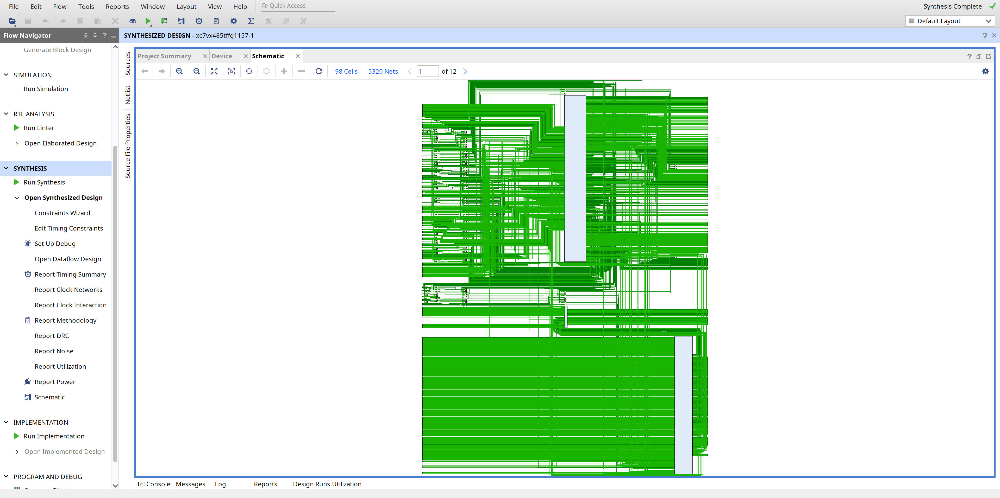
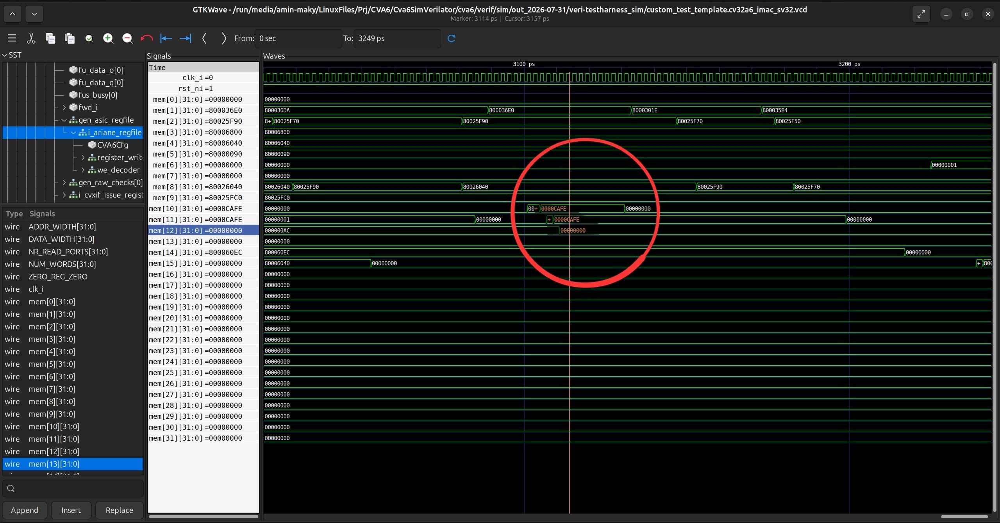
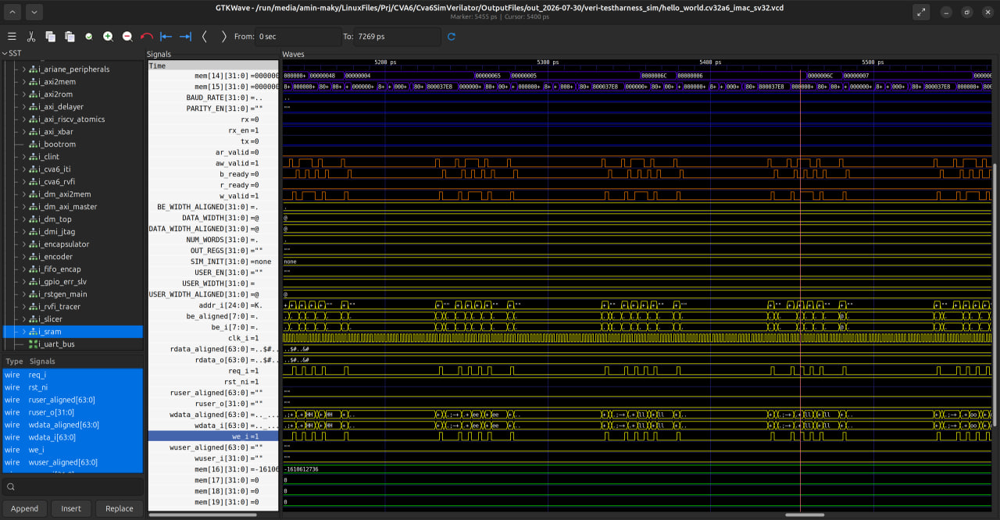
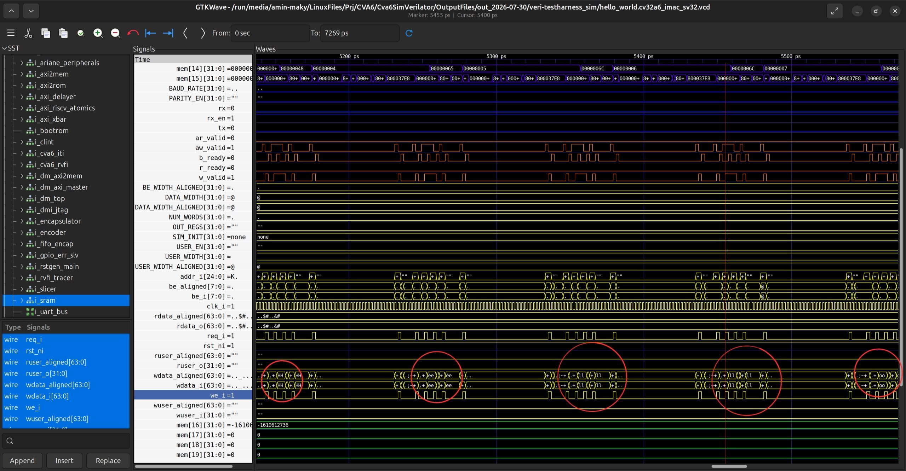

# CVA6 Simulation Flow

---

## 1. Post-Synthesis Simulation (Vivado / XSIM)

**Goal:** Run a functional simulation of the synthesized CVA6 netlist in XSIM, load a small RISC-V program into the core over its AXI instruction interface, and verify at the waveform level that the core actually fetches and executes it.

**Why this step exists.** Behavioral simulation of CVA6 does not work on a 16 GB machine. XSIM fails during elaboration with `[XSIM 43-3322] Static elaboration of top level Verilog design unit(s) in library work failed.` for every configuration, including the lightest one, because the core instantiates internal arrays whose static footprint exceeds available RAM. The workaround — and the subject of this document — is to **synthesize first**, then simulate the resulting netlist using **Post-Synthesis Functional Simulation**. This trades elaboration memory for compile time and gives a design that XSIM can actually load.

**Prerequisites.** The machine preparation and the synthesis run are already covered, and are *not* repeated here:

- **[`1-environment-setup.md`](1-environment-setup.md)** — Linux/WSL2, ext4, storage and RAM planning, swap configuration, Bender installation, and network access.
- **[`2-vivado-synthesis.md`](2-vivado-synthesis.md)** — project creation, `bender script vivado -t <cpu_version> > cva6_files.tcl`, and the full synthesis flow through the utilization report.

**What this section covers.** Three parts, in order:

- **1.1 AXI Testbench and Firmware Setup** — CVA6 has no internal program memory, so a SystemVerilog testbench is written to act as a virtual AXI RAM slave, and a minimal RISC-V program (`main.S` + `link.ld`) is compiled and converted to a memory image the testbench can preload.
- **1.2 Elaboration and Simulation in XSIM** — launching Post-Synthesis Functional Simulation, handling the flattened netlist ports (packed structs become auto-named nets), and running to the point where the core begins fetching.
- **1.3 Waveform Inspection** — reading the AXI read/write channels, confirming the FSM leaves `AR_IDLE`, and verifying the self-checking result: `noc_w_data[63:0] = 0x0000001e_0000001e` when `noc_w_valid` asserts.

**Expected cost and outcome.** Peak memory during simulation is roughly **10.8 GB**, and the initial `launch_simulation` takes about **8 minutes**. Bus activity begins at approximately **2,685,000 ns**, well after reset release. A successful run ends with an observed AXI write

---

### 1.1 AXI Testbench and Firmware Setup

Post-synthesis simulation of CVA6 introduces three interrelated challenges that do not exist in a pure RTL flow. First, Vivado's synthesis flattens every packed struct and interface into individual scalar nets, breaking the signal hierarchy that the RTL testbench depended on. Second, CVA6 has no internal instruction ROM — it is a bus-master that fetches code over AXI, so the simulation environment must supply a working AXI slave loaded with real firmware. Third, that firmware must be compiled, linked, and address-translated into a format that a SystemVerilog `$readmemh` call can consume directly.

The four subsections below address each of these problems in the order you encounter them when setting up the flow from scratch.

---

#### 1.1.1 The Flattened-Netlist Problem

**Why CVA6 uses struct types**

The CVA6 top module exposes a mix of plain-logic ports and struct-typed ports:

```systemverilog
input  logic                       clk_i,
input  logic                       rst_ni,
input  logic [CVA6Cfg.VLEN-1:0]   boot_addr_i,
// ...
output rvfi_probes_t               rvfi_probes_o,
output cvxif_req_t                 cvxif_req_o,
input  cvxif_resp_t                cvxif_resp_i,
output noc_req_t                   noc_req_o,
input  noc_resp_t                  noc_resp_i
```

Types like `noc_req_t` are `parameter type` packed structs — for example:

```systemverilog
parameter type noc_req_t = struct packed {
    axi_aw_chan_t  aw;
    logic          aw_valid;
    axi_w_chan_t   w;
    logic          w_valid;
    logic          b_ready;
    axi_ar_chan_t  ar;
    logic          ar_valid;
    logic          r_ready;
};
```

The project uses this style because it groups related signals under one named port, makes the RTL readable, and makes waveform debugging easier — you see `noc_req_o.ar_valid` instead of thirty anonymous wires.

**What synthesis does to them**

Vivado does not preserve struct types in the output netlist. Every field of every packed struct gets flattened into its own standalone wire, named by the tool. The struct hierarchy you see in RTL simply does not exist in the synthesized netlist.

**Extracting the ground truth**

Before writing any testbench code, dump the post-synthesis netlist:

```tcl
# In the Vivado Tcl console, after synthesis:
pwd                          ; # shows where the file will be written
write_verilog -force cva6_netlist.v
```

The resulting file will be large — on the order of five million lines for a full CVA6 configuration. That is normal. Open it, search for the top-level module declaration, and look at the port list.

**Understanding the names you find**

The first thing that will look strange is lines like this:

```systemverilog
output [31:0] \rvfi_probes_o[csr][jvt_q] ;
```

The `\` is Verilog's **escaped identifier** syntax. It means: everything between the backslash and the next whitespace character is the signal name, even if it contains characters — brackets, dots — that are normally illegal in an identifier. That trailing space before the `;` is part of the syntax, not a typo.

This is how Vivado encodes the flattened field names. The `noc_req_o` struct becomes a set of ports like:

```systemverilog
\noc_req_o[ar_valid]
\noc_req_o[aw_valid]
\noc_req_o[w_data][63]
\noc_req_o[w_data][62]
...
```

These escaped identifiers are the exact strings your testbench must use when wiring up the DUT. You cannot use the original struct port names — they no longer exist as ports.

**Impact on testbench instantiation**

A behavioral testbench connects struct ports cleanly:

```systemverilog
cva6_top dut (
    .clk_i      (clk),
    .noc_req_o  (axi_req),   // single struct connection — RTL sim only
    .noc_resp_i (axi_resp)
);
```

In post-synthesis simulation, that elaborates with an error because `noc_req_o` is not a port. Instead, every field must be connected individually:

```systemverilog
cva6_top dut (
    .clk_i                          (clk),
    .\noc_req_o[ar_valid]           (ar_valid_wire),
    .\noc_req_o[ar_bits_addr][31:0] (ar_addr_wire),
    // ... one line per flattened field
);
```

The practical workflow is: extract the port list from `cva6_netlist.v`, generate the connection list (a small script helps here), and drop it into the testbench. Section 1.1.4 shows how the AXI RAM testbench maps these flat ports onto its internal FSM.

---

#### 1.1.2 Firmware: `main-syn.S` and `link-syn.ld`

CVA6 has no internal ROM. When reset releases, the core immediately issues an AXI read at `PC_RESET` — it expects real, valid instructions to be waiting there. This means the simulation cannot start without a working firmware image preloaded into the testbench RAM.

The firmware has two jobs: give the core something meaningful to execute, and communicate the result back to the testbench without any dedicated signaling hardware. Both constraints are solved by the same one-line technique.

**The assembly program**

```asm
    .section .text
    .global _start

_start:
    li  x1, 10             # x1 = 0x0A
    li  x2, 20             # x2 = 0x14
    add x3, x1, x2         # x3 = 0x1E  ← expected result

    li  x4, 0x80001000     # target address
    sw  x3, 0(x4)          # write result into RAM

loop:
    j loop                 # park the core
```

The arithmetic is intentionally trivial — the interesting part is the `sw`. Because the testbench acts as the AXI RAM slave, it sees every write transaction on the bus. Writing a known value (`0x1E`) to a known address (`0x80001000`) is the handshake: when the testbench's FSM observes that write, it knows the core has finished executing and the result is correct. No interrupt lines, no extra ports, no out-of-band signaling — just a store that the AXI slave was always going to handle anyway.

The trailing `j loop` prevents the core from fetching past the end of the `.text` section into unmapped memory, which would generate bus errors and pollute the waveform.

**The linker script**

```ld
OUTPUT_ARCH("riscv")
ENTRY(_start)

SECTIONS
{
    . = 0x80000000;    /* CVA6 boot address */

    .text : { *(.text) }
    .data : { *(.data) }
    .bss  : { *(.bss)  }
}
```

The only non-obvious line is `. = 0x80000000`. This sets the load address of `.text` to match `PC_RESET` in the CVA6 configuration. If this address does not match, the core's first fetch hits the right physical location in the testbench RAM but the ELF symbol table disagrees with the actual instruction layout — the core executes garbage. Getting this address right is the entire purpose of the linker script.

**you can view the files in these directories:**

    CVA6-lab/                     # Main repository root
    └── benchmarks/               # Software only (formerly firmware)
        ├── src/                  # Source files (main-syn.S)
        └── linker/               # Linker scripts (link.ld, link-syn.ld)

---

#### 1.1.3 Building the Hex Image

Two source files exist at this point — `benchmarks/src/main-syn.S` and `benchmarks/linker/link-syn.ld`. The simulation testbench cannot consume either of them directly. It needs a Verilog hex file, loaded via `$readmemh`, with addresses that match its internal RAM layout. Getting there requires two commands.

---

**Method 1: Manual build**

**Compile and link**

```bash
riscv-none-elf-gcc \
    -march=rv32imac \
    -mabi=ilp32 \
    -nostdlib \
    -T benchmarks/linker/link-syn.ld \
    benchmarks/src/main-syn.S \
    -o firmware.elf
```

- `-march=rv32imac` and `-mabi=ilp32` match the CVA6 configuration being simulated.
- `-nostdlib` suppresses any C runtime startup; the linker script is the complete memory map.

**Extract the hex image**

```bash
riscv-none-elf-objcopy \
    -O verilog \
    --verilog-data-width=4 \
    --change-addresses -0x80000000 \
    firmware.elf \
    firmware_syn.hex
```

The flag that requires explanation is `--change-addresses -0x80000000`. The linker placed `.text` at `0x80000000` to satisfy `PC_RESET`. The testbench's `ram` array, however, is indexed from `0` — `ram[0]` holds the first instruction word, not `ram[0x20000000]`. Without the address shift, `$readmemh` either writes into an impossibly large index or produces an elaboration error. Subtracting `0x80000000` from every address before writing the hex file relocates the first instruction to offset `0x0`, which is exactly where `ram[0]` sits.

`--verilog-data-width=4` sets each hex record to four bytes, matching the 32-bit word layout of the testbench RAM.

After both commands:

firmware.elf   ← ELF binary; usable for Spike verification (see benchmarks/spike-checking/)

firmware_syn.hex   ← Verilog hex file, addresses shifted to start at 0x0


The testbench loads it with:

```systemverilog
$readmemh("path/to/firmware_syn.hex", ram);
```

Because addresses now start at `0`, `ram[0]` through `ram[N]` initialize exactly as expected, and the core's first fetch at `0x80000000` maps straight to `ram[0]`.

---

**Method 2: Automated Build via Makefile**

Both steps above are wrapped in the project's Makefiles. You can run the simulation from the repository root:

```bash
# From CVA6-lab/
make <sim-target>
```

Or equivalently, directly from the simulation workspace:

```bash
# From CVA6-lab/sim/
make <sim-target>
```

Where `<sim-target>` can be:
* `post-syn-sim-32`: Runs post-synthesis simulation for CV32A6.
* `post-syn-sim-64`: Runs post-synthesis simulation for CV64A6.

Exact target names are defined in `CVA6-lab/Makefile` and `CVA6-lab/sim/Makefile`. Running `make help` from either directory will list available targets if a help rule is present.

The practical value of this path is **substitutability**. The only file you ever need to touch to simulate a different program is `benchmarks/src/main-syn.S`. Replace its contents with any valid RV32IMAC assembly — a multiply sequence, a CSR read, a branch-heavy loop — keep `link-syn.ld` and the output filename unchanged, and the rest of the flow runs without modification. The Makefile recompiles, re-extracts, and the testbench picks up the new hex on the next simulation launch. The handshake mechanism from section 1.1.2 still applies: whatever the program computes, a `sw` to a known address at the end is the signal the testbench FSM waits for.

---

#### 1.1.4 The AXI RAM Testbench

The testbench (`cva6_tb.sv`) has one job: act as a fully-functional AXI subordinate so that the synthesized CVA6 netlist can boot, fetch instructions, and write a result back, all without any real hardware. Everything else in the file — clock generation, reset sequencing, memory initialization — exists in service of that one goal.

---

**Module-level parameters**

```systemverilog
`timescale 1ns / 1ps
```

The testbench runs at 1 ns resolution. The clock period is 10 ns, giving a 100 MHz simulation frequency. All timing discussions below use nanoseconds.

---

**Clock and reset**

```systemverilog
initial clk = 0;
always #5 clk = ~clk;          // 100 MHz

initial begin
    rst_n = 0;
    #100;
    rst_n = 1;
end
```

`rst_n` is active-low. The core is held in reset for 100 ns — ten clock cycles — then released. CVA6 begins its AXI fetch sequence shortly after `rst_n` goes high. Bus activity in practice starts around **2,685,000 ns**, which reflects the number of cycles the core needs to flush its pipeline from reset and issue its first read transaction.

---

**Memory model**

```systemverilog
logic [31:0] ram [0:16383];    // 64 KB, word-addressed
```

The RAM is 16,384 words of 32 bits each, giving 64 KB total. It is word-addressed: index `0` holds bytes `[3:0]` of the firmware image, index `1` holds bytes `[7:4]`, and so on.

Initialization happens in two steps:

```systemverilog
initial begin
    for (int i = 0; i < 16384; i++) ram[i] = 32'h0;
    $readmemh("../../sim/firmware_syn.hex", ram);
end
```

The explicit zero-fill before `$readmemh` matters. Any word not written by the hex file remains zero, which is a valid (though useless) instruction — `addi x0, x0, 0`. This prevents undefined-value propagation into the instruction decoder.

The path `../../sim/firmware_syn.hex` is relative to wherever Vivado launches simulation. Section 1.1.3 explains how the address-shifted hex file is produced so that `ram[0]` correctly holds the first instruction at `0x80000000`.

The addressing logic used everywhere in the FSMs below is `ram[addr[15:2]]`. Bits `[1:0]` are the byte offset within a word (dropped because the RAM is word-aligned) and bits `[15:2]` are the 14-bit word index into the 16 K-word array.

---

**AXI read channel — the fetch path**

CVA6 issues AXI read transactions to fetch instructions. The testbench handles them with a two-state FSM:

AR_IDLE  ──(ar_valid && ar_ready)──►  R_DATA
R_DATA   ──(r_valid && r_ready && r_last)──►  AR_IDLE


**`AR_IDLE`**

The testbench holds `ar_ready = 1` continuously in this state, meaning it accepts address requests immediately with no latency. When `ar_valid` asserts and the handshake completes, it captures:

- `r_addr ← ar_addr` — the starting address
- `r_len  ← ar_len`  — the burst length (`ARLEN`; 0 means one beat)
- `r_id   ← ar_id`   — the transaction ID, echoed back on the R channel
- `r_cnt  ← 0`       — beat counter reset

It then moves to `R_DATA`, drives `r_valid = 1`, and sets `r_last = (r_len == 0)` — if the burst is a single beat, the first beat is also the last.

**`R_DATA`**

Each cycle where `r_valid && r_ready` both assert, a beat is consumed. The testbench checks `r_last`:

- If `r_last` is set: the burst is complete. FSM returns to `AR_IDLE`, `ar_ready` returns to 1.
- Otherwise: `r_addr += 8` (AXI data width is 64 bits, so the address advances by 8 bytes per beat), `r_cnt` increments, and `r_last` is re-evaluated as `(r_cnt + 1 == r_len)`.

**Read data assembly**

The data path is a combinational assign:

```systemverilog
assign noc_r_data = (r_state == R_DATA)
    ? {ram[r_addr[15:2] + 1], ram[r_addr[15:2]]}
    : 64'b0;
```

Because the AXI data bus is 64 bits wide and the RAM words are 32 bits, each beat concatenates two adjacent words. `ram[r_addr[15:2]]` provides the low 32 bits; `ram[r_addr[15:2] + 1]` provides the high 32 bits. This gives a little-endian 64-bit word aligned to the AXI bus width.

When not in `R_DATA`, the output drives zero rather than X, which keeps the waveform readable.

---

**AXI write channel — the result path**

CVA6 issues AXI write transactions when the firmware executes `sw`. The testbench handles them with a three-state FSM:

AW_IDLE  ──(aw_valid && aw_ready)──►  W_DATA
W_DATA   ──(w_valid && w_ready && w_last)──►  B_RESP
B_RESP   ──(b_valid && b_ready)──►  AW_IDLE


**`AW_IDLE`**

`aw_ready = 1`. On address handshake, captures `w_addr ← aw_addr` and `w_id ← aw_id`, then moves to `W_DATA` with `w_ready = 1`.

**`W_DATA`**

This state performs the actual write, with byte-granularity support via `WSTRB`:

```systemverilog
if (w_strb[0]) ram[w_addr[15:2]][7:0]   <= w_data[7:0];
if (w_strb[1]) ram[w_addr[15:2]][15:8]  <= w_data[15:8];
if (w_strb[2]) ram[w_addr[15:2]][23:16] <= w_data[23:16];
if (w_strb[3]) ram[w_addr[15:2]][31:24] <= w_data[31:24];
// strobes [4..7] write ram[w_addr[15:2] + 1] similarly
```

The byte-enable logic is there to correctly handle `sb` and `sh` instructions, not just `sw`. For the full 32-bit store the firmware executes (`sw x3, 0(x4)`), `w_strb` will be `8'hFF` (all eight bytes enabled) and both adjacent RAM words are updated.

When `w_last` asserts on the same handshake, the FSM moves to `B_RESP`, clears `w_ready`, and raises `b_valid`. For burst writes, `w_addr += 8` and the beat counter advances before the last beat arrives.

**`B_RESP`**

The write response channel. `b_valid = 1` with `b_id = w_id` (the same transaction ID that arrived on the AW channel). When the manager asserts `b_ready` and the handshake completes, the FSM returns to `AW_IDLE`.

`b_resp = 2'b00` is hardwired to OKAY — the testbench never generates SLVERR or DECERR.

---

**The handshake in practice**

The firmware's `sw x3, 0(x4)` targets `0x80001000`. After the address shift, that maps to RAM word index `0x400` (word 1024 out of 16384). After the write FSM processes the transaction, `ram[0x400]` will hold `0x0000_001E`. The AXI write channel is the only observable output from the firmware — inspecting `ram[0x400]` in the waveform, or watching `noc_w_data[31:0]` when `noc_w_valid` asserts, is how you confirm the core executed correctly.

---

**CVA6 instantiation**

The DUT is instantiated at the bottom of the file:

```systemverilog
cva6 u_cva6 (
    .clk_i         (clk),
    .rst_ni        (rst_n),
    .boot_addr_i   (32'h8000_0000),
    .hart_id_i     (64'h0),
    .irq_i         (2'b0),
    .ipi_i         (1'b0),
    .time_irq_i    (1'b0),
    .debug_req_i   (1'b0),
    // AXI channels via escaped identifiers:
    .\noc_req_o[ar_valid]     (ar_valid),
    .\noc_req_o[ar_bits_addr] (ar_addr),
    // ...
    .\noc_resp_i[r][data]     (noc_r_data),
    .\noc_resp_i[r][valid]    (r_valid),
    // ...
);
```

`boot_addr_i = 0x80000000` is what sends the core's first fetch to `ram[0]`. All interrupt lines are tied off. The CVXIF coprocessor interface is fully disabled — `compressed_ready`, `issue_ready`, `accept`, and `result_valid` are all driven zero, telling the core that no coprocessor exists and it should handle every instruction itself.

The escaped-identifier connections (`.\noc_req_o[ar_valid]`, `.\noc_resp_i[r][data]`) are exactly the flattened port names extracted from the synthesized netlist, as described in section 1.1.1. Each one maps a scalar net from the flat netlist onto a named wire in the testbench.

---

**Termination**

There is no `$finish`, no timeout counter, and no self-checking assertion in the testbench. The simulation runs until you stop it. This is intentional: the firmware parks in `j loop` after writing the result, and the testbench has nothing to react to. The expected workflow is to run the simulation, observe the AXI write transaction in the waveform viewer, confirm `noc_w_data[31:0] = 0x0000_001E` when `noc_w_valid` asserts, then stop manually. Section 1.3 covers reading those waveforms in detail.

---

### 1.2 Elaboration and Simulation in XSIM

#### Vivado GUI Flow

In the **Flow Navigator** (left panel), click **Run Simulation → Run Post-Synthesis Functional Simulation**. Vivado elaborates the synthesized netlist and opens the simulator window. Add signals from the **Scope/Objects** panel to the waveform viewer, then click **Run All** (or press `F3`).

The testbench has no `$finish` — the simulation runs indefinitely. Stop it manually once you have seen what you need in the waveform.

#### Makefile (Batch Mode)

Running `make post-syn-sim-32` or `make post-syn-sim-64` launches Vivado in batch mode with no GUI. The waveform database is written to:

<project_root>/<project_name>.sim/sim_1/synth/func/xsim/


To inspect it, open Vivado separately and use **File → Open Waveform Database**, then load the `.wdb` file from that path.

---

### 1.3 Waveform Inspection

The simulation is only as useful as your ability to read its output. This section walks through the waveform in the order events actually occur: a long quiet boot phase, a burst of AXI read activity as the core fetches the firmware, and finally a single AXI write transaction that carries the computed result. That write is the pass/fail signal for the entire flow.

---

#### Optional sanity check: the schematic view

Before diving into waveforms, the synthesized design itself can be inspected. With the synthesized design open, the **Schematic** view shows the flattened netlist structure — a useful confirmation that synthesis actually produced a populated design rather than an optimized-away shell:



*Figure 1: Schematic view of the synthesized CVA6 netlist. The cell/net counts in the toolbar (98 cells, 5,320 nets on the first page of 12) confirm a real, populated design.*

This step is not required for simulation; skip it if you only care about functional verification.

---

#### Signals worth adding

The flattened netlist exposes thousands of nets, but only a handful matter for this test. From the **Objects** panel, add the testbench-level signals — they are already named cleanly because they live in `cva6_tb.sv`, not in the flattened DUT:

| Group | Signals | What they tell you |
|---|---|---|
| Control | `clk`, `rst_n` | Reset release at 100 ns |
| AXI read address | `noc_ar_valid`, `noc_ar_addr`, `noc_ar_len`, `noc_ar_ready` | Fetch requests from the core |
| AXI read data | `noc_r_valid`, `noc_r_data`, `noc_r_last`, `noc_r_ready` | Instructions returned by the RAM |
| Read FSM | `r_state`, `r_addr`, `r_cnt` | Testbench-side view of each burst |
| AXI write | `noc_aw_valid`, `noc_aw_addr`, `noc_w_valid`, `noc_w_data`, `noc_w_last` | The result write — the signal that matters |

Adding the testbench FSM state (`r_state`) is the single most useful debugging aid: it renders as a named enum (`AR_IDLE`, `R_DATA`) in the viewer, so you can see burst boundaries without decoding handshakes by eye.

---

#### Phase 1: The quiet boot window

Do not expect activity immediately after reset. `rst_n` releases at 100 ns, but the first AXI read transaction does not appear until approximately **2,685,100 ns**:


*Figure 2: Full simulation window. The bus stays idle for the first ~2.68 ms of simulated time; the burst of transitions on the `noc_ar_*` / `noc_r_*` channels and `r_state` leaving `AR_IDLE` marks the start of instruction fetch.*

This is the point where an impatient user concludes the simulation is broken and kills it. It is not broken. Run for at least **3,000,000 ns** (`run 3000000 ns` in the Tcl console, or several presses of `F3` with the default 6,500 ns step increased) before drawing any conclusions. If the bus is still flat after 3 ms of simulated time, *then* something is wrong — the usual suspects are a missing or mis-pathed `firmware_syn.hex` (all-zero RAM) or a `boot_addr_i` mismatch.

---

#### Phase 2: Instruction fetch

Once fetch begins, the read channel shows a repeating pattern that maps directly onto the testbench FSM from section 1.1.4:

1. `noc_ar_valid` pulses with an address in the `0x8000_00xx` range — the core requesting instructions.
2. `r_state` transitions `AR_IDLE → R_DATA`.
3. `noc_r_data` presents concatenated 64-bit words (two adjacent RAM entries per beat) while `noc_r_valid` is high.
4. `noc_r_last` closes the burst; `r_state` returns to `AR_IDLE`.

The addresses on `noc_ar_addr` should walk through the firmware image. Given how short the program is, only a few fetch bursts occur before the core reaches the `j loop` parking instruction — after which fetch activity becomes a tight repeating pattern (or stops entirely if the loop is served from the instruction cache).

---

#### Phase 3: The result write — pass/fail

The verification criterion is a single AXI write transaction. Scroll (or search for a transition on `noc_w_valid`) past the fetch activity:


*Figure 3: The result write. When `noc_w_valid` asserts, `noc_w_data[63:0]` carries `0x0000001e_0000001e` — the value 30 (0x1E) produced by `add x3, x1, x2` and stored by `sw x3, 0(x4)` to address `0x80001000`.*

Three things to check on this transaction:

- **`noc_aw_addr` = `0x0000_0000_8000_1000`** — the store target from the firmware. Any other address means the core executed something unexpected.
- **`noc_w_data` = `0x0000001e_0000001e`** — the expected value `0x1E` appears in both halves because the testbench RAM assembles 64-bit beats from two adjacent 32-bit words; the low 32 bits are the ones the `sw` actually wrote and the strobes select.
- **`noc_w_last` high on the same beat** — a single-beat burst, matching a lone `sw`.

Seeing this transaction is the definition of success for the entire flow: the synthesized netlist booted, fetched real instructions over AXI, executed them, and wrote the correct arithmetic result back over the bus. Once observed, stop the simulation manually — the firmware is parked in `j loop` and nothing further will happen.

---

## 2. Developer Simulation Flow (cva6.py + Verilator + Spike)

**Goal.** Build a complete mental model of the CVA6 simulation toolchain — from running the default test suite to writing custom programs, tracing RTL signals, and understanding the HTIF communication layer behind all bare-metal I/O.

**Why this section exists.** Section 1 validated a synthesized netlist against a pre-built testbench. This section inverts that: it hands you control over what the core executes, how you instrument it, and how you interpret what you see. The `cva6.py` script wraps compilation, Verilator elaboration, and Spike co-simulation into a single command — but that convenience hides several non-obvious layers. Understanding those layers is the difference between running a test and actually debugging hardware.

**Prerequisites.** The environment from [`1-environment-setup.md`](1-environment-setup.md) must be complete: RISC-V toolchain, Verilator, Spike, and the CVA6 repository all confirmed working. The Vivado flow from Section 1 is not required; this section is fully independent.

**What this section covers.**

- **2.1 Running the Default Test Suite** — verifying the toolchain by executing the smoke-test script and interpreting its pass/fail output.
- **2.2 Custom C and Assembly Programs** — writing, cross-compiling, and running your own programs; understanding the flags and linker script that make them compatible with CVA6.
- **2.3 Waveform Debugging & Architectural Signal Analysis** — generating `.vcd` traces from small assembly tests and navigating pipeline signals in GTKWave to observe fetch, decode, issue, and commit in real time.
- **2.4 C Code Analysis & HTIF Communication Mechanism** — disassembling output with `objdump`, tracing the path from `printf` down to a raw `tohost` write, and understanding why HTIF is the only I/O path available in a Verilator simulation.
- **2.5 Conclusion: End-to-End Proof of Functionality** — correlating C source, disassembly, waveform, and Spike reference output into a single coherent verification argument.

**Expected cost and outcome.** Sections 2.1–2.2 take roughly 30–60 minutes including compilation. Waveform exploration in 2.3 is open-ended; a first pass takes about an hour. After completing this section, every layer of the CVA6 execution path — from C source down to RTL toggle — is something you can directly observe and reproduce.

---

### 2.1 Running the Default Test Suite (smoke test)

The smoke test is a quick validation suite that confirms the core, toolchain, and simulators are working correctly. It runs a small set of regression tests and compares Verilator traces against Spike.

**Choose your target configuration** and run the corresponding smoke test script:

```bash
bash verif/regress/smoke-tests-<cpu_version>.sh
```

Replace `<cpu_version>` with one of the following:

- **`cv32a65x`** — 32-bit core with extensions
- **`cv32a6_imac_sv32`** — 32-bit core with I, M, A, C extensions and Sv32 MMU
- **`cv64a6_imafdc_sv39`** — 64-bit core with I, M, A, F, D, C extensions and Sv39 MMU

**Example:**

```bash
bash verif/regress/smoke-tests-cv32a6_imac_sv32.sh
```

---

#### What the Smoke Test Does

The smoke test:

1. **Compiles test programs** using the RISC-V toolchain
2. **Runs them on Verilator** (hardware simulation)
3. **Runs them on Spike** (ISA reference simulator)
4. **Compares execution traces** between the two
5. **Reports PASS/FAIL** for each test

If all tests pass, your environment is correctly configured.

---

### 2.2 Custom C and Assembly Programs

After successfully passing the smoke tests, you can now run your own custom test programs on the CVA6 core. This section covers compiling C and assembly code, generating waveforms for debugging, and analyzing simulation results.

#### Setting Up Simulation Environment

Navigate to the simulation directory and configure the environment:

```bash
cd cva6/verif/sim
source verif/sim/setup-env.sh
```

Set the simulators to use:

```bash
export DV_SIMULATORS=veri-testharness,spike
```

Enable parallel builds:

```bash
export NUM_JOBS=$(nproc)
```

---

#### Enabling Waveform Output

To generate VCD waveform files for debugging in GTKWave, you must enable trace generation before running the simulation.

**Set trace environment variables:**

```bash
export TRACE_FAST=1
unset TRACE_COMPACT
```

- **`TRACE_FAST=1`:** Enables fast VCD waveform generation
- **`unset TRACE_COMPACT`:** Disables compact trace mode (discovered through experimentation; not documented in official README)

> **Why `unset TRACE_COMPACT`?** By default, the simulation framework may use a compact trace format that is not compatible with GTKWave. Unsetting this variable ensures full VCD output.

---

#### Running a Custom C Test

The CVA6 verification framework uses `cva6.py` to orchestrate test compilation, simulation, and trace comparison.

**Example: Running a simple C program**

```bash
cd verif/sim
python3 cva6.py --target cv32a6_imac_sv32 --iss=$DV_SIMULATORS --iss_yaml=cva6.yaml \
--c_tests ../tests/custom/hello_world/hello_world.c \
--linker=../../config/gen_from_riscv_config/linker/link.ld \
--gcc_opts="-static -mcmodel=medany -fvisibility=hidden -nostdlib \
-nostartfiles -g ../tests/custom/common/syscalls.c \
../tests/custom/common/crt.S -lgcc \
-I../tests/custom/env -I../tests/custom/common"
```

**Command breakdown:**

- **`--target cv32a6_imac_sv32`:** Specifies the CVA6 core configuration (32-bit with I, M, A, C extensions and Sv32 MMU)
- **`--iss=$DV_SIMULATORS`:** Uses both Verilator and Spike for simulation and comparison
- **`--iss_yaml=cva6.yaml`:** Configuration file for the ISA simulator
- **`--c_tests`:** Path to your C source file
- **`--linker`:** Linker script that defines memory layout
- **`--gcc_opts`:** Compilation flags:
  - **`-static`:** Static linking (no dynamic libraries)
  - **`-mcmodel=medany`:** Medium any code model for RISC-V (allows access to full address space)
  - **`-fvisibility=hidden`:** Hide symbols by default
  - **`-nostdlib -nostartfiles`:** Don't link standard library or default startup files (bare-metal)
  - **`-g`:** Include debug information
  - **`syscalls.c` and `crt.S`:** Required runtime support files for syscalls and hardware initialization.

---

#### Running a Custom Assembly Test

To run assembly-based tests, replace `--c_tests` with `--asm_tests`.

```bash
python3 cva6.py --target cv32a6_imac_sv32 --iss=$DV_SIMULATORS --iss_yaml=cva6.yaml \
--asm_tests ../tests/custom/hello_world/custom_test_template.S \
--linker=../../config/gen_from_riscv_config/linker/link.ld \
--gcc_opts="-static -mcmodel=medany -fvisibility=hidden -nostdlib \
-nostartfiles ../tests/custom/common/syscalls.c \
../tests/custom/common/crt.S -lgcc \
-I../tests/custom/env -I../tests/custom/common"
```

---

#### Cleaning Simulation Outputs

If you need to re-run a simulation cleanly, you must remove the generated output directories, which contain the VCD files, logs, and compiled binaries from previous runs.

```bash
cd verif/sim
rm -rf out_<date_timestamp>
```

---

### 2.3 Waveform Debugging & Architectural Signal Analysis

After a successful simulation, a `.vcd` file is generated in the `out_...` directory. Open it with GTKWave to view the signal traces:

```bash
gtkwave <path_to_vcd_file>
```

The next challenge is understanding what happened inside the processor. This section covers how to navigate the CVA6 architecture in GTKWave, locate critical hardware modules, and interpret register file activity during program execution.

---
#### Why Simple Tests Matter for Debugging

While `hello_world.c` demonstrates full functionality, it generates **thousands of signal transitions** across the entire processor pipeline, making manual inspection extremely difficult.

For learning and debugging, use **minimal assembly tests** that execute only a few instructions. This allows you to:

- Clearly see the effect of each instruction on the register file
- Understand pipeline stages without noise
- Verify arithmetic/logic operations manually
- Distinguish between your code and startup/shutdown routines

---

#### Example: A Minimal XOR Test

Create a simple assembly test that performs an XOR operation:

```assembly
.globl main
main:
  # Core test logic
  li a0, 0xCAFE;       # Load 0xCAFE into register a0
  li a1, 0xCAFE;       # Load 0xCAFE into register a1
  xor a2, a0, a1;      # XOR a0 and a1, store result in a2
  beqz a2, pass;       # Branch to 'pass' if a2 == 0

fail:
  li a0, 0x0;
  jal exit;

pass:
  li a0, 0x0;
  jal exit;
```

**Expected behavior:**

- `a0` and `a1` both receive `0xCAFE`
- `a2 = a0 XOR a1 = 0x00000000` (XOR of identical values is always zero)
- Branch to `pass` is taken because `a2 == 0`

> **Note:** CVA6's verification framework uses **Spike** (a RISC-V ISA simulator) as a golden reference. Spike extracts expected signal values from your code and compares them against Verilator's RTL simulation. If they match, the test passes. However, for deeper understanding, we analyze the waveforms manually rather than relying solely on automated pass/fail results.

---

#### Navigating the CVA6 Architecture in GTKWave

CVA6 is an **out-of-order processor**, meaning its pipeline structure differs from simple in-order designs. The register file is not located in the Decode stage — it resides in the **Issue stage**.

**Hierarchical path to the register file:**

    TOP
    └── ariane_testharness      (top-level testbench)
        └── i_ariane            (CVA6 core wrapper)
            └── i_cva6          (CVA6 processor core)
                └── issue_stage_i               (Issue stage)
                    └── i_issue_read_operands   (Operand read logic)
                        └── gen_asic_regfile
                            └── i_ariane_regfile   (Register file)


**How to locate it in GTKWave:**

1. Open your VCD file in GTKWave
2. In the **SST (Signal Search Tree)** panel on the left, expand modules in this order:
   - `TOP`
   - `ariane_testharness`
   - `i_ariane`
   - `i_cva6`
   - `issue_stage_i`
   - `i_issue_read_operands`
   - `gen_asic_regfile`
   - `i_ariane_regfile`

3. Click on `i_ariane_regfile` to see its signals in the **Signals panel** below
  
*Figure 1: Navigating the CVA6 module hierarchy to locate the register file in GTKWave*
---

#### Selecting Register File Signals

The register file contains an array called `mem[0..31]`, where each entry corresponds to a RISC-V register:

- `mem[0]` = `x0` (hardwired to zero)
- `mem[10]` = `a0` (first argument register)
- `mem[11]` = `a1` (second argument register)
- `mem[12]` = `a2` (third argument register)
- ...and so on

**Insert these signals into the waveform viewer:**

1. Select `clk_i` (clock signal)
2. Select `rst_ni` (active-low reset)
3. Select `mem[10]` (register `a0`)
4. Select `mem[11]` (register `a1`)
5. Select `mem[12]` (register `a2`)
6. Click **Insert** to add them to the waveform view


*Figure 2: Register file signals validating the functional integrity of the design (pay close attention to the highlighted signals).*

> **Tip:** The magnifying glass icon in GTKWave is for **searching within the currently selected module's signals**, not for navigating the module hierarchy.

---

#### Analyzing the Waveform

Open your VCD file:

```bash
gtkwave <path_to_vcd>/custom_test_template.cv32a6_imac_sv32.vcd
```

**What to observe:**

#### 1. **Initialization (Startup Code)**

Before your `main` function executes, the register file experiences **many transitions**. This is caused by:

- **`crt.S` (C Runtime):** Code that initializes the stack pointer (`sp`), global pointer (`gp`), and zeroes out `.bss` segments before jumping to `main`.
- **Syscalls:** If your code uses standard library functions (like `printf`), the call is routed through the custom `write` function in `syscalls.c`, which sends data directly via HTIF (memory-mapped write to `tohost`) — not through a standard OS-level `ECALL`.

*You will see `a0`, `a1`, and `a2` change frequently during this setup phase.*


*Figure 3: Heavy register activity during initialization before `main` execution*

#### 2. **Execution (Main Code)**

Once the program reaches `main` (the point of interest):

1. **`li a0, 0xCAFE`:** Monitor `mem[10]`. It should jump to `0x0000CAFE` at the next rising clock edge.
2. **`li a1, 0xCAFE`:** Monitor `mem[11]`. It should jump to `0x0000CAFE`.
3. **`xor a2, a0, a1`:** Monitor `mem[12]`. It should become `0x00000000`.

*If these transitions occur exactly as predicted, your RTL implementation of the Integer Unit and Register File is functioning correctly.*

---

### 2.4 C Code Analysis & HTIF Communication Mechanism

After validating the basic functionality of CVA6 with simple assembly tests, the next step is to understand how **high-level C code translates to hardware execution** and how the simulated processor communicates with the outside world for I/O operations like `printf`.

This section covers:
- **Disassembly analysis:** Reading the compiled object dump to trace variable-to-register mapping
- **Loop verification:** Monitoring register values to confirm correct program flow
- **HTIF discovery:** Understanding why UART signals remain idle and how bare-metal `printf` actually works

---

#### Test Program: A Simple Loop with Accumulation

To validate correct execution, we'll use a C program that performs an **accumulation loop** before exiting:

```c
#include <stdint.h>
#include <stdio.h>

int main(int argc, char* argv[]) {
  
  printf("%d: Hello World !", 0);
  
  int a = 0;
  for (int i = 0; i < 5; i++)
  {
    a += i;
  }
  return 0;
}
```

**Expected behavior:**

- `a` starts at `0`
- Loop iterates 5 times: `i = 0, 1, 2, 3, 4`
- Each iteration: `a += i`
- Final value: `a = 0 + 1 + 2 + 3 + 4 = 10 (0x0000000A)`

By identifying which **registers** the compiler assigns to `a` and `i`, we can monitor them in GTKWave and verify that the hardware correctly executes the loop.

---

#### Generating the Disassembly (Object Dump)

To see how the compiler translated our C code into RISC-V assembly, we generate a **disassembly** using `objdump`:

```bash
$RISCV/bin/riscv-none-elf-objdump -d <path_to_elf_file> > hello_world.dump
```

The `.dump` file contains:
- **Memory addresses** (left column)
- **Machine code** (hex, middle column)
- **Assembly instructions** (right column)

> **Note:** This file is **large** because a single `printf` call expands into hundreds of assembly instructions for string formatting, memory operations, and system call setup.

---

#### Locating the `main` Function

Search for the `main` function in the dump file:

```assembly
80003000 <main>:
80003000:  7179                  add   sp,sp,-48
80003002:  d606                  sw    ra,44(sp)
80003004:  d422                  sw    s0,40(sp)
80003006:  1800                  add   s0,sp,48
80003008:  fca42e23              sw    a0,-36(s0)
8000300c:  fcb42c23              sw    a1,-40(s0)
80003010:  4581                  li    a1,0
80003012:  00002517              auipc a0,0x2
80003016:  fee50513              add   a0,a0,-18 # 80005000 <_end_text>
8000301a:  675000ef              jal   80003e8e <printf>
8000301e:  fe042623              sw    zero,-20(s0)
80003022:  fe042423              sw    zero,-24(s0)
80003026:  a829                  j     80003040 <main+0x40>
80003028:  fec42703              lw    a4,-20(s0)
8000302c:  fe842783              lw    a5,-24(s0)
80003030:  97ba                  add   a5,a5,a4
80003032:  fef42623              sw    a5,-20(s0)
80003036:  fe842783              lw    a5,-24(s0)
8000303a:  0785                  add   a5,a5,1
8000303c:  fef42423              sw    a5,-24(s0)
80003040:  fe842703              lw    a4,-24(s0)
80003044:  4791                  li    a5,4
80003046:  fee7d1e3              bge   a5,a4,80003028 <main+0x28>
8000304a:  4781                  li    a5,0
8000304c:  853e                  mv    a0,a5
8000304e:  50b2                  lw    ra,44(sp)
80003050:  5422                  lw    s0,40(sp)
80003052:  6145                  add   sp,sp,48
80003054:  8082                  ret
```

**Column structure:**
- **Left:** Memory address (e.g., `80003008`)
- **Middle:** Machine code in hex (e.g., `fca42e23`)
- **Right:** Assembly instruction (e.g., `sw a0,-36(s0)`)

---

#### Analysis: Identifying Register Assignments

##### **Section 1: Prologue and `printf` Call (80003000 – 8000301a)**

- **80003000 – 80003006:** Stack frame setup. Allocates 48 bytes on the stack, saves return address (`ra`) and frame pointer (`s0`).
- **80003008 – 8000300c:** Stores function arguments `argc` and `argv` onto the stack at offsets `-36(s0)` and `-40(s0)`.
- **80003010:** Loads `0` i.e., the first argument of `printf` (`%d: Hello World !`, 0) into `a1`.
- **8000301a:** Calls `printf` (address `80003e8e`).

##### **Section 2: Loop Initialization (8000301e – 80003026)**

- **8000301e:** Sets local variable `a` to `0` (stored on stack at `-20(s0)`).
- **80003022:** Sets loop index `i` to `0` (stored on stack at `-24(s0)`).
- **80003026:** Jumps unconditionally to `80003040` to evaluate the loop condition.

##### **Section 3: The Loop (80003028 – 8000303c)**

This is where the actual accumulation happens:

- **80003028:** Loads variable `a` into register `a4`.
- **8000302c:** Loads variable `i` into register `a5`.
- **80003030:** `add a5, a5, a4` -> Adds `i` to `a` and stores result in `a5`.
- **80003032:** Stores the new `a` back to the stack `-20(s0)`.
- **80003036:** Loads `i` into `a5`.
- **8000303a:** `add a5, a5, 1` -> Increment `i`.
- **8000303c:** Stores incremented `i` back to the stack `-24(s0)`.

> **Compiler register reuse — `a5`:** Notice that `a5` serves a dual role within each iteration. At `0x80003030`, it transiently holds the running sum (`a + i`). At `0x8000303a`, the compiler reuses the same register as the loop counter for incrementing `i`. In GTKWave, `mem[15]` will therefore toggle between the partial accumulation result and the updated index within a single clock-cycle window. This is a direct artifact of GCC's register allocator and is expected, correct behavior.

##### **Section 4: Loop Condition (80003040 – 80003046)**

- **80003040:** Loads the updated `i` into `a4`.
- **80003044:** Loads `4` into `a5`.
- **80003046:** `bge a5, a4, 80003028` -> If `4 >= i`, branch back to the start of the loop (`80003028`).

---

#### The HTIF (Host-Target Interface) Mystery

If you inspect the GTKWave signals, you will notice that the `UART_TX` line is **completely silent** (stays high/idle).

**Why?**
The CVA6 environment is set up for bare-metal simulation. It doesn't include a fully synthesized UART peripheral by default. Instead, it uses **HTIF** to communicate with the host.

1.  **Memory-Mapped Write:** When `printf` executes, it performs a store operation to a specific memory address (often referred to as `tohost`).
2.  **Simulation Detection:** The CVA6 Verilator testbench monitors the memory bus. When it detects a store to the `tohost` address, it interprets the data as a character or command and prints it to the simulation console.
3.  **Efficiency:** This allows fast console output without needing to simulate the timing of a slow UART serial interface.


*Figure 4: Comparing I/O candidate modules. The `UART` bus (blue) stays idle while `i_sram` (yellow) shows the actual memory-mapped write activity used by HTIF.*

**Debug Tip:**
If your code hangs before printing, check the `tohost` signal in GTKWave. If you see the value `0x00000001` or similar being written to that address, the processor is trying to send data via HTIF, but the host might be waiting for more data, or the program might have crashed before completing the transfer.

---

#### Verification Steps in GTKWave

1.  **Add Signals:**
    *   Find `i_issue_read_operands` in the hierarchy.
    *   Monitor the inputs/outputs corresponding to register reads (`rs1`, `rs2`) and writes (`rd`).
2.  **Monitor Registers `a4` and `a5`:**
    *   Watch their transitions as the simulation passes address `80003030` (the add instruction).
    *   Confirm that `a5` correctly updates to `1, 3, 6, 10`.
    
*Figure 5: Register file activity showing `mem[14]` (a4) and `mem[15]` (a5) accumulating the loop values (1, 3, 6, 10) exactly as predicted from the disassembly.*

3.  **Confirm Loop Termination:**
    *   Watch the branch instruction at `80003046`.
    *   Verify that once `a4` (the index) exceeds `4`, the branch is *not* taken, and the program flows to the `ret` instruction.

---

#### Final Verification: Catching the ASCII on the Bus

Verifying the loop registers (`a4`/`a5`) proves the **computation** is correct, but it doesn't prove the **I/O path** works. The final piece of evidence is catching the actual `"Hello World !"` characters as raw bytes on the memory write bus.

Since `printf` in this bare-metal environment ultimately writes characters through memory-mapped HTIF stores, each character of the string must appear — as its ASCII code — on the write-data bus (`wdata_i`) of the memory subsystem.

**ASCII Reference for the Expected String:**

| Char | `H`  | `e`  | `l`  | `l`  | `o`  | ` `  | `W`  | `o`  | `r`  | `l`  | `d`  | ` `  | `!`  |
|------|------|------|------|------|------|------|------|------|------|------|------|------|------|
| Hex  | 0x48 | 0x65 | 0x6C | 0x6C | 0x6F | 0x20 | 0x57 | 0x6F | 0x72 | 0x6C | 0x64 | 0x20 | 0x21 |

**Observation in GTKWave:**

Between roughly `5200 ps` and `5500 ps`, the register file entries `mem[14]` (a4) and `mem[15]` (a5) and the memory bus show the character bytes moving through the datapath: `0x48`, `0x65`, `0x6C`, `0x6C`, `0x6F` — spelling out `H`, `e`, `l`, `l`, `o`.


*Figure 6: The ASCII codes of "Hello" (0x48, 0x65, 0x6C, 0x6C, 0x6F) captured on the write-data path. Each byte matches the reference table above, proving the string physically traversed the hardware.*

> **Note:** Even though we configured CVA6 as a 32-bit core (`cv32a6`), the underlying memory bus interface (e.g., AXI) remains 64 bits wide. Depending on how the runtime buffers the string, a single bus transaction may carry **multiple characters packed into one word** (e.g., `0x6C6C65480000...`), or characters may appear one-by-one in the low byte. Either way, the ASCII values are identifiable by inspecting the byte lanes of `wdata_i`.

**Clarifying the `tohost` value:**

A common point of confusion: near the end of simulation, `tohost` is written with the value `1`. This is **not** character data. In the HTIF protocol, writing `(exit_code << 1) | 1` to `tohost` signals program termination — so a value of `1` means `exit_code = 0`, i.e., **the program finished successfully** (matching `return 0;` in `main`).

---

### 2.5 Conclusion: End-to-End Proof of Functionality

At this point, the verification chain is complete at every level of abstraction:

1. **Software level:** The C source compiles to the expected RISC-V assembly (confirmed via `objdump`).
2. **Computation level:** The register file shows `a4`/`a5` accumulating `1, 3, 6, 10` — the loop executes exactly as the disassembly predicts (Figure 5).
3. **I/O level:** The ASCII bytes of `"Hello World !"` are physically observed on the memory write bus (Figure 6), confirming the HTIF path from `printf` down to RTL signals.
4. **Termination level:** `tohost = 1` confirms a clean exit with code `0`.

This closes the loop between **what the programmer wrote** and **what the silicon (simulated RTL) actually did** — an end-to-end proof that the CVA6 core, the toolchain, and the simulation environment all function correctly together.

---

## 3. Manual Simulation from Scratch (Standalone Verilator)

---

### 3.0 Overview & Motivation

#### Background

> The previous two sections ([Developer Simulation Flow](#2-developer-simulation-flow-cva6py--verilator--spike) and [Post-Synthesis Simulation](#1-post-synthesis-simulation-vivado--xsim) covered the automated simulation flow and post-synthesis verification. Both are useful for confirming correctness, but neither exposes what is actually happening cycle-by-cycle inside the core.

This guide takes a different approach: build the simulation by hand, instrument every layer of the stack, and use a co-simulation reference to validate the results. By the end of this guide you will have:

- A working Verilator simulation driven from a custom C++ testbench
- A **Golden Reference** trace generated by Spike (the RISC-V ISA simulator)
- A self-checking flow that compares every committed instruction against that reference
- A waveform you can open in GTKWave and trace all the way from fetch to writeback

#### The Two Questions That Motivated This Work

Before building anything, two practical questions had to be answered:

- **How do you feed all of CVA6's submodules to Verilator?** CVA6 spans dozens of SystemVerilog files with deep package and interface dependencies. Listing them by hand is not feasible and breaks whenever the source tree changes.
- **Does the Verilator testbench have to be written in C++?** Verilator compiles RTL into a C++ model, so the driver must be C++ or SystemC. A pure HDL testbench is not an option here.

Both answers shape the tooling choices in this guide: **Bender** solves the first problem by generating a complete, dependency-ordered file list; a custom **C++ testbench** solves the second.

>**Note:** This entire workflow targets the `cv32a6_imac_sv32` configuration of CVA6. Command flags, port names, and linker settings in this guide are specific to that target. Adapting to a 64-bit configuration requires changes to the Bender target flag, the ISA string passed to Spike, and the linker boot address.

---

### 3.1 Dependency Generation via Bender

---

### 3.2 CVA6 AXI Wrapper (`cva6_axi_wrapper.sv`)

---

### 3.3 Spike as Instruction-Level Reference (`--log-commits`)

---

### 3.4 Firmware Suite & Linker Script

---

### 3.5 Self-Checking C++ Testbench

---

### 3.6 Makefile Automation

---

### 3.7 Issue Stage Deep Dive (Scoreboard, RAW Hazards, Dual-Issue, Waveform Tracing)
