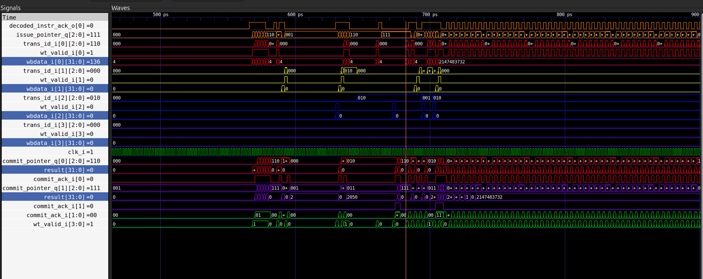
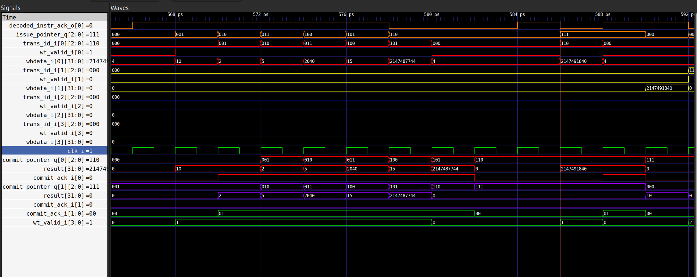
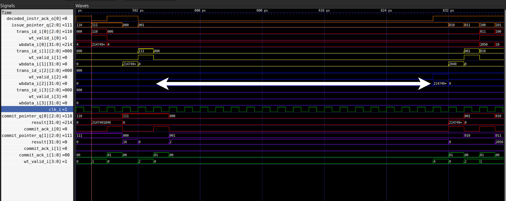
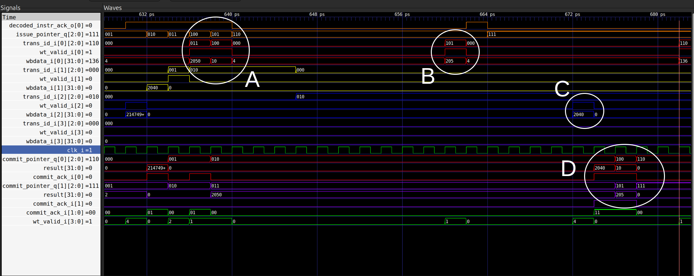

# **Order in the Middle: RTL & Waveform Analysis of the CVA6 Issue Stage**

---

This document is a ground-up analysis of the Issue Stage in the CVA6 RISC-V 
processor, targeting the cv32a6_imac_sv32 configuration — a 32-bit core with 
the IMAC extension set and sv32 virtual memory. The analysis is RTL-first: every 
claim about pipeline behavior is traced back to source files, and every 
architectural assertion is then confirmed against live GTKWave waveforms.

CVA6's Issue Stage sits at the heart of a deliberate contract: instructions enter in program order, execute in whatever order the hardware allows, and retire in program order. Keeping that contract intact across out-of-order write-backs is the job of two modules — the Scoreboard, which acts as a circular ledger tracking every in-flight instruction, and Issue Read Operands, which acts as a gatekeeper that only lets an instruction through when its operands are safe and its execution unit is free.

The document walks through both modules in detail: data structures, pointer 
arithmetic, hazard detection, operand forwarding, and the exact handshake that 
turns allocation into issue in a single cycle. A custom RISC-V test program then 
puts the theory to the waveform, catching a 19-cycle store-buffer stall, a 
6-cycle out-of-order win for a division over a load, and a dual-commit drain 
that retires two instructions per cycle in strict program order.

---

# Zooming Into the Core: The Issue Stage

Up to this point, we have treated CVA6 as a verified black box: instructions go in, commits come out, and Spike confirms every architectural state change. Now that we trust the core, it is time to open it up. This section zooms into the **Issue Stage** — the central traffic controller of the pipeline. 

CVA6 features an **In-Order Issue, Out-of-Order Execution, and In-Order Commit** architecture. The Issue Stage is the primary engine behind this capability: it decides *when* an instruction is allowed to execute, keeps track of out-of-order completions from the execution units, and ensures that the final architectural state is retired strictly in program order.

## 1. The Big Picture: CVA6 Top-Level Structure

`cva6.sv` — the top-level module instantiated by our wrapper in [Section 3.2 of `3-simulation-flow.md`](./3-simulation-flow.md#32-cva6-axi-wrapper-cva6_axi_wrappersv) — is not a monolith. It acts as a thin structural framework wiring together one module per pipeline stage. CVA6 is fundamentally a 6-stage pipeline:

| Stage | Module | Role |
|---|---|---|
| PC Generation | `frontend` | Selects the next PC (branch prediction, exceptions, ...) |
| Instruction Fetch | `frontend` | Talks to the I-cache, delivers raw instruction bytes |
| Instruction Decode | `id_stage` | Decompresses and decodes into an internal format |
| **Issue** | `issue_stage` | Scoreboard, operand read, and dispatch to functional units |
| Execute | `ex_stage` | ALU, branch unit, LSU, multiplier/divider, CSR buffer |
| Commit | `commit_stage` | Retires instructions in order, updates architectural state |

The first three stages form the *frontend*: their sole job is to fetch and deliver a stream of decoded instructions in strict program order. The real magic happens at the boundary between the `id_stage` and `ex_stage`, which is managed entirely by the `issue_stage`. 

According to the CVA6 developer documentation, the execution flow can be split into four distinct steps: **Issue, Read Operands, Execute, and Write-Back**. Strikingly, the Issue Stage owns three of these. It issues instructions in order, fetches their operands, and later collects their out-of-order results (Write-Back) via the Scoreboard. Only the physical computation itself lives in the `ex_stage`.

This is why the Issue Stage is the natural place to zoom in. It houses the CPU Register File and the Scoreboard, meaning every operand an instruction ever consumes, every data dependency resolved, and every forwarding path routed passes directly through it.

## 2. Inside the Issue Stage: Scoreboard and Operand Read

Opening `issue_stage.sv` reveals that the module itself is surprisingly thin:
it is mostly an interface layer that wires together two submodules which do
the actual work. The **Scoreboard** acts as the ledger of the pipeline — it
tracks every instruction currently in flight, from the moment it is accepted
from decode until the moment it retires. The **Issue Read Operands** unit acts
as the dispatcher — it fetches source operands from the register file (or
forwards them from results still in flight), checks that the target functional
unit is ready, and fires the instruction into the Execute stage.

Between them, these two submodules implement all three ordering guarantees
promised in the section title: instructions *issue* in order (the scoreboard
hands them out one at a time, in program order), *execute* out of order (each
functional unit finishes at its own pace and writes back whenever it is done),
and *commit* in order (the scoreboard holds every result until all older
instructions have retired first).

The rest of this section walks through that machinery step by step. Section
2.1 gives an overview of the `issue_stage` top module and how the two
submodules are wired together. Sections 2.2 and 2.3 then zoom into the
Scoreboard and the Issue Read Operands unit individually. Finally, Section
2.4 closes the loop by following a completed result on its way back:
how the scoreboard collects out-of-order write-backs and drains them, in
program order, toward the Commit stage.

### 2.1 Issue Stage Overview

Looking inside `issue_stage.sv` confirms what the introduction promised: the
file is a structural wrapper, not a monolithic block of logic. It instantiates
exactly two submodules — the **Scoreboard** and the **Issue Read Operands
(IRO)** unit — and spends most of its lines simply wiring them to each other
and to the rest of the pipeline.

Seen from the outside, the module talks to three neighbors:

- **Decode side** — it receives decoded instructions from `id_stage`, in
  program order, and acknowledges each one it accepts.
- **Execute side** — it sends the instruction payload and its operands to
  `ex_stage`, together with a "go" signal for the selected functional unit,
  and later receives the tagged results as they come back — in whatever order
  the functional units happen to finish.
- **Commit side** — it presents completed instructions, in program order, to
  `commit_stage`, and receives the register-file write ports when those
  instructions finally retire.

Internally, the division of labor between the two submodules is clean. The
Scoreboard faces the decode and commit sides: it accepts each new instruction
into its ledger, records every result returning from Execute, and drains
finished instructions in order toward Commit. The Issue Read Operands unit
faces the execute side: it takes the oldest not-yet-issued instruction offered
by the Scoreboard, gathers its source operands, and fires it into `ex_stage`
once the target functional unit is ready. A simple valid/acknowledge handshake
between the two marks the exact moment an instruction stops *waiting* and
becomes officially *issued*.

This layout matches the four-step flow described by the developers — Issue,
Read Operands, Execute, Write-Back. Three of those four steps live here:
issuing and operand reading on the way out, and write-back collection on the
way in. Only the physical computation itself happens elsewhere, inside the
functional units of the Execute stage.

The block diagram below puts everything we have discussed so far into a single
picture, at three levels of zoom:


**Level 1 — System view (top).** The CVA6 processor talks to main memory (RAM)
through an AXI-based memory access interface, used both for fetching
instructions and for reading/writing data.

**Level 2 — Pipeline view (middle).** The forward path runs from the Frontend
(PC generation and fetch) through the ID Stage (decode) into the **Issue
Stage** (red box), which prepares operands and hands instructions to the
Execute Stage; completed instructions then retire through the Commit Stage.
The dashed `resolved_branch` feedback path returns to the Frontend so the PC
can be corrected whenever a branch resolves differently than predicted.

**Level 3 — Inside the Issue Stage (bottom).** This is `issue_stage.sv` as
described in the previous section: a wrapper around two submodules.

- **Scoreboard (left).** On the decode side it accepts instructions via
  `decoded_instr_i` / `orig_instr_i` and confirms each accepted one with
  `decoded_instr_ack`. On the write-back side it receives the out-of-order
  results from the functional units — data (`wbdata_i`), exceptions
  (`ex_ex_i`) and, crucially, the transaction ID (`trans_id_i`) that tells it
  which table entry each result belongs to. On the commit side it hands
  finished instructions to the Commit Stage in program order via
  `commit_instr_o`, using `commit_drop_o` for instructions that must be
  cancelled (e.g. after a branch mispredict).
- **Issue Read Operands (right).** This unit logically contains the Register
  File. From the Commit Stage it receives the register-file write ports
  (`waddr_i`, `wdata_i`, `we_gpr_i`, `we_fpr_i`) used when instructions
  retire. Toward the Execute Stage it first checks readiness signals such as
  `flu_ready_i` and `lsu_ready_i`, and only then dispatches the instruction:
  operands and control (`fu_data_o`, `pc_o`), the per-unit valid signals
  (`alu_valid`, `branch_valid`, ...) and the forwarded operand values
  (`rs1_forwarding`, `rs2_forwarding`).
- **Internal connections (middle).** The Scoreboard offers the next ready
  instruction over `issue_instr_sb_iro`; once the IRO has gathered the
  operands and dispatched it, it replies with `issue_ack_iro_sb`, and the
  Scoreboard marks the instruction as issued. The `fwd` path is the
  performance-critical bypass: results that exist in the Scoreboard but have
  not yet been written to the Register File are forwarded directly to the
  IRO, so dependent instructions never wait for Commit.


### 2.2 The Scoreboard: A Ledger for In-Flight Instructions

The introduction called the Scoreboard the *ledger* of the pipeline, and the
implementation in `scoreboard.sv` takes that metaphor almost literally. At its
heart sits a small circular buffer — one row per in-flight instruction — and
everything else in the module is bookkeeping around that buffer: writing new
rows when instructions arrive from decode, updating rows when results return
from Execute, and erasing rows, strictly in order, when instructions commit.

**What a row contains.** The payload of each row is a `scoreboard_entry_t`,
defined in `cva6.sv` (lines 80–100). It is the instruction's complete identity
card: its `pc` and `trans_id`, the functional unit and operation that will
execute it (`fu`, `op`), its register addresses (`rd`, `rs1`, `rs2`, `rs3`),
and — filled in later — the `result`, a `valid` flag that flips once the
result has arrived, exception state (`ex`), and the branch-prediction
information (`bp`) needed to detect mispredicts. The Scoreboard itself does
not interpret most of these fields; it treats the entry as a package to be
stored, updated, and eventually handed to Commit.

**The ledger itself.** The buffer is an array of `CVA6Cfg.NR_SB_ENTRIES`
entries (`mem_q` / `mem_n`, `scoreboard.sv` line 100), and each slot wraps the
payload with three status bits of its own (line 94):

```systemverilog
typedef struct packed {
  logic issued;           // this slot is occupied and its instruction is in flight
  logic cancelled;        // the instruction was squashed and must not take effect
  logic is_rd_fpr_flag;   // destination is a floating-point register
  scoreboard_entry_t sbe; // the instruction's full identity card
} sb_mem_t;
```

**Two pointers, one invariant.** Like any circular FIFO, the buffer is managed
by a pair of pointers: `issue_pointer` marks where the *next* instruction will
be written (line 111), and `commit_pointer` marks the *oldest* instruction
still in flight (line 114). Everything between the two is the current
out-of-order window. The board is full when every slot is occupied
(`issue_full`, lines 126–129), exported as `sb_full_o` (line 135) — the signal
that ultimately stalls decode when the backend cannot absorb more work.

**Step 1 — Accepting an instruction (allocation *is* issue).** A decoded
instruction arrives on `decoded_instr_i` with `decoded_instr_valid_i` raised.
The Scoreboard acknowledges it only if the downstream IRO unit accepts it in
the same cycle and the board is not full (line 158):

```systemverilog
decoded_instr_ack_o[i] = issue_ack_i[i] & ~issue_full[i];
```

This single line hides an important design decision: in CVA6, an instruction
is never parked in the scoreboard *waiting* to issue. The acknowledge toward
decode fires only when the IRO simultaneously agrees to take the instruction,
so allocation into the ledger and issue toward Execute are one and the same
handshake. Accordingly, the new row is written with `issued` already set
(lines 171–179):

```systemverilog
if (decoded_instr_valid_i[i] && decoded_instr_ack_o[i] && !flush_unissued_instr_i) begin
  mem_n[issue_pointer[i]] = '{
      issued: 1'b1,
      cancelled: 1'b0,
      is_rd_fpr_flag: CVA6Cfg.FpPresent && ariane_pkg::is_rd_fpr(decoded_instr_i[i].op),
      sbe: decoded_instr_i[i]
  };
end
```

This is also where the **transaction ID** — the mechanism we have been
mentioning since Section 2 — is born, and its origin is beautifully simple:
the ID *is* the slot index the instruction lands in (line 155,
`issue_instr_o[i].trans_id = issue_pointer[i]`). Because the slot count is a
power of two (`NR_SB_ENTRIES == 2 ** TRANS_ID_BITS`, asserted at line 323),
the ID and the pointer wrap around together for free.

**Step 2 — Collecting out-of-order write-backs.** This is where the
transaction ID pays for itself. Each cycle, the Scoreboard scans all
`NrWbPorts` write-back ports coming from the functional units (line 195).
Whenever a port reports a valid result (`wt_valid_i[i]`), the accompanying
`trans_id_i[i]` is used *directly as an index* into the ledger:

```systemverilog
// scoreboard.sv, lines 195–209 (abridged)
for (int unsigned i = 0; i < CVA6Cfg.NrWbPorts; i++) begin
  if (wt_valid_i[i] && mem_q[trans_id_i[i]].issued) begin
    mem_n[trans_id_i[i]].sbe.valid  = 1'b1;
    mem_n[trans_id_i[i]].sbe.result = wbdata_i[i];
    if (ex_i[i].valid) begin
      mem_n[trans_id_i[i]].sbe.ex.valid = 1'b1;
      mem_n[trans_id_i[i]].sbe.ex.cause = ex_i[i].cause;
    end
  end
end
```

No searching, no matching logic: a multiplier result that took several cycles
and an ALU result that took one both land in exactly the right row, in
whatever order they arrive. Exceptions travel the same path — recorded in the
entry (`sbe.ex`) and dealt with later, at commit time, where program order is
restored. One special case lives in this loop: for instructions dispatched to
an external coprocessor over the CVXIF interface, the coprocessor itself
reports (via `x_we_i` / `x_rd_i`) whether and where it writes a destination
register, and the entry's `rd` field is patched accordingly (lines 214–216).

**Keeping readers honest: clobber tracking.** While instructions are in
flight, their destination registers hold *stale* values in the register file.
The Scoreboard therefore continuously publishes which registers are about to
be overwritten: every occupied, non-cancelled entry (`still_issued`, line 117)
with a valid destination sets the corresponding bit in a 32-bit mask, one for
the integer registers and one for the floating-point registers (lines
282–290). These masks leave the module as `rd_clobber_gpr_o` and
`rd_clobber_fpr_o` and go straight to the IRO unit, which uses them to decide,
per source operand, "is the register file telling me the truth, or must I wait
for a newer value?"

**Answering the wait: the forwarding port.** When the answer is "wait", the
Scoreboard also provides the escape hatch. The `fwd_o` bundle (lines 297–300)
exposes the board's internal state to the IRO — the `still_issued` mask, the
current issue pointer, all stored entries (`sbe`), and, critically, the raw
write-back buses (`wb`). This last piece matters for timing: a result arriving
from a functional unit *this very cycle* has not yet been written into
`mem_q`, so the IRO can pick it up directly off the wire instead of waiting
one extra cycle for the stored copy. This is the `fwd` arrow from the block
diagram in Section 2.1 — the path that lets a dependent instruction issue
back-to-back with its producer.

**Step 3 — Draining in order.** Commit is where the FIFO discipline reasserts
itself. The entry under `commit_pointer_q` is presented to the Commit Stage as
`commit_instr_o` (line 138), together with `commit_drop_o` (line 140), which
is simply the entry's `cancelled` flag — the Commit Stage retires the
instruction if the flag is clear and silently discards it if not. When the
Commit Stage acknowledges (`commit_ack_i`), the row is wiped (lines 244–247)
and the commit pointer advances. Because the pointer only ever moves forward
one entry at a time, instructions leave the Scoreboard in exactly the order
they entered — regardless of how chaotic the write-back traffic was in
between. This single mechanism is what makes the "In-Order Commit" half of
CVA6's architecture true.

**Squashing the wrong path.** What actually happens on a branch mispredict?
The Scoreboard watches the branch unit's feedback and derives a one-cycle
mispredict pulse (line 265):

```systemverilog
assign bmiss = resolved_branch_i.valid && resolved_branch_i.is_mispredict;
```

Two mechanisms then cooperate to kill the wrong path. First,
`flush_unissued_instr_i` gates the allocation condition (line 171), so no
*new* wrong-path instruction can enter the ledger. Second — in configurations
with a speculative scoreboard (`CVA6Cfg.SpeculativeSb`, lines 229–233) — a
wrong-path instruction that already slipped in behind the branch is marked
`cancelled = 1'b1` in place. It is *not* erased: it still occupies its slot,
still flows toward the commit pointer in order, but `commit_drop_o` ensures it
is discarded rather than retired. Older instructions, including the branch
itself, are untouched and finish normally. Finally, a full pipeline flush
(`flush_i`, e.g. after an exception) is the blunt instrument: every entry is
cleared and both pointers reset to zero (lines 254–279) — the ledger starts
blank.

One implementation note worth flagging: the code is parameterizable over
`CVA6Cfg.NrIssuePorts`, so the same module supports the superscalar
(dual-issue) configuration of CVA6 — hence the even/odd slot logic in the
full-detection (lines 126–129). In the single-issue configuration we are
studying, this collapses to the simple one-in, one-out FIFO described above.

#### Life of an Instruction: `add x3, x1, x2`

To see how all these pieces fit together, let's follow a single instruction through the ledger:

1. **Allocation and Issue.** The `add` arrives from Decode. In the same cycle, the IRO confirms that `x1` and `x2` are available and the ALU is free. The Scoreboard's `issue_pointer` points to a free slot — say, row 5. The handshake completes instantly: the entry is written into row 5 with `issued = 1`, and `trans_id = 5` travels with the instruction into the Execute Stage.
2. **Write-back.** Suppose row 4 holds an older, slow multiply instruction that is still computing. The ALU finishes our `add` first and returns `trans_id_i = 5` with the sum on `wbdata_i`. The result lands directly in row 5's `result` field *before* row 4 completes. Out-of-order completion, no searching, no drama.
3. **Commit.** The `commit_pointer` is still parked on row 4, so the finished `add` must wait its turn. Only when the multiply in row 4 successfully retires does the pointer advance to row 5. The `add` is then presented on `commit_instr_o`, the Commit Stage permanently writes the sum into `x3` in the architectural Register File, `commit_ack_i` arrives, and row 5 is wiped and recycled.

The pattern to remember: **the two pointers enforce program order at the edges; the transaction ID grants complete freedom in the middle.**

### 2.3 Issue Read Operands: The Gatekeeper of Dispatch

If the Scoreboard is the ledger of in-flight instructions, the `issue_read_operands` module (IRO) is the gatekeeper standing at the boundary between **in-order issue** and **out-of-order execution**. It is one of the most intricate modules in CVA6, and it is *not* merely a register reader: it is the final decision-maker that determines whether an instruction proposed by the Scoreboard may actually be dispatched to a functional unit in this cycle.

Conceptually, "Issue" and "Read Operands" are two separate pipeline phases. In CVA6, however, both are collapsed into a single cycle and handled by this single module. The file header states this explicitly:

```systemverilog
// Description: Issues instruction from the scoreboard and fetches the operands
//              This also includes all the forwarding logic
```
*(`issue_read_operands.sv`, lines 13–14)*

For every instruction candidate delivered by the Scoreboard, the IRO performs six steps within one clock cycle:

1. Receive the proposed instruction(s) via `issue_instr_i` / `issue_instr_valid_i`.
2. Check whether the target functional unit can accept a new instruction (structural hazard check).
3. Check for RAW data hazards against all in-flight instructions.
4. Read the source operands from the register file.
5. If a newer value exists that has not yet reached the register file, select the forwarded/bypassed value instead.
6. Deliver the finalized `fu_data_o` to the EX stage and return `issue_ack_o` to the Scoreboard.

#### 2.3.1 Interface

The port list (lines 33–149) tells the whole story of who the IRO talks to:

- **From the Scoreboard:** `issue_instr_i`, `issue_instr_i_prev` (for the ALU bypass), `issue_instr_valid_i`, the forwarding bundle `fwd_i`, and the clobber masks `rd_clobber_gpr_i` / `rd_clobber_fpr_i` (lines 41–50, 124–126).
- **From the EX stage:** per-unit readiness — `flu_ready_i` (line 66), `lsu_ready_i` (line 78), `fpu_ready_i` (line 84), `cvxif_ready_i` (line 100) — plus `fpu_early_valid_i` (line 86).
- **To/from the register file:** read addresses `rs1_i`/`rs2_i`/`rs3_i` (lines 128–132) and read data `rs1_data_i`/`rs2_data_i`/`rs3_data_i` (lines 134–138). Note that the register file itself is *not* instantiated inside the IRO; it lives one level up in `issue_stage.sv`, and the FPGA implementation (`ariane_regfile_fpga.sv`, lines 43–60) exposes three combinational read ports and two write ports.
- **To the EX stage:** the operand payload `fu_data_o` (line 52), the per-unit dispatch strobes `alu_valid_o`, `branch_valid_o`, `lsu_valid_o`, `mult_valid_o`, `fpu_valid_o`, `csr_valid_o`, `cvxif_valid_o`, `aes_valid_o`, `alu2_valid_o` (lines 68–98), and `alu_bypass_o` (line 54).
- **Back to the Scoreboard:** `issue_ack_o` (line 48), the handshake that consumes the entry.

#### 2.3.2 Structural Hazards: `fus_busy`

Before anything else, the IRO must know whether the destination functional unit can even accept work. The `fus_busy_logic` block (lines 333 onward) derives per-port busy flags from the readiness inputs. In a single-issue configuration this is a direct inversion:

```systemverilog
flu_busy[0]   = ~flu_ready_i;
lsu_busy[0]   = ~lsu_ready_i;
fpu_busy[0]   = ~fpu_ready_i;
cvxif_busy[0] = ~cvxif_ready_i;
```
*(lines 342–345)*

In the superscalar configuration, a busy flag is only raised for the unit that the instruction on that port actually targets (lines 349–362), and port 1 carries extra restrictions — for example, it cannot claim the FLU if port 0 is already using it. A comment at lines 331–332 clarifies an important subtlety: multi-cycle occupancy is *not* checked here, because the Scoreboard already handles that; these flags only cover same-cycle acceptance.

The grouping behind `flu_busy` is confirmed by `ex_stage.md` (line 115): the **Fixed Latency Unit (FLU)** aggregates the ALU, Branch, CSR, and Multiplier, which is why all of them share a single `flu_ready_i`.

#### 2.3.3 Selecting the Functional Unit

The dispatch decision maps the instruction's `fu` field onto the busy flags (lines 434–458):

```systemverilog
case (issue_instr_i[i].fu)
  ALU, CTRL, CSR, AES: fu_not_busy = ~flu_busy[i];
  MUL:                 fu_not_busy = ~flu_busy[i];  // Multiplier is part of FLU
  LSU:                 fu_not_busy = ~lsu_busy[i];
  FPU, FPU_VEC:        fu_not_busy = ~fpu_busy[i];
  CVXIF:               fu_not_busy = ~cvxif_busy[i];
  NO_FU:               fu_not_busy = 1'b1;          // NOPs always issue
  default:             fu_not_busy = 1'b0;
endcase
```

A `NO_FU` instruction (a NOP) needs no execution resource, so it is always issuable.

#### 2.3.4 RAW Hazards and Forwarding: the `raw_checker`

Data-hazard detection is delegated to one `raw_checker` instance per issue port (lines 483–506). Each checker receives the Scoreboard's clobber masks, the forwarding bundle `fwd_i`, and the three source register addresses, and produces three things per source: a *forward-valid* flag, a *forwarded result*, and a global `stall_o` (`raw_checker.sv`, lines 23–46).

The internal logic of `raw_checker.sv` implements a three-way outcome for each source register:

- **No dependency:** the register is not clobbered by any in-flight instruction — the register file value is correct as-is.
- **Dependency, value available:** the producing instruction has finished. The result is captured either from the current writeback bus (`rs*_fwd_from_wb`) or from a completed-but-not-yet-committed Scoreboard entry (`rs*_fwd_from_sb`), with the fresher writeback value taking priority. The value is forwarded and no stall is needed.
- **Dependency, value not yet available:** the producer is still executing. `stall_o` is asserted and the instruction must wait in the issue slot.

This is precisely where CVA6 hides most of its RAW-hazard latency: a consumer can issue in the same cycle its producer's result appears on the writeback bus, without ever waiting for the register file write.

#### 2.3.5 Final Operand Selection

The outputs of the raw checkers drive a simple per-source mux (lines 539–541):

```systemverilog
rs1_val = (rs1_fwd_valid[i] && !stall_raw[i]) ? rs1_fwd_result[i] : rs1_data_i;
rs2_val = (rs2_fwd_valid[i] && !stall_raw[i]) ? rs2_fwd_result[i] : rs2_data_i;
rs3_val = (rs3_fwd_valid[i] && !stall_raw[i]) ? rs3_fwd_result[i] : rs3_data_i;
```

If a valid forwarded value exists and no stall is pending, it wins; otherwise the register file read data is used.

#### 2.3.6 ALU-to-ALU Bypass

On top of the general forwarding network, CVA6 offers an optional fast path for back-to-back ALU instructions, gated by `CVA6Cfg.ALUBypass` (lines 306–320). If the current instruction is an ALU operation whose `rs1` or `rs2` matches the destination of the *previous* ALU instruction (`issue_instr_i_prev`), the corresponding `alu_bypass_o.rs*_bypassed` flag is raised and the EX stage feeds the previous ALU result straight back into the ALU input. `CPOP` is explicitly excluded on both the producer and consumer side because it is slow and its result "comes late" (comment at line 308).

#### 2.3.7 The Issue Handshake

Everything converges into a single AND at line 571:

```systemverilog
issue_ack_o[i] = issue_instr_valid_i[i] && fu_not_busy && !stall_i && !stall_raw[i] && !flush_i;
```

The acknowledge fires only when a valid instruction exists, its functional unit can accept it, no external stall or RAW stall is active, and the pipeline is not being flushed. In the same cycle, exactly one of the `*_valid_o` strobes is raised toward the EX stage, and the Scoreboard retires the entry from its issue window. If any condition fails, nothing is consumed and the same instruction is re-evaluated next cycle — which is how a stall naturally manifests without any dedicated stall state machine.

One special case deserves mention: **CVXIF offloading**. For a `CVXIF` instruction, issuing additionally requires the coprocessor's own acceptance via the `x_issue_req_o` / `x_issue_resp_i` handshake (lines 102–104); the verification driver in `cvxif_issue_register_commit_if_driver.sv` (lines 35–50) shows the accept side of this protocol — `accept` is asserted when a valid request meets a ready receiver.

### 2.4 Commit Process

The Commit Stage is the final gate of the pipeline. As the file header states — *"Commits to the architectural state resulting from the scoreboard"* (`commit_stage.sv`, line 13) — no instruction result becomes architecturally visible until it passes through this stage. Execution may finish out of order, but results are first written back to the Scoreboard; the Commit Stage then inspects the oldest entries in program order and only they are allowed to update the architectural state.

#### From Scoreboard to Commit

The Scoreboard continuously presents its oldest entries to the Commit Stage, one per commit port (`scoreboard.sv`, lines 137–140):

```systemverilog
assign commit_instr_o[i] = mem_q[commit_pointer_q[i]].sbe;
assign commit_drop_o[i]  = mem_q[commit_pointer_q[i]].cancelled;
```

The `commit_drop_o` flag marks entries that were squashed (e.g., on a mispredicted path). These entries still flow through the commit port to preserve ordering, but the Commit Stage must retire them without any architectural effect.

#### Port 0: A Procedural Decision, Not a Single Formula

The acknowledge for port 0 is **not** a single combinational expression. It is computed procedurally inside an `always_comb` block (starting at `commit_stage.sv`, line 122), where a default value is set first and then progressively refined and — crucially — **overridden** by structural constraints later in the block:

1. **Default: no commit.** The block begins with `commit_ack_o_next = '0;` (line 123). If nothing later in the block asserts the acknowledge, the instruction simply waits.

2. **Guard: a valid, non-halted instruction.** Processing only begins under `if (commit_instr_i[0].valid && !halt_i)` (line 130).

3. **Tentative acknowledge.** If the instruction carries no valid exception and the core is not single-stepping (line 156), the acknowledge is asserted: `commit_ack_o_next[0] = 1'b1;` (line 164).

4. **Structural overrides can revoke it.** Later code in the same block may pull the acknowledge back to zero:
   - **Stores / LSU:** if the LSU cannot accept the commit this cycle, `if (!commit_lsu_ready_i) commit_ack_o_next[0] = 1'b0;` (line 199).
   - **AMOs:** an atomic operation additionally waits for the memory system's response: `if (commit_instr_i[0].op == AMO && !amo_resp_i.valid) commit_ack_o_next[0] = 1'b0;` (line 204).
   - **Fences:** `FENCE` and `FENCE.I` may not retire while stores are still pending in the store buffer; if `!no_st_pending_i`, the acknowledge is cleared (lines 280–282).

The final value — after all overrides — is what the Scoreboard sees, and it is also the value that gates the register file write enables below.

#### Writing the Architectural Register File

The write address and data for each commit port come directly from the Scoreboard entry:

- `waddr_o[i] = commit_instr_i[i].rd` for all ports (lines 111–113).
- `wdata_o[0] = commit_instr_i[0].result` (line 125); for the second port, `wdata_o[1] = commit_instr_i[1].result` (line 360).

The write enables are gated by the *final* acknowledge, a valid non-zero destination, and the register-file type (integer vs. floating-point). For port 0 (lines 166–170):

```systemverilog
we_gpr_o[0] = commit_ack_o_next[0] && commit_instr_i[0].rd_valid && (commit_instr_i[0].rd != '0) &&
              !commit_instr_i[0].is_fp && !commit_instr_i[0].is_double_rd_macro_instr;
we_fpr_o[0] = commit_ack_o_next[0] && commit_instr_i[0].rd_valid && (commit_instr_i[0].rd != '0) &&
              commit_instr_i[0].is_fp;
```

Port 1 uses the identical structure with index 1 (lines 337–340). Because a dropped (squashed) instruction never reaches an asserted acknowledge with a valid destination write, cancelled entries retire silently.

#### Port 1: Conditional Dual Commit

With the standard configuration `CVA6Cfg.NrCommitPorts = 2`, CVA6 can retire up to two instructions per cycle, but the second port is heavily restricted. The logic exists only under `if (CVA6Cfg.NrCommitPorts > 1)` (line 301), and the base condition is (lines 323–328):

```systemverilog
commit_ack_o_next[1] = commit_ack_o[0] && commit_instr_i[1].valid && !commit_drop_i[1] &&
                       (commit_instr_i[0].op != AMO && commit_instr_i[0].fu != CSR && commit_instr_i[0].op != FENCE_I &&
                        commit_instr_i[0].op != FENCE && commit_instr_i[0].op != SFENCE_VMA &&
                        commit_instr_i[0].fu != LSU && commit_instr_i[0].fu != CVXIF && commit_instr_i[0].op != MRET &&
                        commit_instr_i[0].op != SRET && commit_instr_i[0].op != DRET && commit_instr_i[0].op != WFI &&
                        commit_instr_i[0].op != ECALL && commit_instr_i[0].op != EBREAK);
```

In words, the second instruction can only commit if:

- port 0 commits in the same cycle (in-order retirement is never violated — port 1 can never commit alone), and
- the second instruction is valid and not dropped, and
- the **first** instruction is not one of the "special" cases that must retire alone: AMO, CSR accesses, `FENCE.I`, `FENCE`, `SFENCE.VMA`, any LSU operation, CVXIF (coprocessor) instructions, `MRET`/`SRET`/`DRET`, `WFI`, `ECALL`, or `EBREAK`.

On top of that, the **second** instruction itself must come from a simple functional unit. If it is not one of `ALU`, `MULT`, `CTRL`, `FPU`, `FPU_VEC`, or `AES`, the acknowledge is forced back to zero (lines 330–334):

```systemverilog
if (!(commit_instr_i[1].fu == ALU || commit_instr_i[1].fu == MULT || commit_instr_i[1].fu == CTRL ||
      commit_instr_i[1].fu == FPU || commit_instr_i[1].fu == FPU_VEC || commit_instr_i[1].fu == AES)) begin
  commit_ack_o_next[1] = 1'b0;
end
```

This means memory operations, CSR accesses, and system instructions always retire through port 0 only; the dual-commit path is reserved for pairs of simple, side-effect-free instructions writing independent results through the two register-file write ports.

#### Exception Priority

Exception selection is a separate combinational block, `exception_selection` (`commit_stage.sv`, lines 371–396). The default is no exception, and the priority order is:

1. **The committing instruction's own exception** — `commit_instr_i[0].ex.valid` (lines 375–376). An exception that traveled with the instruction through the pipeline always wins.
2. **A CSR-module exception** — `csr_exception_i.valid` (lines 377–378), e.g., an illegal CSR access detected at commit time.
3. **A breakpoint from the trigger module** — `break_from_trigger_i`, raising cause `BP` (lines 379–382).
4. **`ECALL`** (lines 383–386).
5. **`EBREAK`**, raising cause `BREAKPOINT` (lines 387–390).
6. **`flush_dcache_i`** — a *fake* exception with cause `ILLEGAL_INSTR_EXC`, used purely as a mechanism to flush the pipeline for a data-cache flush (lines 391–394).

#### Freeing the Scoreboard Entry

The commit acknowledge closes the loop back to the Scoreboard. For each asserted `commit_ack_i[i]`, the corresponding entry is freed (`scoreboard.sv`, lines 242–248):

```systemverilog
if (commit_ack_i[i]) begin
  mem_n[commit_pointer_q[i]].issued    = 1'b0;
  mem_n[commit_pointer_q[i]].cancelled = 1'b0;
  mem_n[commit_pointer_q[i]].sbe.valid = 1'b0;
  num_commit_next++;
end
```

`num_commit` is the count of acknowledged ports this cycle (assigned from `num_commit_next` at line 253 — conceptually `commit_ack_i[0] + commit_ack_i[1]` for two ports). Both commit pointers then advance by exactly that amount, or reset to zero on a flush (lines 259–271):

```systemverilog
if (flush_i) begin
  commit_pointer_n = '0;
end else begin
  commit_pointer_n[0] = commit_pointer_q[0] + num_commit;
  if (CVA6Cfg.NrCommitPorts > 1)
    commit_pointer_n[1] = commit_pointer_q[1] + num_commit;
end
```

Advancing by the *actual* number of committed instructions — zero, one, or two — is what keeps retirement strictly in order while still letting the queue drain at up to two entries per cycle once a long-latency instruction at the head finally completes and releases the backlog behind it.

## 3. Seeing It in the Waveform

Everything described so far — out-of-order writeback into the Scoreboard, in-order retirement through the Commit Stage — can be observed directly in a simulation waveform. This section walks through a small experiment in three phases: crafting an assembly program that *forces* out-of-order completion, tracing the relevant signals in GTKWave, and reading the result.

### 3.1 Step 1: Designing the `.S` Test Program

The goal of this experiment is to force a situation where a **younger** instruction writes its result back to the Scoreboard **before** an **older** one — and then watch the Commit Stage retire them in program order anyway. Designing such a program is not as simple as "put a slow instruction before a fast one": the writeback port topology of CVA6 constrains which instructions can actually race each other.

**Reconnaissance: mapping the writeback channels**

Before writing the test, the four writeback channels feeding the Scoreboard (`trans_id_i`, `wbdata_i`, `wt_valid_i`, `ex_i` — `scoreboard.sv`, lines 75–78) were characterized, both empirically in simulation and by tracing the RTL. In `ex_stage.sv` the mapping is explicit (lines 683–686), and these ports are wired one-to-one up through `cva6.sv` into the Issue Stage (lines 1210–1225 and 1253–1256):

| Channel | Driven by | Behavioral observation |
|---|---|---|
| 0 | `fu_wb_sbe` — the **shared** fixed/flexible-latency port: ALU, Branch, CSR, Multiplier, and the serial Divider, selected by a priority arbiter (`ex_stage.sv`, lines 654–672) | Fast integer results appear here — but because ALU and DIV share this single port, a simple `add` **cannot** overtake a long `div`. An intra-channel race is impossible. |
| 1 | `store_wb_sbe` — LSU store path | `sw` hands its data to the store buffer and acknowledges almost immediately, freeing the port for the next store. Too fast to be overtaken — but ideal for observing store-to-load forwarding. |
| 2 | `load_wb_sbe` — LSU load path | `lw` must wait for the memory round-trip, so this channel has genuinely long, variable latency. This is the channel we can beat. |
| 3 | `fpu_wb_sbe` — FPU | Floating-point only. Deliberately left inactive in this test so the integer behavior is isolated (this channel stays silent for the whole waveform). |

**The resulting strategy**

Since overtaking is impossible *within* a channel, the race must be staged *across* channels: an old `lw` on channel 2 against a young `div` on channel 0. Two ingredients make this work:

1. **Make the load slow.** A back-to-back store/load chain to the same address (write an address, load it back, store through the loaded pointer) builds a dependent memory sequence, so the final `lw` sits in the LSU waiting on memory.
2. **Make the divider's operands ready early.** The `div` consumes results of two single-cycle ALU instructions (`add`, `sub`) that are fully independent of the pending load. Its operands are therefore valid long before the load returns, and the serial divider (`div_unit i_div_unit`, `ex_stage.sv`, lines 476–486) can start immediately.

The expectation — to be verified in Step 2 — is that the divider, despite being younger in program order, writes back on channel 0 while the older `lw` is still pending on channel 2, and that `commit_pointer_q` nevertheless waits for the load before either instruction retires.

**The test program**

The `# ID` column gives the Scoreboard `trans_id` assigned at issue. It is a 3-bit index, so it wraps around after `111`. (Note: a single `li` may expand to two instructions — `lui` + `addi` — for constants that do not fit in a 12-bit immediate, so IDs do not always advance one per line.)

```asm
.section .data
.align 6
.global tohost
tohost: .dword 0           # HTIF: simulator polls this to detect termination

.global fromhost
fromhost: .dword 0         # HTIF return channel (unused here)

.section .text
.global _start
_start:
    
    # ---  Start Our Custom APK ---
    
    # ==========================================================
    # Block 0: Register Initialization                          # ID
    # ==========================================================
    # Plain ALU setup. Each instruction occupies one Scoreboard
    # entry; trans_ids are handed out sequentially, 000..110.
    li a0, 10               # operand for the add below         # 000
    li a1, 2                #                                   # 001
    li a2, 5                # subtrahend for the sub below      # 010
    li a3, 2040             # value stored to memory in Block 1 # 011
    li a4, 15               # minuend for the sub below         # 100
    li a5, 0x80001000       # memory region A base address      # 101
    li a6, 0x80002000       # memory region B base address      # 110

    # ==========================================================
    # Block 1: Store->Load Forwarding (channels 1 and 2)
    # ==========================================================
    sw a6, 0(a5)            # store: accepted by the store      # 111
                            # buffer quickly (channel 1)
    lw a7, 0(a5)            # a7 = a6; reads the address just   # 000 (wrap)
                            # written -> store-to-load
                            # forwarding path is exercised
    sw a3, 0(a7)            # stores through the freshly loaded # 001
                            # pointer; a forwarding event was
                            # observed here in simulation

    # ==========================================================
    # Block 2: The Out-of-Order Race (channel 2 vs channel 0)
    # ==========================================================
    # The lw is OLDER but slow (memory round-trip on channel 2).
    # The div is YOUNGER, but its operands come from independent
    # single-cycle ALU ops, so the serial divider starts while
    # the load is still outstanding. Expected result: div writes
    # back BEFORE lw -- yet both retire in program order.
    lw  t0, 0(a7)           # t0 = MEM[a7] = 2040 (slow)        # 010
    add t1, a3, a0          # t1 = 2040 + 10 = 2050 (fast ALU)  # 011
    sub t2, a4, a2          # t2 = 15 - 5  = 10   (fast ALU)    # 100
    div t3, t1, t2          # t3 = 2050 / 10 = 205              # 101
                            # younger than lw, finishes first

    # --- Finish Our Custom APK ---

    # ==========================================================
    # Exit: signal PASS to the simulator via HTIF
    # ==========================================================
    la t0, tohost
    li t1, 1                # 1 = PASS
    sw t1, 0(t0)

loop:
    j loop                  # fallback if the simulator ignores tohost
```

### 3.2 Step 2: Following the Waveform

Before tracing the sequence of events, we first need to establish *what we are looking at*. This step introduces the capture itself: where each signal comes from, what it does, and where in the trace our test program begins and ends. The later sub-steps will then walk through the actual sequence of writebacks and commits on top of this map.




>The selected signals (highlighted in blue) are configured to display in decimal format, while the remaining signals retain their default format.

**How the signals were captured**

Every signal in this view was pulled from a single module instance, **`i_scoreboard`** — the Scoreboard is the natural observation point because it sits exactly on the boundary we care about: writeback comes *in* from the execution units, and committed results go *out* to the Commit Stage. Watching one module lets us see the whole In-order Issue → Out-of-order Writeback → In-order Commit story without hopping between hierarchies.

There is one deliberate exception. The two `result[31:0]` rows are **not** top-level Scoreboard ports. They were taken from inside `i_scoreboard`, from the sub-fields of its two commit outputs, `commit_instr_o[0]` and `commit_instr_o[1]`. This is justified by the RTL: each commit output is assigned straight from the stored entry it points at —

```systemverilog
// scoreboard.sv, lines 136-138
for (int unsigned i = 0; i < CVA6Cfg.NrCommitPorts; i++) begin : gen_commit_instr
  assign commit_instr_o[i] = mem_q[commit_pointer_q[i]].sbe;
end
```

so `commit_instr_o[i].result` is literally the result field of the Scoreboard entry currently under commit pointer `i`. Exposing it lets us watch a value *as it is handed to the Commit Stage*, which the raw writeback buses alone do not show.

**Where the program starts and ends in this trace**

The visible window spans roughly 450 ps to 900 ps, but our test program occupies only part of it:

- The program **starts at 566 ps**. This is where the first writeback traffic appears — `wt_valid_i` pulses and `trans_id_i` / `wbdata_i` begin changing — meaning the results of our `_start` block have started landing in the Scoreboard.
- The program **ends at 678 ps**. By "end" we mean the point where execution reaches the `# --- Finish Our Custom APK ---` marker in the assembly source: by this time, every instruction of the actual test — the initialization, the store/load forwarding of Block 1, and the out-of-order race of Block 2 — has been written back and committed.
- What follows is not part of the test itself. Between 678 ps and roughly 710 ps the exit sequence executes (`la t0, tohost`, `li t1, 1`, `sw t1, 0(t0)`), and at about **710 ps** the core enters the `j loop` infinite loop. From that point on, the pipeline is merely spinning in place, which is why the signals on the right side of the capture collapse into a tight, repetitive pattern with nothing new being issued or committed.

So the entire meaningful story of this experiment lives in the **566–678 ps** band. We will not simply assert these boundaries: in the next step we verify them by following the signals one by one and watching exactly how the program executes through this window.

**What each signal is and why it is here (top to bottom)**

| # | Signal(s) | Source in `scoreboard.sv` | Purpose in this trace |
|---|---|---|---|
| 🟠 | `decoded_instr_ack_o[0]` | output, line 35 | The Scoreboard accepting a decoded instruction on issue port 0. Its pulses mark issue events; it also drives the issue-pointer increment (line 282). |
| 🟠 | `issue_pointer_q[2:0]` | internal reg, line 111 | Where the next instruction will be written in `mem_q`. This is the trans_id being *handed out*. (Included so we can see **which trans_id each instruction receives at issue**. This matters because some instructions (e.g. a wide `li`) expand into two pseudo-ops and therefore consume two IDs — the orange pair makes that visible.)|
| 🔴 | `trans_id_i[0]`, `wt_valid_i[0]`, `wbdata_i[0]` | inputs, lines 75/77/76 | **Writeback channel 0** — the shared fixed/flexible-latency port. This is where **arithmetic results** (ALU, and critically the `div`) appear. `wbdata_i[0]` shows the value, `wt_valid_i[0]` says it is valid, `trans_id_i[0]` says which instruction it belongs to. |
| 🟡 | `trans_id_i[1]`, `wt_valid_i[1]`, `wbdata_i[1]` | inputs, lines 75/77/76 | **Writeback channel 1** — the store path. Here we watch `sw` complete. |
| 🔵 | `trans_id_i[2]`, `wt_valid_i[2]`, `wbdata_i[2]` | inputs, lines 75/77/76 | **Writeback channel 2** — the load path. Here we watch `lw` complete. This is the slow channel the younger `div` will beat. |
| 🟣 (indigo) | `trans_id_i[3]`, `wt_valid_i[3]`, `wbdata_i[3]` | inputs, lines 75/77/76 | **Writeback channel 3** — the FPU. We never enabled floating-point, so this channel stays flat for the entire run; it is here to *prove* it stays silent. |
| 🟢 | `clk_i` | input, line 26 | System clock — the timing reference for everything above and below. |
| 🔴 | `commit_pointer_q[0]`, `result[31:0]`, `commit_ack_i[0]` | reg line 114 / `commit_instr_o[0].result` (line 137) / input line 54 | **Commit port 0.** The pointer says which entry is being retired, `result` is the value being committed (drawn from the entry, as explained above), and `commit_ack_i[0]` fires when the Commit Stage accepts it. |
| 🟣 (violet) | `commit_pointer_q[1]`, `result[31:0]`, `commit_ack_i[1]` | reg line 114 / `commit_instr_o[1].result` (line 137) / input line 54 | **Commit port 1** (second retire slot). Together the two commit ports let us confirm that retirement happens **in program order**, regardless of the out-of-order writebacks above. |
| 🟢 | `commit_ack_i[1:0]`, `wt_valid_i[3:0]` | inputs, lines 54 / 77 | The bus-form "parent" signals for rows already shown bit-by-bit above. They could not be removed from the view, so treat them as redundant aggregates, not new information. |

With this map in place, the following sub-steps can point at concrete transitions — a value on `wbdata_i[0]` here, a `commit_ack_i[0]` pulse there — and the reader will already know exactly what each row means and where in the program's lifetime it is happening.

#### **Walkthrough — Block 0: Register Initialization (≈ 566–590 ps)**




Block 0 is the warm-up. Seven `li` instructions load constants into `a0`–`a6`; nothing here is out-of-order and nothing touches memory yet. Its purpose in the trace is to give us a clean baseline: a place where the pipeline behaves in the simplest possible way, so we can calibrate our eye before the interesting Blocks 1 and 2.

```asm
# Block 0: Register Initialization                            # trans_id
li a0, 10          # operand for the add below                # 000
li a1, 2           #                                          # 001
li a2, 5           # subtrahend for the sub below             # 010
li a3, 2040        # value stored to memory in Block 1        # 011
li a4, 15          # minuend for the sub below                # 100
li a5, 0x80001000  # memory region A base address             # 101
li a6, 0x80002000  # memory region B base address             # 110
```

Because every `li` here is a plain ALU operation, all seven results come back on **writeback channel 0** (the red `trans_id_i[0]` / `wt_valid_i[0]` / `wbdata_i[0]` group). Reading `wbdata_i[0]` left-to-right, tagged by `trans_id_i[0]`, reproduces the program exactly:

| `trans_id` | Register | `wbdata_i[0]` (decimal) | Source constant |
|---|---|---|---|
| `000` | `a0` | `10` | `10` |
| `001` | `a1` | `2` | `2` |
| `010` | `a2` | `5` | `5` |
| `011` | `a3` | `2040` | `2040` |
| `100` | `a4` | `15` | `15` |
| `101` | `a5` | `2147487744` | `0x80001000` |
| `110` | `a6` | `2147491840` | `0x80002000` |

The two large decimal values are not noise — `2147487744` and `2147491840` are precisely `0x80001000` and `0x80002000`, the base addresses of memory regions A and B that Block 1 will use. Seeing them land in `a5`/`a6` confirms the address setup is correct.

Notice also that `issue_pointer_q` (orange) advances one step ahead of the writebacks — `000 → 001 → … → 110` — because it points at *where the next instruction will be stored*, while `trans_id_i[0]` reports *which instruction just finished*. The one-slot offset between the orange issue pointer and the red writeback tag is the visual signature of the in-order issue front running ahead of completion.

**The two-cycle case: `trans_id 110`**

Six of the seven `li`s follow a strict one-writeback-per-clock cadence. The last one, `a6` / `trans_id 110`, is the exception: it takes **two clock cycles** instead of one. On the waveform you can see this directly — the issue pointer holds at `110` for two consecutive clocks, and on channel 0 there is an idle cycle in between: `wt_valid_i[0]` deasserts and `wbdata_i[0]` briefly falls back to its stale value `4` before `2147491840` finally appears with `trans_id_i[0] = 110`. So a single one-cycle bubble opens up right at the end of Block 0. This is worth flagging now because it means the mapping "one assembly line = one clock" is only approximately true; wide-immediate loads into high addresses do not always retire in a single cycle, and we should not assume perfectly uniform spacing when we time Blocks 1 and 2.

**Commit is in program order**

The bottom half of the capture proves the retirement side. Following `result[31:0]` on **commit port 0** top-to-bottom, gated by the `commit_ack_i[0]` pulses and the `commit_pointer_q[0]` walk, we read out:

10 → 2 → 5 → 2040 → 15 → 2147487744 → 2147491840


— exactly `a0` through `a6`, in source order. `commit_pointer_q[0]` advances monotonically `000 → 001 → … → 110 → 111`, never skipping and never reordering, while `commit_ack_i[1:0]` fires each retirement. Even though Block 0 is too simple to reorder anything, this already demonstrates the property the whole experiment is built around: **entries leave the Scoreboard in the same order they were issued**. Blocks 1 and 2 will keep this commit behavior identical while deliberately scrambling the writeback order above it.

#### **Walkthrough — Block 1: Store-to-Load Forwarding (channels 1 and 2)**



Block 1 occupies roughly the **594–636 ps** window of the trace (with a 2 ps clock period, that is 21 cycles for just three instructions — and the distribution of those cycles is the whole story of this block). It is the first time the program touches memory, and it activates the two writeback channels that stayed silent during Block 0: channel 1 (`store_wb_sbe`) and channel 2 (`load_wb_sbe`). Recall from `ex_stage.sv` that these are hard-wired positions, not arbitrated ones — `wb_sbe_o[1] = store_wb_sbe` and `wb_sbe_o[2] = load_wb_sbe` (`ex_stage.sv`, lines 684–685) — so every store answers on the second red group and every load on the third.

```asm
# Block 1: Store->Load Forwarding                             # trans_id
sw a6, 0(a5)        # store 0x80002000 to region A            # 111
lw a7, 0(a5)        # a7 = a6; reads the address just written # 000 (wrap)
sw a3, 0(a7)        # stores 2040 through the loaded pointer  # 001
```

One bookkeeping detail first: the Scoreboard has eight entries, so after `sw a6` consumes `trans_id 111`, the issue pointer wraps around and the `lw` receives `trans_id 000` again. From here on, a given tag value no longer uniquely names one instruction across the whole trace — the tag must always be read together with *which channel* it appears on and *when*.

**594 ps — the first `sw` looks "instant", and that is misleading**

The store barely disturbs the waveform: `trans_id_i[1] = 111` fires with `wt_valid_i[1]` asserted, and at **594 ps** commit port 0 already retires it. It is tempting to read this as "the data is now in memory". It is not. In CVA6, a store is acknowledged the moment it is *handed to the store buffer*: the commit handshake terminates at the buffer's `commit_i` / `commit_ack_o` ports (`store_unit.sv`, lines 324–325, on the `i_store_buffer` instance at line 301). The buffer then drains to the data cache on its own schedule, through a completely separate interface — `store_req_o` / `store_addr_o` / `store_data_o` paced by the cache's `store_rdy_i` (`store_unit.sv`, lines 348–353). Architecturally the store is committed at 594 ps; physically the write is still in flight. This decoupling is exactly what makes stores cheap on channel 1, and it is also what sets up the next event.

**594 → 632 ps — the long gap: the `lw` pays for the store's laziness**

The large white arrow in Figure 3.2.3 spans the striking feature of this block: a **38 ps (19-cycle)** stretch in which channel 2 shows no activity at all, before `trans_id_i[2] = 000` finally arrives with `wbdata_i[2] = 2147491840` (the value of `a6`) and the load retires at **632 ps**. Nineteen cycles is an enormous price next to the single-cycle rhythm of Block 0 — and the load is not slow by nature; it is *deliberately held back*. The LSU compares the load address against every valid store-buffer entry, word-aligned: `page_offset_match[i]` is raised when a pending store's address bits `[XLEN-1:2]` equal the load's (`load_store_unit.sv`, lines 408–409), and an older matching store blocks the load outright — `block_load_for_older_store = any_page_offset_match && older_store_pending` (`load_store_unit.sv`, line 520). The load unit receives this conflict vector as `page_offset_matches_i` (`load_unit.sv`, line 50) and its FSM simply refuses to launch the cache access while the hazard persists.

So the white-arrow interval is the load waiting for the earlier `sw a6, 0(a5)` — *committed all the way back at 594 ps*, but still sitting in the store buffer — to actually reach memory. Read together, the two timestamps are the whole lesson of this block: the store retired 19 cycles before its data was truly in memory, and the RTL guarantees correctness by stalling the dependent load rather than letting it read stale data. Only when the buffer finally drains does the load issue, complete the memory round-trip, and deliver `2147491840` into `a7`.

**632 → 636 ps — the second `sw`: catching the operand on the fly**

The final instruction, `sw a3, 0(a7)`, depends on `a7` — the value the `lw` has only just produced. If the pipeline waited for that value to be written into the register file and read back out, we would see several more cycles between the load's completion and the store's. Instead, the dependent store retires at **636 ps — just 2 cycles after the load**. Within those two cycles the store had to receive its operand, execute, write back on channel 1 (`trans_id_i[1] = 001`), and commit; that is only possible because the issue stage forwarded the load's result *directly off the writeback bus* into the store's operand — the value was caught in flight, before it ever landed in the register file. This is the forwarding event this block was designed to exhibit: an instruction consuming a result that architecturally does not exist in the register file yet.

**Commit stays in order regardless**

As in Block 0, the bottom of the capture is unimpressed by all of this. `commit_pointer_q[0]` walks `111 → 000 → 001` without skipping, and the commit timestamps — 594, 632, 636 ps — retire the three instructions exactly in program order. The 19-cycle load stall merely delays retirement of everything behind the `lw`; it never reorders it.

#### **Walkthrough — Block 2: The Out-of-Order Race (channel 0 vs channel 2)**



Block 2 is the experiment the whole test program was built around. It stages a race between two writeback channels: an **older but slow** instruction (a `lw` that must make a full memory round-trip on channel 2) against a **younger but self-sufficient** one (a `div` whose operands come from independent single-cycle ALU ops on channel 0). If the machine truly executes out of order, the younger `div` must write back first — and if commit is truly in order, the Scoreboard must still retire everything in program sequence afterwards. The four annotated regions A–D in Figure 8.3.2.4 capture exactly that, in exactly that order.

```asm
# Block 2: The Out-of-Order Race (channel 2 vs channel 0)     # trans_id
lw  t0, 0(a7)       # t0 = MEM[a7] = 2040 (slow, channel 2)   # 010
add t1, a3, a0      # t1 = 2040 + 10 = 2050 (fast ALU)        # 011
sub t2, a4, a2      # t2 = 15 - 5  = 10   (fast ALU)          # 100
div t3, t1, t2      # t3 = 2050 / 10 = 205 (serial divider)   # 101
                    # younger than lw, finishes first
```

**Region A — 636–638 ps: the ALU pair clears the runway**

The `add` and `sub` were placed here deliberately: their operands (`a3`, `a0`, `a4`, `a2`) all come from Block 0, so neither depends on the outstanding load. Channel 0 shows them completing at the familiar one-per-cycle cadence: `trans_id_i[0] = 011` with `wbdata_i[0] = 2050` at **636 ps**, then `trans_id_i[0] = 100` with `wbdata_i[0] = 10` at **638 ps**. (Note that 636 ps is the same instant Block 1's final store retires at the bottom of the capture — the blocks overlap in the pipeline; block boundaries exist in the source code, not in the hardware.) By 638 ps, both divider operands exist — and crucially, the `lw` issued *before* both of them is still nowhere to be seen on channel 2.

**Region B — 660 ps: the younger div finishes while the older lw is still in flight**

Eleven cycles after its operands became available, the serial divider delivers: `trans_id_i[0] = 101`, `wbdata_i[0] = 205` at **660 ps** — exactly $2050 / 10$. Look at channel 2 at this moment: still silent. This single event is the headline of the entire waveform. Instruction `101` was issued *after* instruction `010`, yet its result reaches the Scoreboard first. Nothing stalled, nothing waited: the divider grabbed its operands off the writeback bus and ground through its serial algorithm while the load was still traversing the memory subsystem. The Scoreboard happily accepts the result into entry `101` — writeback order is whatever the execution units make it.

**Region C — 672 ps: the elder finally arrives**

The load completes its round-trip at **672 ps**: `trans_id_i[2] = 010`, `wbdata_i[2] = 2040` — the value Block 1's second store (`sw a3, 0(a7)`) placed at that address, read back correctly. The race verdict is now official: the younger `div` beat the older `lw` by **12 ps = 6 clock cycles**. At this instant the Scoreboard holds a completed-but-unretired backlog: entries `010`, `011`, `100`, `101` are all finished, three of them having waited on the slowest, oldest member of the group.

**Region D — the payoff: four instructions retire in two cycles, two at a time, in order**

Until 672 ps the commit side had been idle since Block 1 — it *could not* retire `add`, `sub`, or `div`, because the older `lw` at the head of the window was unfinished, and in-order commit never skips. The moment the load's result lands, the dam breaks, and this is where both commit ports finally earn their place in the signal list. The backlog drains **two instructions per cycle, in two consecutive cycles**:

| Cycle | Port 0 (`result` / entry) | Port 1 (`result` / entry) |
|---|---|---|
| first | `2040` — `lw`, entry `010` | `2050` — `add`, entry `011` |
| second | `10` — `sub`, entry `100` | `205` — `div`, entry `101` |

Both `commit_ack_i` bits pulse together (`commit_ack_i[1:0] = 11`), and the pointers now advance by *two* per cycle instead of one: `commit_pointer_q[0]` steps `010 → 100 → 110` while `commit_pointer_q[1]` shadows it at `011 → 101 → 111` — precisely what Region D shows. Read the retired results in order — `2040, 2050, 10, 205` — and it is the program source, line by line, even though the writeback order above was `2050, 10, 205, 2040`.

This closes the loop on the architecture claim from the start of Section 3: **execution is out of order, and it is also invisible**. The `div` overtaking the `lw` happened, measurably, six cycles' worth — yet no observer of the commit ports could ever tell. The Scoreboard absorbed the reordering, held the young results until the elder arrived, and then used its second commit port to pay back the accumulated delay at double rate.

### 3.3 Step 3: Conclusion

The test program set out to make three architectural claims about CVA6 observable on a waveform: instructions are **issued in order**, **executed and written back out of order**, and **committed in order**. The captures in Steps 1–2 confirm all three, with concrete numbers rather than inference:

**1. In-order issue.** `issue_pointer_q` advanced strictly sequentially through the eight-entry Scoreboard — `000 → 111`, wrapping back to `000` — and every instruction received its `trans_id` in program order, one `decoded_instr_ack_o[0]` pulse at a time. At no point did the issue side reorder, skip, or speculate past an entry.

**2. Out-of-order execution and writeback.** Writeback order was demonstrably decoupled from program order:

- In Block 1, the dependent `sw a3, 0(a7)` consumed the load's result directly off the writeback path and completed only 2 cycles after the load — it did not wait for the register file.
- In Block 2, the decisive event occurred: the younger `div` (`trans_id 101`, issued fourth in the block) wrote back at 660 ps, while the older `lw` (`trans_id 010`, issued first) arrived at 672 ps — the younger instruction overtook the older one by **6 clock cycles**. The writeback sequence on the buses was `2050, 10, 205, 2040`; the program order is `2040, 2050, 10, 205`. Execution order and program order are simply different orderings of the same set.

**3. In-order commit.** Despite the reordering above, the commit ports never once presented a result out of program sequence. `commit_pointer_q` advanced monotonically through the entries; the retired `result` values read back, in commit order, exactly as the source code reads top to bottom: `10, 2, 5, 2040, 15, 0x80001000, 0x80002000` (Block 0), then `0x80002000, 2040-store, ...` through Blocks 1 and 2, ending with `2040, 2050, 10, 205`. When the `lw` at the head of the window stalled retirement, the Scoreboard held four completed results and then drained them **two per cycle over two cycles** using both commit ports — absorbing the out-of-order backlog without ever exposing it.

**Data correctness.** Every retired value matches the arithmetic the program specifies: the load in Block 1 returned `0x80002000`, the value the immediately preceding store wrote (store-to-load path exercised correctly); the load in Block 2 returned `2040`, the value stored through the freshly loaded pointer; and `div` produced `205 = 2050 / 10`. Correct ordering with wrong data would mean nothing — here both hold.

**Side observations confirmed along the way.** The 19-cycle stall of Block 1's load was not slowness but hazard protection: `page_offset_match` / `block_load_for_older_store` in `load_store_unit.sv` held the load until the conflicting older store left the store buffer, preventing a stale read. And a store's commit (594 ps) preceded its actual arrival in the data cache — commit means *architecturally done*, not *physically written*.

Taken together, the waveform shows a Scoreboard doing exactly what the RTL promises: a circular buffer that hands out `trans_id`s in order, accepts results in whatever order the execution units produce them, and releases them to the Commit Stage strictly in program order — making out-of-order execution a performance fact but an architectural invisibility.

## 4. Summary: It Can Be Further Developed

The observations above are not only a validation of the current design — they also point directly at where performance is being left on the table. Each idea below follows from something we actually measured in Section 3.

**1. Fully independent computational units.** In the current configuration, the ALU and the divider share writeback channel 0: they are grouped behind a single fixed-latency-unit port, and the serial divider occupied it for 11 cycles (`638–660 ps`) while producing one result. Our test happened to have no ALU work queued during that window, but any instruction stream that mixes division with ordinary arithmetic will serialize behind the divider. Splitting multiplication and division into fully independent units — each with its own `trans_id`-tagged writeback channel into the Scoreboard — would let ALU results keep flowing while a division is in flight. The Scoreboard needs no conceptual change for this: it already accepts results on multiple channels in arbitrary order, as Block 2 demonstrated. The cost is one more writeback port and its arbitration, which is exactly the kind of trade the scoreboard architecture was designed to absorb.

**2. A pipelined or higher-radix divider.** Independent of point 1, the divider itself is serial: one bit per cycle. A radix-4 or radix-16 implementation would cut the 11-cycle latency to a fraction, and a pipelined divider would additionally allow back-to-back divisions to overlap — turning the single longest latency we observed into an ordinary multi-cycle operation.

**3. Store-buffer data forwarding.** The 19-cycle stall in Block 1 was correctness-preserving but conservative: the load was *blocked* until the conflicting store left the store buffer, even though the store buffer already held exactly the data the load needed. Forwarding the value directly from the store buffer entry to the load (a common technique in aggressive load/store units) would collapse those 19 cycles to roughly the cost of the address comparison that already exists (`page_offset_match`).

**4. Wider issue.** Commit is already two-wide — Block 2 showed both ports draining the backlog at two instructions per cycle — but issue is one instruction per cycle, which makes the single issue port the structural ceiling of the whole pipeline. A dual-issue front end would let independent instruction pairs (like the `add`/`sub` pair in Block 2) enter the Scoreboard together, and the out-of-order backend shown here would exploit that immediately.

**5. A deeper Scoreboard.** With 8 entries, a single long-latency instruction at the head (the Block 2 `lw`) lets only 3–4 younger instructions complete behind it before the window fills. More entries would let the core keep executing further past a stalled load — the same mechanism, just with more room to hide latency in.

The common thread: the Scoreboard-based out-of-order machinery we traced in this section is already general enough to support all of these. The limits we observed were in the execution units and the pipeline width around the Scoreboard — not in the reordering mechanism itself.
