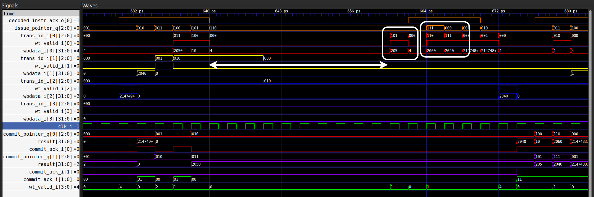
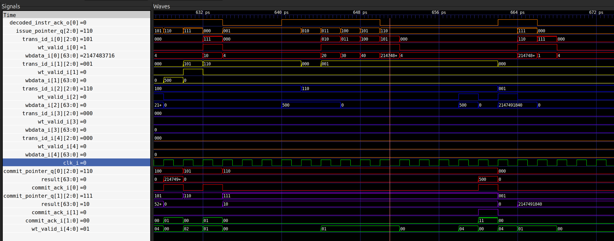
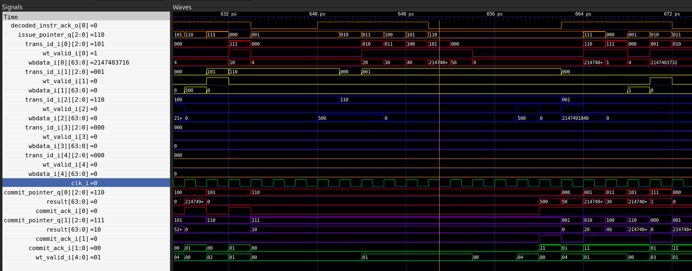
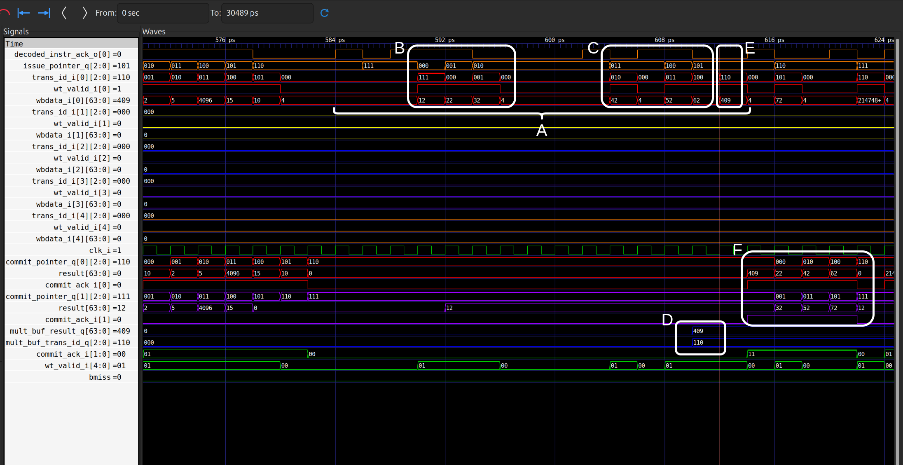
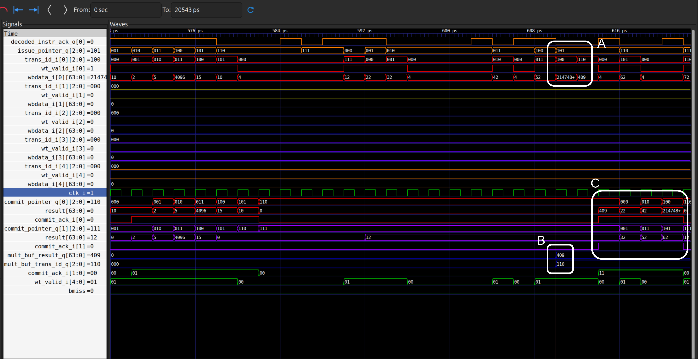
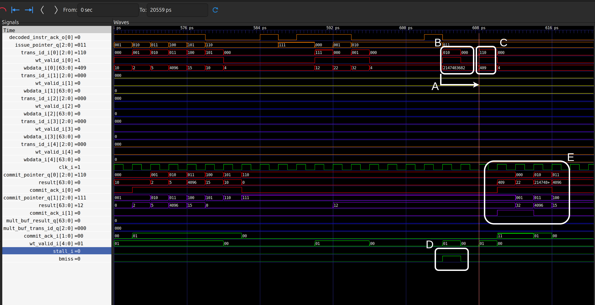
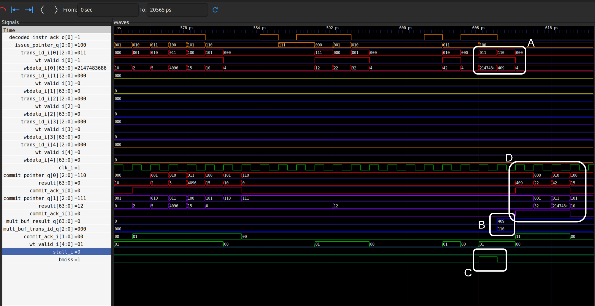

# Case Study: Breaking the FLU Write-back Bottleneck — Motivation
## Introduction

This document is a case study of a self-inflicted performance problem — and how it was diagnosed and removed.

The work started from a verification exercise, not a design goal. While checking whether CVA6's out-of-order writeback path (managed through the Scoreboard) behaved as intended on a `cv64a6_imafdc_sv39` core, a stall appeared where none should exist: younger single-cycle ALU instructions were held in the Issue Stage behind an older multi-cycle division, despite having no data dependency on it. The cause was structural, not data-related — a **false structural hazard** created by the Functional Unit's shared `flu_ready_o` signal, which let one busy sub-unit (the Divider) block unrelated consumers of the same writeback channel.

What follows is the full path from that observation to a verified fix: root-cause analysis at the signal level, an explicit comparison of the two design-space alternatives (a dedicated Divider channel versus issue decoupling over the existing shared channel), and the selection of the cheaper option with the cost of each documented rather than asserted. The implementation is then presented incrementally, in four phases — prerequisite dependency analysis, issue decoupling, write-back arbitration with a holding buffer, and back-pressure — each phase accompanied by its SystemVerilog changes, a targeted test sequence, and its own failure mode where one exists.

Correctness is treated separately from performance. Section 6 verifies the modified pipeline against deliberately forced hazard scenarios — concurrent ALU work during an active division, control-flow redirection at several distinct points relative to the division's write-back (including coincident redirect), and overlapping multi-cycle instructions — with waveform evidence rather than argument.

The closing section compares the custom core against the unmodified 64-bit baseline and against the Superscalar-ON configuration, on resource utilization, timing (WNS, $F_{max}$, logic depth), and bare-metal benchmark execution time (`complex.S`, `matmul.c`, `complex_avg.c`) measured in Verilator cycles. The result is deliberately modest and deliberately honest: a small reduction in LUTs, a small regression in timing, and up to roughly $3.5\%$ faster execution on division-heavy workloads, with no gain where the workload offers none. The point is that a targeted microarchitectural fix can recover real performance at near-zero hardware cost — without brute-force scaling of a dual-issue pipeline.

---

## 1. Root-Cause Analysis

While verifying CVA6's out-of-order writeback capability through the Scoreboard, we encountered an unexpected performance bottleneck: **younger, single-cycle ALU instructions were forced to stall behind an older, multi-cycle division** — not because of a true data dependency, but because both functional units shared the same ready signal back to the Issue Stage.

To isolate and demonstrate this behavior, we designed a minimal test sequence that exercises independent instructions across multiple writeback channels:

```asm
lw  t0, 0(a7)       # t0 = 2040          — ID: 010, Channel 2 (Load)
add t1, a3, a0      # t1 = 2040 + 10     — ID: 011, Channel 0 (ALU)
sub t2, a4, a2      # t2 = 15 - 5        — ID: 100, Channel 0 (ALU)
div t3, t1, t2      # t3 = 2050 / 10     — ID: 101, Channel 0 (Divider)
add t4, t1, t2      # t4 = 2050 + 10     — ID: 110, Channel 0 (ALU)
sub t5, t1, t2      # t5 = 2050 - 10     — ID: 111, Channel 0 (ALU)
```

The operands for all instructions were pre-loaded into registers, eliminating any read-after-write (RAW) hazards. The `lw` was intentionally slowed by a preceding store-to-load sequence (detailed in [Section 3.1 of `4-arch-32b-analysis.md`](4-arch-32b-analysis.md#3-seeing-it-in-the-waveform)), while the `div` operands (`t1` and `t2`) were produced by independent, single-cycle ALU operations (`add` and `sub`).

**Expected behavior:** According to CVA6's four independent writeback channels (see [Section 3.1 of `4-arch-32b-analysis.md`](4-arch-32b-analysis.md#3-seeing-it-in-the-waveform) for the full channel-assignment table), the `lw` (ID `010`) should write back through **Channel 2**, while the `div` (ID `101`) should write back through **Channel 0**. Since these channels are independent, the younger `div` should be able to complete and write back while the older `lw` is still waiting for memory — demonstrating true out-of-order writeback across channels.


**What we observed instead:** The waveform below (Figure 1) reveals the problem:



**Figure 1:** Trace of issue and writeback activity during the test sequence. Transaction IDs are shown in binary (e.g., `010`, `011`, `101`) and correspond to Scoreboard entries. The white arrow highlights the critical stall region where younger ALU instructions remain blocked despite having no dependency on the Divider.

In the waveform:

1. **Channel 2 (Load):** The `lw` (ID `010`) issues to the LSU at ~632 ps and writes back through Channel 2 (`trans_id_i[2:0] = 010`, `wt_valid_i[2] = 1`) at ~648 ps with result `0x7fa` (2042 decimal).

2. **Channel 0 (Early ALU):** The first `add` (ID `011`) and `sub` (ID `100`) issue to the ALU, complete in a single cycle, and write back through Channel 0:
   - `add t1, a3, a0` → result `0x802` (2050)
   - `sub t2, a4, a2` → result `0xa` (10)

3. **Channel 0 (Divider occupancy):** The `div` (ID `101`) issues to the Divider at ~640 ps and occupies Channel 0 for the full division latency. During this period, `wt_valid_i[0]` remains low, signaling that Channel 0 is unavailable for writeback.

4. **False structural hazard (highlighted by the white arrow):** The subsequent `add t4` (ID `110`) and `sub t5` (ID `111`) — which depend only on the already-committed results of `t1` and `t2` — **cannot issue from the queue**. As shown in the boxed region:

   * `issue_pointer_q[2:0]` advances to `101` (the Divider) but remains stuck there.
   * IDs `110` and `111` do not appear in `trans_id_i[1]` (the Multiplier/ALU channel tracking signal), confirming that they are blocked at the Issue Stage, not merely delayed at writeback.
   * The ALU hardware is physically idle during this interval — `wt_valid_i[0]` shows no activity between the Divider's issue and its eventual completion.
   * As clearly indicated by the white arrow, although the functional units were not busy and the `add` and `sub` instructions had no data dependencies on the divider, these instructions were completely blocked from issuing until the division operation completed (approximately 40 cycles later).

5. **Release and recovery:** Only after the Divider completes (~672 ps) does `issue_pointer_q` advance to `110` and `111`, allowing the blocked ALU instructions to finally issue and write back through Channel 0.

The root cause is a **false structural hazard** stemming from a shared ready-signal topology. Both the ALU (`alu_wrapper`) and the serial Divider (`serdiv`) drive a single `flu_ready_o` signal back to `issue_read_operands`. When `serdiv` is active, `flu_ready_o` drops, which the Issue Stage interprets as the entire Functional Logic Unit (FLU) being unavailable. Consequently, this blocks all ALU, Branch, CSR, and Multiplier operations, even though only the Divider is actually occupied. The younger ALU instructions are not waiting for the Divider's result; they are stalled waiting for a shared control signal. Since these execution units are physically independent, this constitutes an artificial serialization point rather than a true resource conflict.

This is a **false structural hazard**: the hardware resources (ALU, Multiplier, Divider) are physically independent and could operate concurrently, but the single-ready-signal interface creates an artificial serialization point. The younger ALU instructions are not waiting for the Divider's *result* — they are waiting for the Divider to release a *control signal* that was never exclusive to it in the first place.

### 1.1 Design Space: New Channel vs. Shared Channel

The root cause — sharing a single writeback channel (Channel 0) between single-cycle ALU operations and multi-cycle Divider operations — suggests two architectural approaches to eliminate the bottleneck:

#### Background: Why Channel 0 is Shared

Unlike load/store instructions, which are executed by the LSU and have their own dedicated writeback channel (e.g., Channel 2), computational instructions — both fast (ALU, Branch, CSR) and slow (Multiplier, Divider) — are **multiplexed onto a single path** through the FLU (Functional Logic Unit) and share **Channel 0** for writeback. This sharing is the source of the false structural hazard: when a slow operation occupies the channel, fast operations cannot issue, even though the hardware is physically idle.

#### Plan A: Dedicated Writeback Channel for the Divider

The first option is to break the sharing at the writeback interface by allocating a new, dedicated writeback channel in the Scoreboard exclusively for the Divider:


**Figure 2:** Plan A — Add a fourth writeback channel dedicated to the Divider. Each FLU sub-unit writes back through its own channel, eliminating all structural conflicts at the cost of additional Scoreboard ports and routing.

**Characteristics:**
- **Isolation:** The Divider no longer shares Channel 0. ALU, Branch, CSR, and Multiplier operations use Channel 0; the Divider uses the new channel.
- **Zero protocol change:** The Issue Stage, `ex_stage`, and Scoreboard interfaces remain unchanged. Each unit still has a single ready signal.
- **Hardware cost:**
  - One additional writeback port in the Scoreboard (transaction ID bus, data bus, valid signal, arbiter).
  - Additional routing and multiplexing in `ex_stage` to steer Divider results to the new port.
  - Increased area and power due to wider Scoreboard arbitration logic.

#### Plan B: Issue Decoupling with a Single Shared Channel

The second option is to preserve Channel 0 as a shared resource but **decouple the Issue Stage protocol** so that ALU and Divider operations can issue independently and compete for the channel only at writeback time:


**Figure 3:** Plan B — Introduce a lightweight Controller in the EX Stage to manage independent ready signals for each FLU sub-unit. Multiple operations may be in flight; the controller arbitrates writeback when both complete simultaneously.

**Characteristics:**
- **Independent issue:** `flu_ready_o` (for ALU/Branch/CSR) and `mult_ready_o` (for Multiplier/Divider) are decoupled. The Issue Stage can dispatch an ALU instruction even while the Divider is busy.
- **Shared writeback:** Both units still write back through Channel 0. A simple controller in `ex_stage` arbitrates when both units finish in the same cycle, prioritizing the younger instruction or buffering the older one.
- **Hardware cost:**
  - One additional ready signal routed back to `issue_read_operands`.
  - A small holding register (one transaction ID + one data word) to buffer a Divider result if the ALU wins arbitration.
  - Negligible area and power compared to a full Scoreboard port.

#### Trade-Off Comparison

| Aspect                     | Plan A: New Dedicated Channel          | Plan B: Decoupled Ready + Arbitration       |
|----------------------------|----------------------------------------|---------------------------------------------|
| **Hardware cost**          | High (new Scoreboard port, routing)    | Low (one register, one mux)                 |
| **Design complexity**      | Low (no protocol change)               | Medium (new arbitration logic in `ex_stage`)|
| **Scalability**            | Poor (each new unit needs a channel)   | Good (N units share one channel)            |
| **Performance**            | Maximum (zero contention)              | Near-maximum (rare single-cycle stall)      |
| **CVA6 philosophy**        | Contradicts existing out-of-order WB   | Aligns with existing shared-channel design  |

**Architectural consistency:** CVA6 already uses shared writeback channels successfully — for example, the LSU (Channel 2) is shared by loads and stores, and the Multiplier and ALU currently share Channel 0 without issue when both are single-cycle. The problem arises only because the **Issue Stage treats the shared channel as if it were occupied by a single monolithic unit**, not because sharing itself is fundamentally flawed. Plan B preserves this philosophy while fixing the Issue protocol; Plan A solves the problem by brute force at the cost of area and future scalability.

#### Selected Approach: Plan B (Issue Decoupling + Shared Channel)

We adopt **Plan B** for the following reasons:

1. **Minimal hardware overhead:** One holding register and one multiplexer vs. a full Scoreboard port.
2. **Localized changes:** All modifications are confined to `ex_stage.sv` and `issue_read_operands.sv`; the Scoreboard, LSU, and memory interface remain untouched.
3. **Alignment with CVA6's existing out-of-order writeback philosophy:** Shared channels with independent issue are already proven in other parts of the pipeline.
4. **Extensibility:** If a future feature requires adding another slow operation (e.g., a square-root unit), Plan B scales naturally by adding one more ready signal, whereas Plan A would require yet another Scoreboard port.

The remainder of this case study details the implementation of Plan B across three phases: **Decoupling** (independent issue), **Arbitration** (writeback collision handling), and **Back-Pressure** (buffer overflow prevention).

### 1.2 Implementation Roadmap: Four-Phase Incremental Deployment

Plan B requires careful sequencing: we cannot simply decouple the ready signals without also handling the writeback collision that decoupling will expose. The implementation is therefore structured as **four dependent phases**, where each phase is verified in simulation before the next begins.

#### Phase 0: Prerequisite Analysis (Dependency Check)

**Goal:** Confirm that the existing hardware can support concurrent operation without structural modifications to the Divider or Multiplier themselves.

**Key questions:**
1. **Operand latching:** When `serdiv` receives a division request and begins computation, does it latch the operands (`fu_data_i`) into internal registers in the first cycle, or does it rely on the bus remaining stable for the duration of the operation?
   - If operands are latched immediately, decoupling is safe: ALU instructions can freely change `fu_data_i` in subsequent cycles without corrupting the ongoing division.
   - If operands are not latched, structural changes to `serdiv.sv` would be required before proceeding.

2. **Issue Stage protocol:** How does `issue_read_operands.sv` currently decide whether the FLU is available? Specifically:
   - Which signal(s) gate the issue of ALU, Branch, CSR, Multiplier, and Divider instructions?
   - Can we introduce a second ready signal without requiring a new Scoreboard channel?

---

#### Phase 1: Issue Decoupling (Independent Dispatch)

**Goal:** Allow ALU, Branch, and CSR instructions to issue independently of Multiplier/Divider occupancy.

**Implementation:**
1. **In `ex_stage.sv`:**
   - Currently: `assign flu_ready_o = csr_ready & mult_ready;`
   - Modified: `assign flu_ready_o = csr_ready;` (ALU is always single-cycle and implicitly ready)
   - Export `mult_ready_o` as a new output port from `ex_stage`, carrying the Multiplier/Divider ready state.

2. **In `issue_read_operands.sv`:**
   - Add `mult_ready_i` as a new input.
   - Update the issue logic:
     - For ALU/Branch/CSR instructions → check only `flu_ready_o`.
     - For Multiplier/Divider instructions → check both `flu_ready_o` **and** `mult_ready_o`.
   - This ensures that a second `div` cannot issue while the first is still running (preserving correctness), but ALU instructions are no longer blocked.

**Testing:**
- **Test case:** Assembly sequence with one `div` followed by multiple `add`/`sub` instructions with no RAW dependencies.
- **Success metric:** Waveform shows that the younger ALU instructions enter the EX Stage and execute while the `div` is still in progress. The `issue_pointer_q` advances past the `div` without stalling.
- **Known issue at this phase:** If an ALU instruction and the Divider both complete in the same cycle, the Divider's result may be overwritten in the output multiplexer (this is expected and will be fixed in Phase 2).

---

#### Phase 2.1: Write-back Arbitration (Collision Handling)

**Goal:** Prevent loss of the Divider's result when it completes simultaneously with an ALU operation.

**Root cause of the collision:** The output multiplexer in `ex_stage.sv` currently uses fixed priority:
```systemverilog
assign flu_result_o = alu_valid ? alu_result :
                      csr_valid ? csr_result :
                      mult_valid ? mult_result :
                      /* default */ '0;
```
When `alu_valid` and `mult_valid` are both high in the same cycle, the ALU wins and the Divider's result is discarded.

**Implementation:**
1. **Add a holding register in `ex_stage.sv`:**
   ```systemverilog
   logic [TRANS_ID_BITS-1:0] mult_buf_trans_id_q;
   logic [XLEN-1:0]          mult_buf_result_q;
   logic                     mult_buf_valid_q;
   ```
2. **Collision detection and buffering logic:**
   - When `mult_valid` asserts but `alu_valid` is also high → store `mult_trans_id`, `mult_result`, and set `mult_buf_valid_q`.
   - In subsequent cycles, if `alu_valid` is low and `mult_buf_valid_q` is high → drive `flu_result_o` and `flu_trans_id_o` from the buffer and clear `mult_buf_valid_q`.
3. **Priority update:**
   - The buffer takes priority over new `mult_valid` assertions to prevent starvation.

**Testing:**
- **Critical test case:** Craft an assembly sequence where the `div` completes in the exact same cycle that an `add` enters EX and completes. This requires precise control of the issue timing (e.g., by inserting NOPs or using a store-to-load delay to synchronize the `div`'s completion with a subsequent ALU issue).
- **Success metric:** Both results write back correctly to the register file:
  - The `add` result appears in cycle $N$ (via `flu_result_o`, `trans_id = add_id`, `wt_valid[0] = 1`).
  - The `div` result appears in cycle $N+1$ (via `flu_result_o`, `trans_id = div_id`, `wt_valid[0] = 1`, sourced from the buffer).
- **Verification:** Read both destination registers in subsequent instructions and confirm correct values.

---

#### Phase 2.2: Back-Pressure (Buffer Overflow Prevention)

**Goal:** Prevent deadlock or incorrect behavior if the holding buffer remains occupied for multiple cycles (e.g., a continuous stream of ALU instructions preventing the buffered Divider result from draining).

**Implementation:**
- Add a back-pressure condition to `flu_ready_o`:
  ```systemverilog
  assign flu_ready_o = csr_ready & ~mult_buf_valid_q;
  ```
- When the buffer is full (`mult_buf_valid_q == 1`), `flu_ready_o` is lowered, temporarily blocking new ALU instructions from issuing. This guarantees that the buffer will drain within one cycle.

**Testing:**
- **Stress test:** Issue a `div`, followed immediately by a **long sequence of back-to-back ALU instructions** (e.g., 10+ `add`/`sub` in a row with no dependencies).
- **Success metric:**
  - The `div` result eventually writes back, even if the buffer had to stall the Issue Stage briefly.
  - No transactions are lost.
  - The performance penalty is minimal (at most one extra cycle of ALU stall per division).

---

#### Phase 3: Regression and Integration Testing

**Goal:** Confirm that the modifications do not break existing functionality or introduce subtle bugs in corner cases (exceptions, CSR accesses, branch mispredictions, etc.).

**Exit criteria:** All tests pass without regression. The IPC (instructions per cycle) for compute-heavy workloads should show measurable improvement compared to the baseline (pre-decoupling) configuration.

---

## 2. Prerequisite Analysis (Phase 0)

Before touching any logic, we verified two assumptions that the entire fix depends on.

### 2.1. Divider Data Safety (Latching)

Good news: the divider data path is already safe. When `serdiv` is in the `IDLE`
state and `in_vld_i` is asserted, it latches all operands (`op_a`, `op_b`) and the
operation ID (`id_i`) into its own internal registers (`op_a_q`, `op_b_q`) on that
very first clock cycle, before transitioning into the `DIVIDE` state.

This means that while the divider is busy computing, if `fu_data_i` (which arrives
from the shared bus) changes because a new `add` instruction has been issued, it has
zero effect on the ongoing division. We therefore do **not** need to modify the
divider's input structure.

### 2.2. Decoupling the Ready Signals in the Issue Stage

Currently in `issue_read_operands.sv` (line 330), whenever `flu_ready_i` is
deasserted, the ALU, AES, Branch, CSR, and Mult units are all marked busy and
stall together as a single group.

We can break this coupling with a minimal change:

- Add a new port called `mult_ready_i` to both `issue_stage` and
  `issue_read_operands`.
- Use `flu_ready` only to gate (mark busy) the ALU, AES, Branch, and CSR units.
- Use `mult_ready` exclusively to gate (mark busy) the Mult unit.

---

## 3. Issue Decoupling (Phase 1)

With Phase 0 confirming that no structural changes are needed inside `serdiv`, the
first fix is purely an interface change: split the single `flu_ready_o` handshake
into two independent ready signals so that the Issue Stage can distinguish
"the CSR/ALU path is busy" from "the Multiplier/Divider is busy."

### 3.1. The Coupling Point

The entire bottleneck reduces to one assignment in `ex_stage.sv`:
```systemverilog
// baseline
always_comb begin
  flu_ready_o = csr_ready & mult_ready;
end
```

Both flags share a single declaration in the same file:

```systemverilog
logic csr_ready, mult_ready;
```

This AND gate is the artificial serialization point identified in Section 1.
`mult_ready` stays low for the full ~40-cycle division latency, and because it is
folded into `flu_ready_o`, the Issue Stage sees the *entire* fixed-latency cluster
(ALU, AES, Branch, CSR, Mult) as unavailable.

### 3.2. Implementation

**Step 1 — Export the Divider's ready state separately (`ex_stage.sv`)**

Add a new output port next to the existing `flu_ready_o` declaration in the port list:

```systemverilog
output logic flu_ready_o,
output logic mult_ready_o,   // NEW: Multiplier/Divider occupancy, reported separately
```
Then split the ready assignment:

```systemverilog
always_comb begin
  flu_ready_o  = csr_ready;    // decoupled: no longer gated by the Divider
  mult_ready_o = mult_ready;
end
```
The ALU needs no term here: it is combinational and single-cycle, so it is
implicitly always ready. `csr_ready` remains the only legitimate reason to stall
the fast path.

**Step 2 — Route the signal through the Issue Stage (`issue_stage.sv`)**

Mirror the existing `flu_ready_i` port declaration:

```systemverilog
input logic flu_ready_i,
input logic mult_ready_i,   // NEW
```
and forward it in the `issue_read_operands` instantiation, alongside the existing
connection:

```systemverilog
.flu_ready_i  (flu_ready_i),
.mult_ready_i (mult_ready_i),   // NEW
```
**Step 3 — Split the busy decoding (`issue_read_operands.sv`)**

Add the input port to the module's port list, beside `flu_ready_i`:

```systemverilog
input logic mult_ready_i,
```
Then separate the two conditions inside the `structural_hazards` block that computes
`fus_busy`:

```systemverilog
// Before: one signal marks five units busy
if (!flu_ready_i) begin
  fus_busy[0].alu       = 1'b1;
  fus_busy[0].aes       = 1'b1;
  fus_busy[0].ctrl_flow = 1'b1;
  fus_busy[0].csr       = 1'b1;
  fus_busy[0].mult      = 1'b1;   // <-- the false hazard
end

// After: each ready signal gates only what it actually owns
if (!flu_ready_i) begin
  fus_busy[0].alu       = 1'b1;
  fus_busy[0].aes       = 1'b1;
  fus_busy[0].ctrl_flow = 1'b1;
  fus_busy[0].csr       = 1'b1;
end

if (!mult_ready_i) begin
  fus_busy[0].mult      = 1'b1;
end
```
Keeping `fus_busy[0].mult` gated by `mult_ready_i` is what preserves correctness:
a second `div` still cannot enter a busy `serdiv`. Only the *unrelated* units are
released.

**Step 4 — Top-level wiring (`cva6.sv`)**

`ex_stage` and `issue_stage` are instantiated in `cva6.sv`, so the new
`mult_ready_o` → `mult_ready_i` wire must be declared and connected there as well.
Without this, elaboration fails on an unconnected port.

**What must not be touched:** the same `always_comb` block contains a second,
independent guard keyed on `mult_valid_q`, which blocks the fast units for the single
cycle after a multiply is issued. That guard protects the fixed-latency multiplier's
own write-back slot and is unrelated to `flu_ready_i`. It stays as-is.

### 3.3. Result: The Issue Path Is Free

Re-running the Section 1 test sequence, the behaviour changes exactly as intended:

* `issue_pointer_q` no longer parks on the `div` entry (`101`). It advances to
  `110` and `111` while `serdiv` is still iterating.
* `add t4` and `sub t5` enter the EX Stage and execute during the division window,
  instead of waiting ~40 cycles for it to retire.
* `mult_ready_i` is the only signal held low for the division latency, and it now
  blocks nothing except a hypothetical second multiply/divide.

The false structural hazard is gone. Phase 1 alone, however, is **not a correct
design.**

### 3.4. What Phase 1 Breaks

Decoupling the *issue* side does nothing about the *write-back* side — both paths
still converge on the same Channel 0 multiplexer. That multiplexer uses a fixed
priority chain (`ex_stage.sv`):
```systemverilog
always_comb begin
  // Branch result as default case
  flu_result_o   = {{CVA6Cfg.XLEN - CVA6Cfg.VLEN{1'b0}}, branch_result};
  flu_trans_id_o = one_cycle_data.trans_id;
  // ALU result
  if (|alu_valid_i) begin
flu_result_o = alu_result[0];
// CSR result
  end else if (|csr_valid_i) begin
flu_result_o = csr_result;
  end else if (mult_valid) begin
flu_result_o   = mult_result;
flu_trans_id_o = mult_trans_id;
  end else if (|aes_valid_i) begin
flu_result_o = aes_result;
  end
end
```
`|alu_valid_i` is checked first, so if an ALU operation and the Divider assert in
the same cycle, `mult_result` and `mult_trans_id` are simply never selected. Note
also that only the `mult_valid` branch overrides `flu_trans_id_o`; every other branch
leaves it at the default `one_cycle_data.trans_id`. Worse, `flu_valid_o` is driven by
an OR:

systemverilog
assign flu_valid_o = |one_cycle_select | mult_valid;

so the Scoreboard still sees a valid write-back on Channel 0 in that cycle — but it
sees the **ALU's** transaction ID carrying the ALU's result. The division is not
merely delayed; its transaction is silently dropped.

**Figure 3.4.1** shows the exact moment of failure. At **650 ps**, the Divider
completes its latency and presents its result 
on `wbdata_i[0]` with transaction ID `000` and `wt_valid_i[0]` asserted. In the same
cycle, an ALU addition writes back result with transaction ID `101`. Because the
multiplexer gives ALU unconditional priority, the Scoreboard receives only the ALU
transaction; `trans_id_i[0]` reads `101` and `wbdata_i[0]` reads `2147483716`. The division
result is overwritten and lost.

  

The consequences unfold over the next few hundred picoseconds:

1. **`serdiv` cannot retry.** It has already deasserted its own valid/handshake and
   returned to `IDLE`. The result is unrecoverable.
2. **Scoreboard entry `000` is never marked valid.** `commit_ack_i[0]` remains `00`
   for that entry throughout the trace.
3. **The Commit Stage deadlocks.** `commit_pointer_q[0]` parks at `110` from 632 ps
   onward, waiting for an entry that will never complete. The pipeline stalls
   indefinitely.

Before decoupling, this collision was structurally impossible: the Divider held
`flu_ready_o` low, so no ALU instruction could ever be in flight at the same time.
The old bottleneck was, in effect, acting as an accidental mutual exclusion
mechanism. Removing it exposes a latent correctness bug in the write-back
multiplexer that was previously unreachable.

This is the defect Phase 2.1 addresses with a holding buffer and explicit
arbitration.

---

## 4. Write-back Collision & the Holding Buffer (Phase 2.1)

Phase 1 decoupled the issue path but left the write-back multiplexer unchanged. That multiplexer uses a fixed `if/else if` priority chain in `ex_stage.sv`:

```systemverilog
always_comb begin
  flu_result_o   = {{CVA6Cfg.XLEN - CVA6Cfg.VLEN{1'b0}}, branch_result};
  flu_trans_id_o = one_cycle_data.trans_id;
  
  if (|alu_valid_i) begin
    flu_result_o = alu_result[0];
  end else if (|csr_valid_i) begin
    flu_result_o = csr_result;
  end else if (mult_valid) begin
    flu_result_o   = mult_result;
    flu_trans_id_o = mult_trans_id;
  end else if (|aes_valid_i) begin
    flu_result_o = aes_result;
  end
end
```

When both `|alu_valid_i` and `mult_valid` assert in the same cycle, the ALU branch is entered first, leaving `mult_result` and `mult_trans_id` unselected. The Scoreboard sees a valid write-back (because `flu_valid_o = |one_cycle_select | mult_valid`), but it carries the ALU's transaction ID and data. The Divider's result is silently dropped, the Scoreboard entry never completes, and the pipeline deadlocks.

The fix is a **one-entry holding register** that captures the Divider's result when the bus is occupied by a single-cycle operation, then drains it in the next available cycle.


### 4.1. Implementation

**Step 1 — Declare the buffer signals (`ex_stage.sv`)**

Add the following registers near the top of the module, before the combinational logic blocks:

```systemverilog
  // --- MULT Holding Buffer Signals ---
  logic                             mult_buf_valid_q, mult_buf_valid_d;
  logic [CVA6Cfg.XLEN-1:0]          mult_buf_result_q, mult_buf_result_d;
  logic [CVA6Cfg.TRANS_ID_BITS-1:0] mult_buf_trans_id_q, mult_buf_trans_id_d;
```

**Step 2 — Sequential logic (register the buffer on every clock)**

Insert the following `always_ff` block immediately after the buffer signal declarations:

```systemverilog
  always_ff @(posedge clk_i or negedge rst_ni) begin
    if (!rst_ni) begin
      mult_buf_valid_q    <= 1'b0;
      mult_buf_result_q   <= '0;
      mult_buf_trans_id_q <= '0;
    end else if (flush_i) begin
      mult_buf_valid_q    <= 1'b0;
    end else begin
      mult_buf_valid_q    <= mult_buf_valid_d;
      mult_buf_result_q   <= mult_buf_result_d;
      mult_buf_trans_id_q <= mult_buf_trans_id_d;
    end
  end
```

**Step 3 — Combinational logic (buffer control and output multiplexer)**

Replace the existing `flu_valid_o` assignment and the output multiplexer block with the following:

```systemverilog
  logic flu_bus_busy;
  assign flu_bus_busy = |one_cycle_select;

  // --- Holding Buffer Logic ---
  always_comb begin
    mult_buf_valid_d    = mult_buf_valid_q;
    mult_buf_result_d   = mult_buf_result_q;
    mult_buf_trans_id_d = mult_buf_trans_id_q;

    // 1. Divider completes but bus is occupied → store in buffer
    if (mult_valid && flu_bus_busy) begin
      mult_buf_valid_d    = 1'b1;
      mult_buf_result_d   = mult_result;
      mult_buf_trans_id_d = mult_trans_id;
    end
    // 2. Buffer is full and bus is now free → drain buffer
    else if (mult_buf_valid_q && !flu_bus_busy) begin
      mult_buf_valid_d    = 1'b0;
    end
  end

  // --- FLU Valid Signal ---
  assign flu_valid_o = flu_bus_busy | (mult_valid && !flu_bus_busy) | mult_buf_valid_q;

  // --- Result MUX ---
  always_comb begin
    // Default assignment (branch result acts as fallback)
    flu_result_o   = {{CVA6Cfg.XLEN - CVA6Cfg.VLEN{1'b0}}, branch_result};
    flu_trans_id_o = one_cycle_data.trans_id;

    // Single-cycle operations have strict priority
    if (|alu_valid_i) begin
      flu_result_o = alu_result[0];
    end else if (|branch_valid_i) begin
      // Branch/Jump must be explicit in the priority chain to prevent
      // mult/div buffer data from overwriting the result when both
      // branch_valid_i and mult_buf_valid_q are asserted simultaneously.
      flu_result_o   = {{CVA6Cfg.XLEN - CVA6Cfg.VLEN{1'b0}}, branch_result};
      flu_trans_id_o = one_cycle_data.trans_id;
    end else if (|csr_valid_i) begin
      flu_result_o = csr_result;
    end else if (|aes_valid_i) begin
      flu_result_o = aes_result;
    end
    // No single-cycle operation active: drain the buffer first, then
    // forward a fresh mult/div result if one arrived this cycle.
    else if (mult_buf_valid_q) begin
      flu_result_o   = mult_buf_result_q;
      flu_trans_id_o = mult_buf_trans_id_q;
    end else if (mult_valid) begin
      flu_result_o   = mult_result;
      flu_trans_id_o = mult_trans_id;
    end
  end
```

> **Why the explicit `branch_valid_i` arm is required**
>
> In the original CVA6 design, Branch/Jump was a safe implicit default because the Scoreboard's stall logic prevented `mult_valid` and `branch_valid_i` from being asserted in the same cycle. Plan B intentionally relaxes that constraint — single-cycle results are allowed to collide with a buffered mult/div result — so the implicit default is no longer safe. Without an explicit arm, the MUX falls through to `else if (mult_buf_valid_q)` whenever the ALU and CSR checks are false, overwriting `flu_result_o` and `flu_trans_id_o` with stale divider data. The buffer then never clears because `flu_bus_busy` was high when the drain condition was last evaluated, causing the same stale result to be committed on every subsequent cycle. Adding the explicit arm locks the output to the branch result for the duration of the Branch/Jump cycle, and the buffer drains cleanly on the first bubble that follows.

### 4.2. Operation

The buffer operates as follows:

1. **Collision detection:** When `mult_valid` asserts but `flu_bus_busy` is also high (indicating an ALU/CSR/AES operation is using Channel 0 in the same cycle), the Divider's result and transaction ID are captured in `mult_buf_*_q`.

2. **Buffered write-back:** In subsequent cycles, if `mult_buf_valid_q` is high and `flu_bus_busy` is low, the buffered data is selected by the output multiplexer and driven onto `flu_result_o` and `flu_trans_id_o`. The Scoreboard sees this as a normal write-back on Channel 0.

3. **Buffer release:** Once the buffered result is written back, `mult_buf_valid_d` is cleared, making the buffer available for the next Divider operation.

The single-cycle operations retain unconditional priority at the multiplexer, but now a collision merely *delays* the Divider's result by one cycle instead of *dropping* it entirely.

### 4.3. Result: Collision Resolved

Re-running the Section 3.4 test case, the failure no longer occurs. **Figure 4.3.1** shows the corrected behavior:



**Figure 4.3.1:** Corrected write-back behavior after implementing the holding buffer. Comparing with Figure 3.4.1, the bug is now eliminated: the Divider's result (ID `000`, value `50`) is no longer lost. Instead, it is captured in the holding buffer when Channel 0 is occupied by the ALU transaction, then successfully writes back one cycle later once the channel becomes available.

At **652 ps**, the Divider's transaction successfully completes its write-back through Channel 0. 

The bug is eliminated. The Divider and ALU can now operate concurrently without losing results, at the cost of a single additional cycle of latency when a collision occurs.

---

## 5. Back-Pressure (Phase 2.2)

The holding buffer introduced in Phase 2.1 is exactly **one entry deep**. That depth is sufficient for the collision it was designed to absorb, but it raises an obvious follow-up question: what happens if a *second* Multiplier/Divider result becomes available while the first one is still sitting in the buffer?

### 5.1. The Hypothetical Failure

The feared scenario is an overwrite. Consider a buffer already holding a completed division (`mult_buf_valid_q == 1`), waiting for Channel 0 to free up. If a second multiply/divide were to complete during that window, the buffer control logic would take the first branch of its priority chain:

```systemverilog
if (mult_valid && flu_bus_busy) begin
  mult_buf_valid_d    = 1'b1;
  mult_buf_result_d   = mult_result;
  mult_buf_trans_id_d = mult_trans_id;
end
```

The new result and transaction ID would be latched **over** the pending ones. The first transaction would vanish silently — the same class of failure as the Phase 1 bug in Section 3.4, only now hidden one level deeper: the Scoreboard entry would never complete, and the Commit Stage would park on it forever.

This is precisely the risk that the retained guard in `issue_read_operands.sv` was expected to mitigate:

```systemverilog
if (|mult_valid_q) begin
  // ALU, CSR, etc. are busy...
```

But that guard was written for a different purpose, and after decoupling it is no longer obvious that it still cd_operands.sv` was expected to mitigate:

```systemverilog
if (|mult_valid_q) begin
  // ALU, CSR, etc. are busy...
```

But that guard was written for a different purpose, and after decoupling it is no longer obvious that it still ce stress sequences, the overwrite never occurred — and not by luck. Two independent mechanisms already inherited from the baseline CVA6 design make the scenario unreachable.

**Mechanism 1 — The Predictive Stall in the Issue Stage.**

The original CVA6 authors placed a pre-emptive guard in `issue_read_operands.sv` that blocks the entire fixed-latency cluster for the cycle following a multiply issue:

```systemverilog
// 2. Prevent Fixed-Latency Bus Collision with Multiplier Result
// After a multiplication was issued, only another multiplication can be issued.
if (|mult_valid_q) begin
  fus_busy[0].alu       = 1'b1;
  fus_busy[0].aes       = 1'b1;
  fus_busy[0].ctrl_flow = 1'b1;
  fus_busy[0].csr       = 1'b1;
end
```

The reasoning behind it is a pure timing argument. A `MUL` has a fixed one-cycle latency, while ALU operations are combinational and produce their result in the cycle they are issued. So if a `MUL` is issued in cycle $N$ and an `ADD` is issued in cycle $N+1$, **both** present a valid result on Channel 0 at the end of cycle $N+1$. The original designers' solution was blunt and effective: the cycle after any multiply is issued, lock the ALU out so nothing can compete for the bus.

This guard is what silently protected our Phase 2.1 implementation. It was never intended to serve the holding buffer — it predates it — but as a side effect it removes exactly the ALU/multiply overlap that would make the buffer collide in the first place. This is why the guard was explicitly left untouched in Phase 1 (Section 3.2, Step 4): it protects the fixed-latency multiplier's own write-back slot, and it is keyed on `mult_valid_q` rather than on `flu_ready_i`, so decoupling never disturbed it.

**Mechanism 2 — `serdiv` Cannot Accept Back-to-Back Requests.**

The second protection lies inside the Divider itself. `serdiv` only accepts a new request from the `IDLE` state, and it returns to `IDLE` strictly after the current division has handed off its result. There is no pipelining and no request queue. Consequently, a second division physically cannot be in flight while the first one's result is still in the buffer — the hardware serializes divisions regardless of what the Issue Stage attempts.

Between these two mechanisms, the buffer's single entry is structurally sufficient: the Multiplier path is protected by an issue-time stall, and the Divider path is protected by its own non-pipelined state machine.

### 5.3. Making It Bullet-Proof Anyway

Relying on a guard written for an unrelated purpose is fragile. If a future contributor removes the `mult_valid_q` stall (a natural optimization target, since it costs a cycle after every multiply), or replaces `serdiv` with a pipelined divider, the buffer overwrite becomes reachable again — and it fails silently, which is the worst possible failure mode.

We therefore make the buffer's own occupancy an explicit part of the handshake, rather than an implicit consequence of someone else's logic. In `ex_stage.sv`, where the ready signals are generated:

```systemverilog
  always_comb begin
    //flu_ready_o = csr_ready & mult_ready;

    // flu_ready_o  = csr_ready;   // decoupled
    flu_ready_o  = csr_ready & /*mult_ready &*/ ~mult_buf_valid_q; // Back-pressure
    mult_ready_o = mult_ready;
  end
```

`mult_ready` is deliberately left commented out rather than deleted. Keeping the two conditions separate is the whole point of Phase 1: folding `mult_ready` back into `flu_ready_o` would reintroduce the original false structural hazard from Section 1. The commented term documents *what was removed and why*, so that the decoupling is not accidentally undone.

The new `~mult_buf_valid_q` term closes the loop:

- While the buffer holds a pending result, `flu_ready_o` is deasserted.
- The Issue Stage marks ALU, AES, Branch, and CSR as busy and dispatches nothing onto the fast path.
- With no single-cycle operation in flight, `flu_bus_busy` falls in the next cycle, the drain branch of the buffer control logic fires, and the pending result reaches Channel 0.
- `mult_buf_valid_q` clears, `flu_ready_o` rises again, and normal issue resumes.

The buffer is now **guaranteed** to drain within one cycle of being filled, by construction rather than by circumstance. `mult_ready_o` remains untouched, so a genuine multiply/divide is still gated only by the Divider's own occupancy.

### 5.4. Cost

The back-pressure term is a single AND gate on a signal that already exists, so the area cost is nil. The performance cost is bounded and small: at most one cycle of fast-path stall per write-back collision, and collisions themselves are rare — they require a division to complete in the same cycle that a single-cycle operation claims the bus.

Compared against the stall that Section 1 documented, this is a negligible price. More importantly, the correctness of the design no longer depends on a guard elsewhere in the pipeline that a future refactor might legitimately remove. Phase 2.2 adds no new capability; it converts an accidental invariant into an enforced one.

---

## 6. Functional Verification via Forced Hazard Scenarios


### 6.1. Concurrent ALU Operation During an Active Division

U Operation During an Active Division

The first scenario targets the core hazard that motivated this work: a sequence of short-latency ALU operations issued immediately after a long-latency division, where multiple write-back events complete and accumulate in the scoreboard before the divider finishes.

**Test sequence.** The program initializes five registers (`a0`–`a4`) and then issues a `DIV` followed by seven consecutive `ADD` instructions, each reading `a0` and one prior result. Transaction IDs are assigned sequentially and wrap modulo 8 (3-bit field), so the `DIV` carries ID `110` and the `ADD` chain spans IDs `111` through `101`.

```asm
sub t1, a4, a2   # t1 = 10       (ID 101)
div t2, a3, t1   # t2 = 409      (ID 110)  ← long-latency
add t3, a0, a1   # t3 = 12       (ID 111)
add t4, a0, t3   # t4 = 22       (ID 000)
add t5, a0, t4   # t5 = 32       (ID 001)
add t3, a0, t5   # t3 = 42       (ID 010)
add t4, a0, t3   # t4 = 52       (ID 011)
add t5, a0, t4   # t5 = 62       (ID 100)
add t3, a0, t5   # t3 = 72       (ID 101)
```

Under the modified design, the issue stage is fully decoupled from the divider's ready signal. The `ADD` instructions are free to issue, execute, and write back through Channel 0 while the divider is still running. When the division result is ready and the write-back bus is occupied by an ALU result, the holding buffer latches the result and its transaction ID and waits for the bus to clear.

**Figure 6.1** captures the full lifecycle of this interaction:



**Figure 6.1:** Write-back and commit activity during the concurrent-ALU scenario. Transaction IDs are shown in binary on `issue_pointer_q`, `trans_id_i[0]`, and `commit_pointer_q`. The division result (`wbdata_i[0] = 409`, ID `110`) is visible latched in `mult_buf_result_q` and `mult_buf_trans_id_q` while the bus remains occupied.

Region **A** spans the full observed latency of the `DIV`: from the cycle it is accepted by the issue stage to the cycle its result reaches the write-back bus. During this interval, regions **B** and **C** show the ALU results (`12`, `22`, `32` and `42`, `52`, `62` respectively) arriving on Channel 0 in successive cycles, advancing `trans_id_i[0]` through IDs `111`–`100`, and being registered in the scoreboard — without any stall issued to the upstream pipeline.

At the boundary of region **D**, the divider finishes and its result (`409`, ID `110`) is captured by the holding buffer (`mult_buf_result_q = 409`, `mult_buf_trans_id_q = 110`). The bus is still occupied by the final ALU write-back at the tail of region **C**, forcing the held result to wait for exactly one cycle. Region **E** demonstrates the bus clearing: `wt_valid_i[0]` deasserts for a single cycle, allowing the buffer to drive `commit_pointer_q` through ID pairs `(110, 111)`, `(000, 001)`, `(010, 011)`, and `(100, 101)`. The `result[63:0]` sequences correctly through `409 → 12 → 22 → 32 → 42 → 52 → 62 → 72`, ensuring no data loss and preserving strict program order.

### 6.2. Control-Flow Redirection During an Active Division

When a control-flow redirect is signalled while a division is in flight, the pipeline's response depends on how far the result has progressed through the completion path. If the divider has already finished, the result occupies one of two states: it is either driving the write-back bus directly, in which case it has logically retired and the write-back must be allowed to land before the flush takes effect, or it is parked in the holding buffer awaiting bus access, in which case it can be invalidated — provided the flush logic can distinguish it from the concurrent ALU write-backs sharing the same bus and transaction-ID space. A third window exists if the redirect arrives before the ID stage has accepted the division at all; in that case no result is in flight, and the hazard reduces to preventing an architecturally unreachable instruction from ever entering the divider and reserving a scoreboard entry. Sections 6.2.1 through 6.2.3 address each of these cases in turn, distinguishing between redirects caused by unconditional jumps and those caused by mispredicted branches, since the two carry different scoreboard obligations.

#### 6.2.1. Redirect by an Unconditional Jump

The jump (`j branch`, ID `100`) is architecturally certain: it carries no speculative state and requires no pipeline flush. The only concern is temporal — the in-flight division must be allowed to write its result back cleanly even though its completion cycle coincides with the jump's own write-back.

In the test program, `div t2, a3, t1` (ID `110`, computing $4096 \div 10 = 409$) is issued two cycles after the last ALU instruction in the sequence and occupies the multi-cycle divider across all six subsequent `add` instructions before the jump:

```asm
sub t1, a4, a2    # t1 = 15 - 5 = 10    | ID 101
div t2, a3, t1    # t2 = 4096/10 = 409  | ID 110  ← enters divider
add t3, a0, a1    # t3 = 12             | ID 111
add t4, a0, t3    # t4 = 22             | ID 000
add t5, a0, t4    # t5 = 32             | ID 001
add t3, a0, t5    # t3 = 42             | ID 010
add t4, a0, t3    # t4 = 52             | ID 011
j   branch                              | ID 100  ← redirect, no flush
```

The division does not finish until the jump has already reached the write-back stage, producing a one-cycle collision on the write-back bus.



*Figure 6.2.1 — (A) the jump (ID `100`) asserting `wt_valid_i[0]` and driving the write-back bus while the division simultaneously completes its calculation; (B) `mult_buf_result_q=409`, `mult_buf_trans_id_q=110` — the division result latched into the holding buffer in the same cycle the jump occupies the bus; (C) both results committed in strict program order with no gap, no reordering, and `bmiss` deasserted throughout.*

At annotation A, `trans_id_i[0]` carries `100` with `wt_valid_i[0]` asserted: the jump is actively driving the write-back bus. In that same cycle the divider finishes its computation. Because the bus is occupied, the result (`409`, transaction ID `110`) cannot be forwarded immediately; instead it is parked in the holding buffer, as shown at annotation B by `mult_buf_result_q=409` and `mult_buf_trans_id_q=110`. In the following cycle the bus is free and the buffered result forwards onto it normally, with no stall and no data corruption.

Annotation C confirms the outcome: the commit pointers advance monotonically and `result[63:0]` reflects the expected values in program order — `409` followed by the post-redirect `add` results. Neither result is lost, and `bmiss` remains deasserted throughout, confirming the jump never triggers the flush path.

The interaction reduces to two invariants. First, write-back bus arbitration guarantees that a result held in the buffer is forwarded in the cycle immediately after the bus is released, preventing indefinite blocking. Second, the scoreboard retains the division's entry (`110`) until its result has landed in the register file, so the jump's redirection of the fetch pointer does not invalidate a pending but architecturally committed result.

#### 6.2.2. Redirect by a Mispredicted Branch

A mispredicted branch is architecturally more demanding than an unconditional redirect: it carries speculative state, its resolution triggers a full flush of all younger instructions, and the age-ordering logic that decides what survives that flush is exercised under real timing pressure. This combination concentrates error likelihood — an over-eager flush silently discards an older in-flight result; an under-eager one allows a wrong-path instruction to reach the commit queue. Both failure modes are subtle enough to pass unit-level testing while producing observable miscommits only under specific timing conditions, which makes mispredicted branches a natural and high-value correctness-validation surface for the dual-issue write-back mechanism studied here.

Two distinct timing scenarios are examined. Section 6.2.2.1 places the branch redirect entirely within the division's execution window: the flush completes before the divider has produced its result, testing age-selective survival of an older in-flight instruction. Section 6.2.2.2 raises the timing pressure further by making the branch write-back coincide with the division write-back, simultaneously stressing the bus arbitration and scoreboard update paths.

#### 6.2.2.1. Branch Redirect Prior to Division Write-Back

This scenario forces a mispredicted branch to resolve — and redirect the front-end — while an older division is still executing in the divider. Unlike the unconditional jump of [6.2.1](#621-redirect-by-an-unconditional-jump), the branch carries speculative state: its misprediction triggers a full flush of younger instructions. The property under test is that this flush leaves the older, in-flight division untouched, and that commit order is preserved once the division result eventually lands.

**Test sequence.** The register setup is identical to the previous scenarios. The `beq t1, a0, branch` compares `t1 = 10` against `a0 = 10`; the branch is therefore *taken*, but the predictor assumes fall-through, producing a misprediction. Note that the second `beq` (after the first wrong-path `add`) is commented out — only a single branch is active in this variant, placed immediately after the `add` chain and *before* the division has completed:

```asm
sub t1, a4, a2    # t1 = 15 - 5 = 10    | ID 101
div t2, a3, t1    # t2 = 4096/10 = 409  | ID 110  ← enters divider
add t3, a0, a1    # t3 = 12             | ID 111
add t4, a0, t3    # t4 = 22             | ID 000
add t5, a0, t4    # t5 = 32             | ID 001
beq t1, a0, branch #                    | ID 010  ← taken, mispredicted
add t3, a0, t5    # wrong path, flushed
# beq t1, a0, branch                    (commented out in this variant)
add t4, a0, t3    # wrong path, flushed
add t5, a0, t4    # wrong path, flushed
add t3, a0, t5    # wrong path, flushed
branch:
add t5, a0, t4    # t5 = 62             | ID 011  ← correct path resumes
add t3, a0, t5    # t3 = 72             | ID 100
```

The branch reaches the EX stage, resolves, and writes back while the divider — holding the older instruction `110` — is still several cycles away from producing its result. The redirect and flush therefore occur entirely *within* the division's execution window.



*Figure 6.2.2.1 — (A) as noted previously, the default value driven on the write-back bus is the branch unit's output; it remains on the bus from the moment it is computed until the division result finally claims the bus. (B) the branch (ID `010`) writing back before the division result has been written back — indeed, before it has even been computed. (C) the division result (`409`, ID `110`) writing back. (D) the `bmiss` pulse signalling that the branch was mispredicted, triggering the redirect and flush of the wrong-path instructions. (E) all instructions committing in order and without loss once the division result has written back — commit being, by definition, gated on the write-back of the oldest instruction.*

At annotation B, `trans_id_i[0]` carries `010` with `wt_valid_i[0]` asserted: the branch retires its write-back while the divider is still busy. One cycle later, `bmiss` asserts (annotation D), the front-end is redirected to the `branch:` target, and the four wrong-path `add` instructions are flushed before any of them can claim a scoreboard entry. Crucially, the flush is *age-selective*: the division (ID `110`) is older than the branch, so its scoreboard entry and its occupancy of the divider survive the flush untouched.

Annotation A highlights a subtlety of the bus behaviour: in the absence of an active write-back, the bus idles at the branch unit's output value. This residual value persists across the entire remaining latency of the division and is never sampled — `wt_valid_i[0]` stays deasserted throughout, so the scoreboard registers nothing spurious.

When the divider finishes (annotation C), its result (`409`, ID `110`) writes back through the normal path. Since the flush has long since completed and the bus is idle, no holding-buffer intervention is required. Annotation E then shows the commit pointers advancing through the surviving instructions in strict program order — the division (`409`) followed by the pre-branch `add` results and the correct-path targets (`62`, `72`) — with no gaps and no lost write-backs.

The scenario confirms two guarantees. First, a mispredicted-branch flush discriminates by instruction age: an older multi-cycle instruction in flight is never collateral damage of a younger branch's redirect. Second, the commit stage's in-order requirement naturally absorbs the timing skew — younger `add` results that wrote back before the division simply wait in the scoreboard until the oldest entry (`110`) retires, at which point commit drains them in order.

##### 6.2.2.2. Branch Redirect Coincident with Division Write-Back

This scenario is the timing complement of [6.2.2.1](#6221-branch-redirect-prior-to-division-write-back): rather than the branch resolving while the division is still computing, the two instructions complete in the same cycle. The property under test is that bus arbitration and the age-selective flush operate independently and composably — the flush does not discard a division result that is simultaneously being captured by the holding buffer, and the buffer correctly forwards that result after the branch has released the bus.

**Test sequence.** The setup is identical to [6.2.2.1](#6221-branch-redirect-prior-to-division-write-back) with one structural change: the first `beq` (ID `010`) is commented out and replaced with `add t3, a0, t5` (ID `010`, $t3 = 42$). The branch is pushed one slot later to ID `011`. This single-instruction shift advances the branch's write-back cycle by one, causing it to land in precisely the cycle the divider produces its result:

```asm
sub t1, a4, a2    # t1 = 15 - 5 = 10    | ID 101
div t2, a3, t1    # t2 = 4096/10 = 409  | ID 110  ← enters divider
add t3, a0, a1    # t3 = 12             | ID 111
add t4, a0, t3    # t4 = 22             | ID 000
add t5, a0, t4    # t5 = 32             | ID 001
# beq t1, a0, branch                    | ---     ← commented out
add t3, a0, t5    # t3 = 42             | ID 010  ← inserted here
beq t1, a0, branch #                    | ID 011  ← taken, mispredicted
add t4, a0, t3    # wrong path, flushed
add t5, a0, t4    # wrong path, flushed
add t3, a0, t5    # wrong path, flushed
branch:
add t5, a0, t4    # t5 = 32             | ID 100
add t3, a0, t5    # t3 = 42             | ID 101
```

`beq t1, a0, branch` compares `t1 = 10` against `a0 = 10`; the branch is taken while the predictor assumes fall-through, producing a misprediction.



*Figure 6.2.2.2 — (A) the branch (ID `011`) claiming the write-back bus in the same cycle the division result becomes ready; bus arbitration assigns priority to the branch. (B) the division result (`409`, ID `110`) captured into `mult_buf_result_q` and `mult_buf_trans_id_q` in that same cycle while the bus is occupied. (C) `bmiss` asserting — also in that same cycle — signalling the branch misprediction and triggering the age-selective flush of wrong-path instructions. (D) commit advancing monotonically through the surviving instructions in strict program order once the division result has forwarded from the buffer.*

At annotation A, `trans_id_i[0]` carries `011` with `wt_valid_i[0]` asserted: the branch is driving the write-back bus. In that same cycle, the divider finishes and its result (`409`, ID `110`) becomes available. Because the bus is occupied, the arbitration logic routes the division result into the holding buffer rather than forwarding it directly; annotation B confirms `mult_buf_result_q = 409` and `mult_buf_trans_id_q = 110` asserting in that same cycle.

Annotation C shows `bmiss` also asserting in that same cycle, redirecting the front-end to the `branch:` target and initiating the flush of the three wrong-path `add` instructions. The flush is age-selective with respect to the branch (ID `011`): only instructions with IDs strictly younger than `011` are invalidated. The division carries ID `110`, which is architecturally *older* — it was issued before the branch — so its scoreboard entry and its holding-buffer slot are invisible to the flush logic and survive intact.

The key architectural property exposed here is causal independence: `bmiss` and the buffer-capture event are concurrent rather than ordered. The buffer latches the division result in response to bus occupancy, with no knowledge of whether a flush is simultaneously in progress. The flush logic invalidates instructions by age, with no knowledge of the buffer's occupancy state. Neither mechanism has a visibility path into the other's internal state, so their simultaneous assertion produces no conflict.

Once the branch releases the bus, the buffer detects the deassert of `wt_valid_i[0]` and drives `409` with ID `110` onto the write-back bus in the immediately following cycle — the same forwarding path described in [6.1](#61-concurrent-alu-operation-during-an-active-division). The wrong-path flush has already completed by this point, so no incorrect instruction can contest the bus or claim a scoreboard entry. Annotation D then shows the commit pointers advancing through all surviving instructions — the division result first, followed by the correct-path `add` results — with no gaps and no reordering.

The scenario validates that the two correction mechanisms are composable under the most adversarial timing alignment: the holding-buffer guarantee and the age-selective flush guarantee are upheld simultaneously, each mechanism operating correctly without requiring coordination with the other.

#### 6.2.3. Redirection Before the Division Is Accepted from the ID Stage

When the control-flow instruction appears *before* the `div` in program order, neither a holding buffer entry nor a scoreboard reservation for the division exists at the point of redirection. The redirect therefore has nothing to undo with respect to the divider. The remaining question is purely structural: can the division, despite being architecturally unreachable, slip past the redirect and enter the divider anyway?

It cannot, and the reason differs slightly between the two redirect types.

**Unconditional jump.** A jump carries no speculative state. By the time it reaches the issue stage and asserts its redirect, all subsequent instructions — including the `div` — are behind it in the pipeline in younger slots. The fetch pointer is redirected immediately and deterministically; the `div` is squashed in decode or issue before it can claim a scoreboard entry or assert a divider request.

**Mispredicted branch.** The branch is resolved in the EX stage. From that point, any instruction younger than the branch — including the `div` — is already somewhere in the ID or issue stages, never in EX. The flush propagates upstream from EX, and the `div` is caught before it can cross into the execution stage and trigger the divider.

The key invariant is that branch resolution time is a fixed, bounded latency. Because the branch and the `div` move through the pipeline in strict issue order, no younger instruction can overtake the branch and reach EX before the misprediction is detected. The `div` arrives at the EX stage gate only after the branch has already resolved there — at which point the flush is already in effect and the `div`'s issue is cancelled.

In both cases the outcome is the same: the divider is never loaded, no scoreboard entry is allocated, and the holding buffer logic is not involved. The hazard is neutralized entirely by the pipeline's existing flush mechanism without any modification to the write-back path.

### 6.3. Overlapping Multi-Cycle Instructions (Division/Multiplication on Division/Multiplication)

The scenarios examined in [6.1](#61-concurrent-alu-operation-during-an-active-division) and [6.2.1](#621-redirect-by-an-unconditional-jump) both reduce to the same core question: what happens when a second result needs the write-back bus while the holding buffer is already occupied by a completed division? The answer established there holds for any second contender — including another long-latency division or multiplication.

The reason this sub-class of overlap cannot produce a hazard, and therefore cannot be isolated as a testable failure mode, is architectural rather than incidental. The CVA6 multi-cycle unit introduces a one-cycle deliberate stall in `wt_valid_i[0]` immediately after each ALU write-back, as observed in waveform region E of Figure 6.1. This deassert is not a side effect of pipeline pressure; it is an intentional decision by the developers to clear the write-back bus for exactly one cycle after every short-latency commit. The effect is a fixed, bounded window during which the bus is guaranteed to be free.

When an older division or multiplication completes and its result is captured in the holding buffer, as described in [6.1](#61-concurrent-alu-operation-during-an-active-division), it waits at most until the next natural clearing of the bus. The deliberate stall ensures that clearing arrives within a constant number of cycles — the buffer does not have to compete indefinitely. The result is forwarded to the register file during that window, deterministically.

A younger division or multiplication instruction, having been issued strictly later due to in-order issue, cannot have arrived at the holding buffer before the older result has already drained. The fixed one-cycle window is consumed by the older result; the younger instruction is still in the divider pipeline when that window opens and closes. There is no race.

It is worth noting that the holding buffer and scoreboard logic described in [5](#5-architectural-modifications) already closes the theoretical residual case: even in an edge configuration where a younger multi-cycle result could attempt to write into the buffer while the older entry has not yet been forwarded, the algorithm prevents the overwrite. The buffer's occupancy flag blocks any new capture until the current entry has committed. This makes the protection unconditional — it does not rely on timing assumptions about when results arrive relative to one another.

The combination of these two properties — the constant-time clearing guaranteed by the deliberate stall, and the overwrite prevention guaranteed by the buffer occupancy check — means that no test program can exercise a failure path in this sub-scenario. Constructing a failure would require simultaneously defeating both mechanisms, which cannot be done through instruction scheduling alone. The hazard is not suppressed under specific conditions; it is structurally absent.

## 7. Comparison

The modifications described in this case study — decoupled ready signalling, bus arbitration, and the holding-buffer back-pressure mechanism — were selected precisely because they promised near-maximum performance gains at minimal hardware cost. Section 7 examines whether that promise holds in practice. The comparison is structured around four axes: resource footprint (LUTs, FFs, and any new logic paths introduced), timing closure and critical-path impact, execution speed as measured by the three benchmark workloads (`complex.S`, `matmul.c`, `avg.c`), and a final trade-off assessment that weighs every cost against the throughput benefit. Together these sections answer the central question of the case study: are the changes justifiable?

### 7.1 Resource Utilization

| Configuration (Core) | Superscalar | LUT | FF | BRAM | DSP | IO |
| :--- | :---: | :---: | :---: | :---: | :---: | :---: |
| **64-bit** (`cv64a6_imafdc_sv39`) | OFF | 54,326 | 23,728 | 36 | 27 | 0 |
| **64-bit-custom** (`cv64a6_imafdc_sv39`) | OFF | 54,023 | 23,803 | 36 | 27 | 0 |
| **64-bit** (`cv64a6_imafdc_sv39`) | ON | 63,685 | 25,108 | 36 | 27 | 0 |


<div align="center">
  
  
  <p><i>Figure 7.1: FPGA synthesis resource utilization across configurations. The custom core achieves a slight reduction in LUTs compared to the baseline, avoiding the massive area overhead of the superscalar frontend.</i></p>
</div>

### 7.2 Timing Analysis & Critical Path

| Configuration (Core) | Superscalar | WNS (ns) | $F_{max}$ (MHz) | Logic Levels | Routing Share |
| :--- | :---: | :---: | :---: | :---: | :---: |
| **64-bit** (`cv64a6_imafdc_sv39`) | OFF | −9.118 | 52.31 | 45 | 72.0 % |
| **64-bit-custom** (`cv64a6_imafdc_sv39`) | OFF | −9.160 | 52.19 | 45 | 71.097 % |
| **64-bit** (`cv64a6_imafdc_sv39`) | ON | −9.968 | 50.08 | 47 | 71.8 % |


<div align="center">
  
  
  <p><i>Figure 7.2: Timing metrics and critical path comparison. The custom modifications maintain the baseline's logic depth (45 levels) with a negligible impact on maximum frequency (F<sub>max</sub>).</i></p>
</div>

### 7.3 Performance & Execution Speed (Benchmarks)


| Configuration (Core) | Superscalar | complex.S (Cycles) | matmul.c (Cycles) | avg.c (Cycles) |
| :--- | :---: | ---: | ---: | ---: |
| **64-bit** (`cv64a6_imafdc_sv39`) | OFF | 2,656,954 | 117,244 | 10,266 |
| **64-bit-custom** (`cv64a6_imafdc_sv39`) | OFF | 2,615,871 | 117,244 | 10,226 |
| **64-bit** (`cv64a6_imafdc_sv39`) | ON | 2,076,882 | 112,486 | 14,540 |

<div align="center">
  
  
  <p><i>Figure 7.3.1: Execution time comparison for standard bare-metal benchmarks. The custom core improves performance in complex.S while avoiding the severe penalties the superscalar core suffers in low-ILP tasks like avg.c.</i></p>
</div>

#### **Complex Average Program**

**Note:** To run this benchmark, rename `complex_avg.c` to `avg.c` in the `benchmarks/src` folder, then simulate it using:

```
make ARCH=<64 or 32> run_avg
```

| Configuration (Core) | Superscalar | complex_avg.c (Cycles) |
| :--- | :---: | ---: |
| **64-bit** (`cv64a6_imafdc_sv39`) | OFF | 11,235,565 |
| **64-bit-custom** (`cv64a6_imafdc_sv39`) | OFF | 10,834,566 |
| **64-bit** (`cv64a6_imafdc_sv39`) | ON | 9,875,796 |

<div align="center">
  
  
  <p><i>Figure 7.3.2: Execution time for the demanding complex_avg.c workload, highlighting the ~3.5% performance speedup achieved by the custom core's structural hazard mitigation.</i></p>
</div>


## 7.4 Conclusion and Final Trade-off Assessment

The custom modifications successfully decoupled the instruction issue mechanism and eliminated the write-back structural hazard with a highly favorable cost-to-benefit ratio:

1. **Hardware Cost (Logic/Area):** The inclusion of a holding buffer and multiplexer arbitration marginally increased register usage (+75 FFs) but optimized the overall logic network, resulting in a net reduction of 303 LUTs compared to the baseline single-issue core.
2. **Timing & Frequency:** The architectural changes introduced a negligible timing regression. The logic depth remained constant at 45 levels, and the Worst Negative Slack (WNS) degraded by just 42 ps, reducing $F_{max}$ slightly from $52.31 \text{ MHz}$ to $52.19 \text{ MHz}$. 
3. **Throughput Gains:** The resolution of the structural hazard yielded tangible IPC improvements. In division-heavy benchmarks (e.g., `complex_avg.c`), execution time was reduced by roughly 401,000 cycles (a ~3.5% speedup). Control-heavy and data-parallel workloads (`avg.c` and `matmul.c`) maintained baseline performance without any penalty.
4. **Superscalar Comparison:** While enabling the default dual-issue (superscalar) configuration maximizes Instruction-Level Parallelism (ILP) for highly parallel code, it imposes severe area penalties (~17% LUT increase) and timing degradation (~850 ps WNS drop). Furthermore, it suffers drastically in low-ILP workloads like `avg.c` due to structural saturation. The custom single-issue design strikes an optimal balance, providing targeted hazard mitigation with near-zero hardware overhead.
